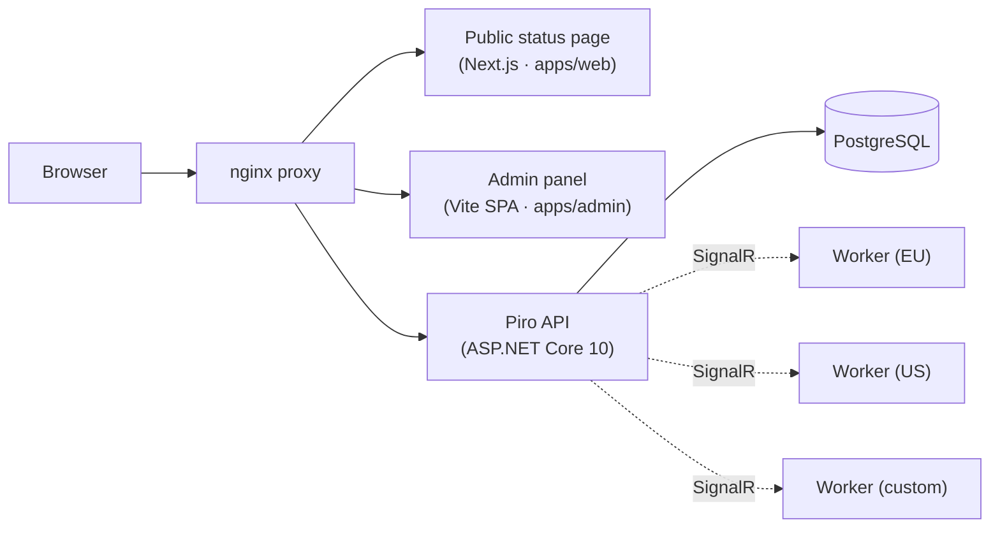

  
  <h1>Piro</h1>
  
<strong>Enterprise-grade open-source status page and uptime monitoring</strong>

  

    
    
    
    
    
  

  

    <a href="https://github.com/Heva-Co/piro/wiki">Documentation</a> ·
    <a href="https://github.com/Heva-Co/piro/wiki/Self-Hosting">Self-Hosting Guide</a> ·
    <a href="https://github.com/Heva-Co/piro/issues/new?template=bug_report.md">Report a Bug</a> ·
    <a href="https://github.com/Heva-Co/piro/issues/new?template=feature_request.md">Request a Feature</a>
  

---

Piro is a **self-hosted, enterprise-grade status page, uptime monitoring, and incident-response platform** built for engineering teams that demand full control over their infrastructure. Run checks from any region, page the right on-call engineer, and give your users a real-time status page — all on servers you own, with no data leaving your infrastructure.

It pairs active monitoring (HTTP, DNS, SSL, TCP, Ping, gRPC, and more) with the operational layer most status pages leave out: on-call rotations, escalation policies, verified personal alert channels, incidents, and maintenance windows — in one self-hostable stack.

Built by [heva](https://heva.co) and released under the AGPL. Read the story and the reasoning behind it in **[MOTIVATION.md](MOTIVATION.md)**.

## Why it exists

Monitoring and status pages are critical infrastructure, yet the good tooling has long sat behind expensive per-seat SaaS. We believe teams shouldn't have to choose between vendor lock-in and building it all from scratch. Piro is our contribution to the community — a production-ready, self-hostable alternative to StatusPage, Instatus, or Better Stack that you own completely.

We built it for ourselves first, running it internally at heva to monitor our own services, and we dogfood it in production. We welcome contributions, bug reports, and the kind of real-world feedback that makes software better. The full backstory is in **[MOTIVATION.md](MOTIVATION.md)**.

## Features

### Core platform
- **Multi-region monitoring** — Deploy lightweight workers to any cloud, on-prem server, or bare-metal machine. Workers connect back to the API over SignalR and scale independently across regions; single-region setups run checks in-process with no separate worker
- **Many check types** — HTTP, DNS (with expected-value matching), SSL certificate expiry, TCP, Ping, gRPC health, and GCP Cloud Run Job checks — each with tunable intervals and per-region assignment
- **Public status page** — Branded, real-time status page with uptime history, latency trends, incidents, and scheduled maintenances
- **Incident management** — Structured incidents with timeline updates, severity levels, and manual alert-to-incident linking — you decide when an alert becomes a customer-facing incident, never automatically
- **Maintenance windows** — Schedule maintenance windows that automatically suppress a service's public status during the window

### On-call & escalation
- **On-call schedules** — RRULE-based rotation layers with overrides, timezone-aware, visualized on a Gantt-style calendar
- **Escalation policies** — Per-service policies with ordered steps, delays, per-step retries, and re-escalation after inactivity; a policy can be reused across any number of services
- **Personal on-call calendar** — Every user sees their own upcoming shifts and an "on-call now" indicator in their profile
- **Verified notification channels** — Personal alert channels (Email, Telegram, SMS via Twilio, ntfy) require a one-time code confirmation before they're used for paging, so a typo never means a missed page

### Alerting
- **Flexible alert rules** — Configure thresholds on status, latency, certificate expiry, or failed name servers, with tunable failure/success thresholds to reduce noise
- **Personal, prioritized delivery** — Each on-call user configures their own ordered list of notification channels; escalation tries them in priority order and falls back to email if every configured channel fails
- **Per-channel message formatting** — Built-in Scriban templates render each channel's messages appropriately (Email, Telegram, SMS, ntfy)

### Integrations
- **Outbound alerting** — Email, Telegram, Twilio SMS, and ntfy for personal paging
- **PagerDuty** — Events API v2 dispatcher with service discovery and OAuth connection; map Piro services to PagerDuty services
- **GCP Cloud Monitoring** — Ingest Google Cloud Monitoring alert webhooks as Piro alerts

### Enterprise & security
- **OIDC / SSO** — Single sign-on with Google, Microsoft, GitHub, or any standard OIDC/OAuth2 provider; enforce an SSO-only login policy
- **RBAC** — Owner, Admin, Member, and Viewer roles with email-based invitations
- **Encrypted secrets at rest** — Integration credentials and secret fields are encrypted in the database
- **API-first** — Full REST API with an OpenAPI 3.1 spec; every admin operation is available programmatically
- **Self-hosted** — Your data stays on your infrastructure. No product telemetry, tracking, or phone-home
- **Branding** — Upload logo, favicon, and social preview image; customize site name, URL, and meta tags

## Architecture

The API can execute checks in-process (single-region setups) or dispatch them to standalone Workers over SignalR for multi-region coverage. Workers are stateless, self-contained binaries — they receive check assignments, execute HTTP / DNS / SSL / TCP / Ping / gRPC / GCP Cloud Run Job checks, and stream results back in real time.

## Docker Images

| Image | Latest | Platforms |
|---|---|---|
| `ghcr.io/heva-co/piro-api` | `latest` | `linux/amd64`, `linux/arm64` |
| `ghcr.io/heva-co/piro-worker` | `latest` | `linux/amd64`, `linux/arm64` |
| `ghcr.io/heva-co/piro-web` | `latest` | `linux/amd64` |
| `ghcr.io/heva-co/piro-proxy` | `latest` | `linux/amd64` |

All four images ship under the same version tag on every [release](https://github.com/Heva-Co/piro/releases), so there's a single `PIRO_VERSION` to pin. Each release also attaches a ready-to-run `docker-compose.release.yml` with the version resolved — `docker compose -f docker-compose.release.yml up` runs that exact release, no source checkout required.

→ **[Self-Hosting Guide](https://github.com/Heva-Co/piro/wiki/Self-Hosting)** — Docker Compose quickstart and full configuration reference.

## Contributing

We welcome contributions from the community. See [CONTRIBUTING.md](CONTRIBUTING.md) for guidelines on opening issues, submitting pull requests, and running the project locally.

Good first issues are tagged [`good first issue`](https://github.com/Heva-Co/piro/issues?q=label%3A%22good+first+issue%22).

## Security

Please **do not** report security vulnerabilities via GitHub issues. Email [devops@heva.co](mailto:devops@heva.co) instead. We aim to respond within 48 hours.

## License

Piro is open-source software released under the [GNU Affero General Public License v3.0](LICENSE) (AGPL-3.0).

**You are free to:** deploy Piro on your own infrastructure, use it internally, and make private modifications for internal use — with no obligation to publish anything.

**You may not:** host Piro as a paid or public managed service for third parties without publishing your modifications under the same license. If you offer Piro (modified or not) as a service to others, the AGPL requires you to make your source code available.

Copyright © 2025 [heva Inc.](https://heva.co)

---

  Built with ♥ by <a href="https://heva.co">heva</a> · <a href="mailto:devops@heva.co">devops@heva.co</a>

