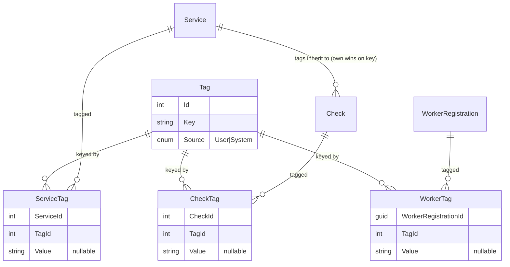
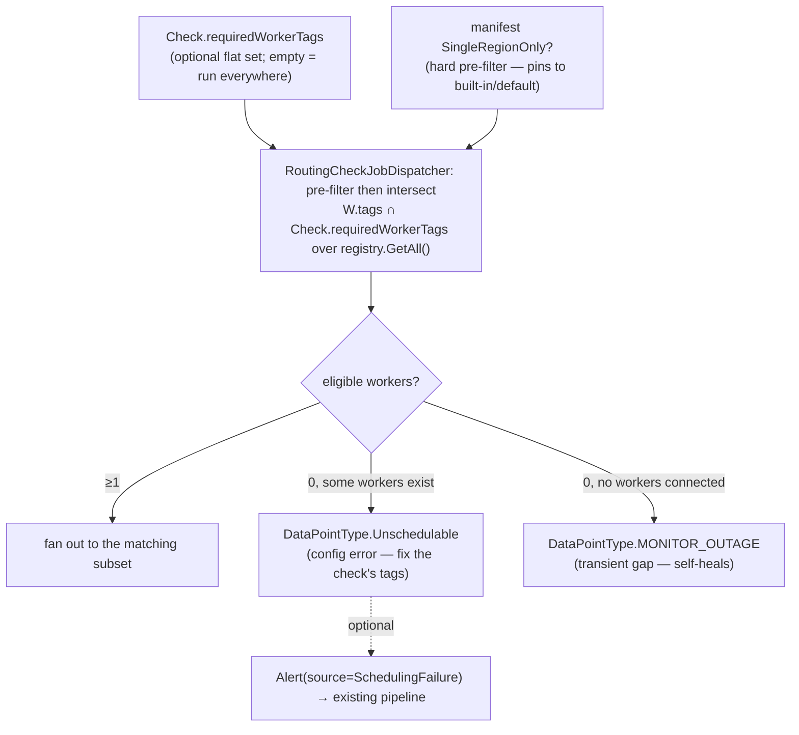

# RFC 0008 — Arbitrary tags on Services, Checks, and Workers, with tag-based worker↔check scheduling

Status: proposal
Author: Arael Espinosa (https://github.com/cl8dep)
Date: 2026-07-17

> **Changelog**
>
> *2026-07-24.* Reconciled with the current codebase and narrowed the scope after a design review. Nothing
> here is built yet; this is greenfield, and §6 phase 1 creates the tag model from scratch. A couple of
> references dated as other RFCs landed: RFC 0016 removed the YAML importer (`YamlImportService`), so it is
> no longer a second write path we have to guard, and it retired the `IntegrationType` enum. RFC 0013 added
> the `CheckManifest.SingleRegionOnly` capability, which the Part B scheduler has to respect (§4.6).
>
> The review also changed two things about how scheduling works. Part B is now a flat, one-directional
> worker-tag match rather than a two-sided selector engine: a worker carries a set of tags, a check names
> the worker tags it requires, and the check runs where they intersect (require nothing and you get today's
> behavior). The idea of a worker refusing work was dropped because no issue asks for it. And a check that
> can never be placed is reported as its own `Unschedulable` data point, kept separate from
> `MONITOR_OUTAGE`: the first is a config error you fix by editing the check, the second is a transient gap
> that heals when a worker reconnects. Governance (Part C) is a CI/lint concern, not a runtime table.

## 1. Problem

Piro has no way to attach arbitrary metadata to its core operational entities, and, more consequentially, no way to control which worker runs which check beyond a single boolean.

On metadata: a `Service` (`src/Piro.Domain/Entities/Service.cs:11`), a `Check` (`src/Piro.Domain/Entities/Check.cs:10`), and a `WorkerRegistration` (`src/Piro.Domain/Entities/WorkerRegistration.cs:8`) each carry only their own fixed columns. There is nowhere to record that a service belongs to `team:payments`, that a check is `tier:critical`, or that a worker sits in a particular compliance zone. Operators end up encoding this in names (`payments-api-prod`) or descriptions, which are unqueryable and drift.

On scheduling: the worker a check runs on is decided entirely by one bool, `Check.IsMultiRegion` (`src/Piro.Domain/Entities/Check.cs:47`), consumed at exactly two lines in `RoutingCheckJobDispatcher.DispatchAsync` (`src/Piro.Infrastructure/Workers/RoutingCheckJobDispatcher.cs:23-24`):

| | API worker live | API worker not live |
|---|---|---|
| `IsMultiRegion == true` | fan-out to **all** connected workers (`remote.DispatchAsync`) | fan-out to **all** connected workers |
| `IsMultiRegion == false` | run **in-process** (`local.DispatchAsync`) | run on **the single default** worker (`remote.DispatchToDefaultWorkerAsync`) |

There is no middle ground. A check cannot say "run me in EU and US but not Asia," and a worker cannot say "I only accept checks tagged `tier:critical`." The fan-out in `RemoteCheckJobDispatcher.DispatchAsync` (`src/Piro.Infrastructure/Workers/RemoteCheckJobDispatcher.cs:41`) iterates the entire set of alive workers from `registry.GetAll()` with no filtering. `WorkerRegistry.GetConnectionIdForRegion` (`src/Piro.Infrastructure/Workers/WorkerRegistry.cs:44-55`) already exists to select a worker by region, and has zero callers anywhere in `src/`. Region-aware routing was scaffolded and abandoned; the data to do better is on `WorkerRegistration.Region` (`src/Piro.Domain/Entities/WorkerRegistration.cs:16`) but nothing consumes it for dispatch.

A third problem emerges only at scale. In a deployment with hundreds of services, free-form tags rot: the same concept gets typed four ways (`tier:critcal`, `tier:Critical`, `tier:crit`, `tier:critical`), some entities silently lack the classifying tag entirely, and the naming convention lives in someone's head or a wiki rather than in the system. None of these fail loudly. A selector `tier=critical` just quietly misses a third of what it should match. This is a governance problem, not a modeling one.

This RFC introduces a tag system that solves the metadata problem (Part A, phase 1 of §6) and, on the same data model, a label-selector scheduler that generalizes and eventually replaces `IsMultiRegion` (Part B, designed here, shipped later), plus a governance layer that closes the tag vocabulary to curb error at scale (Part C, designed here, shipped later). All three are unbuilt; the phased plan (§6) ships them in order.

## 2. Non-goals

- Multi-valued keys. A tag key is unique per entity: a check has one `env`, not both `env:prod` and `env:staging`. Multi-value is out of scope, since it complicates both override-on-inheritance (§4.3) and selector semantics (§4.5) for a case no one has asked for.
- User-defined system tags. The `piro:` namespace (§4.2) is owned by Piro: users can never create, rename, or delete a `piro:*` key. A curated subset (assignable flags, e.g. `piro:3rd-party`, §4.2) may be associated or disassociated by users, but its key and meaning are still Piro's. This RFC offers no escape hatch to hand-author a new `piro:*` key or change what an existing one means.
- Replacing `IsMultiRegion` in Part A. Part A adds tags as metadata only: dispatch is untouched and `IsMultiRegion` still decides routing exactly as today. The flag is subsumed only when Part B ships (§4.6).
- Tag-based authorization / RBAC scoping. Tags are for organization and scheduling, not for gating who can see or edit an entity. Permission checks stay on the existing RBAC model (`RolePermission`, `src/Piro.Domain/Entities/RolePermission.cs`).
- A strict-by-default vocabulary. Part C (§4.8) governs tags opt-in, key by key. The system stays permissive (any free key allowed) until an admin promotes a specific key to governed. A closed-from-day-one vocabulary is a non-goal: it is unusable on a new install and would invalidate every existing tag on an already-populated one.
- Automatic bulk-rewriting of non-conforming tags. Part C reports policy violations; it does not mass-rewrite data (`tier:crit` to `tier:critical`) via a mapping. Destructive bulk edits are out of scope: corrections are surfaced and made deliberately, not applied silently.
- Governance scoped by tag selector. A policy applies globally per entity type ("`tier` is required on all Services"), not to a selector-defined subset ("`tier` required only on `env:prod` services"). Selector-scoped governance is a possible later refinement, not part of this design.
- Admin UI visual design. This RFC specifies the API contracts (§4.7) and the UI surface, meaning which screens and controls exist (§4.9), but not the visual design (spacing, exact components, styling), which is left to implementation.
- A generic worker capability protocol. Workers stay dumb executors (§4.4). This RFC does not add a worker-side accept/reject handshake or capability advertisement over SignalR beyond what the API already knows from `WorkerRegistration`.

## 3. Design principle

One normalized tag model serves both metadata and scheduling, and the scheduler is the only new decision layer: it plugs into the existing dispatch choke point rather than forking a parallel routing path. Every choice below traces back to this. Tags are stored once and read the same way whether a human is filtering the admin list or the scheduler is matching a check to a worker. System-derived facts (`piro:region`, `piro:check-type`) live in the same table as user tags so a selector never has to special-case origin. And Part B's matcher slots into `RoutingCheckJobDispatcher.DispatchAsync`, the single line pair that decides routing today, instead of a new dispatcher.

## 4. Design

Part A is the tag model: a key catalog plus one join per entity, with the value living on the join (§4.1). A check's effective tags are its own unioned with its service's, own winning on key (§4.3):



Part B is the worker-tag match (future, council-refined): flat and one-directional, where the check picks a worker by tag intersection. `SingleRegionOnly` is a hard pre-filter. An empty match is a visible datapoint that distinguishes a config error (`Unschedulable`) from a transient gap (`MONITOR_OUTAGE`); routing stays total, never silent (§4.5, §4.6):



### 4.1 The `Tag` entity and join tables

`Tag` is a catalog of keys: one row per distinct key, not per `key:value` combination. The value of a key is a property of the assignment (this service is `tier:critical`, that one is `tier:standard`), so it lives on the join, not on `Tag`. The source (System/User) is a property of the key. Piro's namespace rule (§4.2) makes `piro:*` keys System and every other key User, uniformly across all entities, so it lives on `Tag`. This split is the crux of the model: value varies per assignment, source does not.

```csharp
// src/Piro.Domain/Entities/Tag.cs — the key catalog, one row per key
public class Tag
{
    public int Id { get; set; }
    public string Key { get; set; } = string.Empty;   // normalized, validated (§4.2); UNIQUE
    public TagSource Source { get; set; }             // System | User — fixed by the namespace
}

// src/Piro.Domain/Enums/TagSource.cs
public enum TagSource { User, System }

// src/Piro.Domain/Entities/ServiceTag.cs   (CheckTag, WorkerTag are identical shape)
public class ServiceTag
{
    public int ServiceId { get; set; }
    public int TagId { get; set; }                    // → Tag (the key)
    public string? Value { get; set; }                // optional — this entity's value for that key
    public Service Service { get; set; } = null!;
    public Tag Tag { get; set; } = null!;
}
```

This follows Piro's established join-entity convention: a composite-PK junction with `HasOne/WithMany` on both sides, carrying extra columns, exactly as `PageService` does (`src/Piro.Infrastructure/Persistence/Configurations/PageServiceConfiguration.cs:12-27`, which itself adds `DisplayOrder`/`SettingsJson` to the junction).

Putting the value on the join yields two properties that the alternative value-on-`Tag` shape had to enforce in code:

- Key-uniqueness per entity (§4.2) becomes a DB constraint. With `TagId` as the key, `UNIQUE(ServiceId, TagId)` makes it impossible to give one service two `tier` rows. In a value-on-`Tag` model, `tier:critical` and `tier:standard` are two different `Tag` ids and a plain join can't stop both from linking, so the invariant would live in application code.
- Changing a value is a one-row `UPDATE` of `ServiceTag.Value`, not "unlink `tier:critical`, find-or-create `tier:standard`, link it."

A key catalog is preferable to a JSONB column on each entity (the cheaper option, cf. `PageService.SettingsJson` at `PageServiceConfiguration.cs:17`) because the load-bearing operations are "list every check with `tier=critical`" and key/value autocomplete in the admin (§4.7). Key autocomplete is now `SELECT Key FROM Tags` over a tiny table (one row per dimension, dozens of rows total); value autocomplete for a key is a scoped `DISTINCT` over one join column; the value-filter is an indexed join. All are awkward as JSON containment scans. The catalog also lets Part C's `TagPolicy` (§4.8) reference a real key row rather than a loose string.

`WorkerTag` points at `WorkerRegistration.Id` (a `Guid`, `src/Piro.Domain/Entities/WorkerRegistration.cs:10`); `ServiceTag`/`CheckTag` point at the `int` PKs of `Service`/`Check`. All three join tables cascade-delete with their owning entity (`OnDelete(DeleteBehavior.Cascade)`, per the `PageService` template), so deleting a service drops its tag assignments. The `Tag` catalog rows persist: they are a small, slow-changing dimension table (one row per key ever used), not per-entity data, so there is no orphan-row accumulation to sweep.
### 4.2 Validation, the `piro:` namespace, and the tag limit

A user-supplied tag key must:

- start with a lowercase letter, never `-`, `_`, or a digit;
- thereafter contain only lowercase alphanumerics, `-`, and `_`;
- not exceed a length cap (63, matching common label conventions);
- not use the reserved `piro:` namespace: any key beginning with `piro:` is rejected from user input.

The value is optional: a tag may be `key` alone (`critical`) or `key:value` (`tier:critical`). A key is unique per entity, so assigning `env:staging` to a check that already has `env:prod` replaces it, it does not add a second `env`. This uniqueness is not an application rule but the `UNIQUE(entityId, TagId)` composite PK on each join table (§4.1), so it cannot be violated even by a direct write.

The per-entity ceiling is a named constant, not a magic number:

```csharp
// src/Piro.Domain/TagConstants.cs
public static class TagConstants
{
    public const int MaxTagsPerEntity = 50;
    public const string SystemNamespace = "piro:";
    public const int MaxKeyLength = 63;
}
```

System tags carry `TagSource.System` and live in the `piro:` namespace. What makes them "system" is that Piro owns the key: the set of `piro:*` keys is a curated catalog, not user-invented, so a user can never create a `piro:*` key or coin a variant (`piro:3rdparty` vs `piro:3rd-party`). But who assigns the key to an entity splits system tags into two kinds, along an `Assignment` axis:

- Reconciled: Piro both owns the key and controls the assignment, deriving it from a fact and keeping it in sync. The user never touches it. (`piro:check-type`, `piro:region`, …)
- Assignable: Piro owns the key, but the user associates/disassociates it on the entities they choose. Piro does not derive it, there is no internal fact to derive from, the user's choice is the fact. The user cannot rename it, change its meaning, or invent a sibling, only toggle its presence. (`piro:3rd-party`.)

This is the well-known-label pattern (à la Kubernetes' `kubernetes.io/*` labels or GitHub's reserved labels): the platform defines an official vocabulary of flags; the operator applies them but cannot fork them.

| Entity | System tag | Assignment | Source of truth | Storage |
|---|---|---|---|---|
| Check | `piro:check-type` | reconciled | `Check.Type` (`src/Piro.Domain/Entities/Check.cs:20`), e.g. `piro:check-type=http` | **stored** |
| Check | `piro:multi-region` | reconciled | `Check.IsMultiRegion` (`src/Piro.Domain/Entities/Check.cs:47`) | **stored** |
| Worker | `piro:region` | reconciled | `WorkerRegistration.Region` (`src/Piro.Domain/Entities/WorkerRegistration.cs:16`) | **stored** |
| Worker | `piro:builtin` | reconciled | `WorkerRegistration.IsBuiltIn` (`src/Piro.Domain/Entities/WorkerRegistration.cs:32`) | **stored** |
| Worker | `piro:default` | reconciled | `WorkerRegistration.IsDefault` (`src/Piro.Domain/Entities/WorkerRegistration.cs:29`) | **stored** |
| Service, Check | `piro:3rd-party` | **assignable** | the user's toggle (key-only, no value) | **stored** |
| Service | `piro:has-incident` | reconciled | an open `IncidentService` linkage for the service | **computed on read** |
| Service | `piro:has-alerts` | reconciled | an active (unresolved) `Alert` with this `ServiceId` | **computed on read** |

Stored (write-through) system tags derive from a field on the entity's own row, which only changes when someone edits the entity, a rare, manual event. They are materialized as ordinary `Tag`/join rows, written once in the same `UpdateAsync` that changes the source field: `CheckAppService.UpdateAsync` already touches `IsMultiRegion` (`src/Piro.Application/Services/CheckAppService.cs:132`) and `Check.Type`, so it reconciles `piro:check-type`/`piro:multi-region` there; `WorkerAppService.UpdateAsync` already mutates `Region` (`src/Piro.Application/Services/WorkerAppService.cs:82-83`) so it reconciles `piro:region`. There is no periodic job; the write happens exactly when, and only when, the fact changes. These are persisted precisely because Part B's selector (§4.5) must `JOIN` on them: matching `piro:region=eu` across all workers has to be an indexed query, not a per-row computation.

Computed (on-read) system tags derive from external, self-changing state: whether the service currently has an open incident or an active alert. Materializing these would be the mistake. Their source fact changes on its own (an alert fires at 3am, no one edited the service), so a stored copy would need a background reconciler sweeping every service on a timer to stay fresh, precisely the recurring overhead to avoid, and a guaranteed source of staleness between ticks. Instead they are not stored at all; they are computed in the effective-tags read path (§4.3, the `GET …/tags` DTO) against state that already lives in the DB (`EXISTS` over active `Alerts` / open `IncidentService`s). Nothing to keep in sync, nothing to sweep, never stale. The trade-off: a computed tag is not indexable, so it cannot drive a Part B selector. That is fine, because `piro:has-incident`/`piro:has-alerts` exist only to filter in the admin ("show services with active alerts"), a one-off query, never a scheduling `JOIN`. These two are also the only speculative reconciled system tags: if admin filtering by them proves unused they can be dropped without touching the model or the storage of anything else. The five stored check/worker tags are load-bearing for Part B and are not optional.

Assignable system tags are Piro-owned keys that the user toggles. `piro:3rd-party` is the v1 instance: it marks a service or check as a third-party dependency (a vendor API like Stripe or Twilio, monitored alongside your own services), which Piro cannot infer (a check to `api.stripe.com` looks identical to one to your own API, only the operator knows it is external). It is `TagSource.System` so it is an official flag with a fixed spelling. The reason it is not just a free user tag `third-party` is exactly that: a user tag would drift into `3rdparty`/`external`/`vendor` (the drift problem Part C, §4.8, exists to solve), whereas a system-owned key has one canonical form the whole product and its selectors can rely on. It is stored (a plain `Tag`/join row) so Part B can select on it and the admin can filter by it with an indexed query. It is key-only (no value): presence is the flag.

The mutation rule follows the `Assignment` axis, not `TagSource` wholesale. The tag-write API (§4.7) rejects any user attempt to define a `piro:*` key (create, rename, delete from the catalog). But for an assignable system tag it permits associate/disassociate on an entity, exactly as for a user tag; for a reconciled one it still forbids it (Piro owns the assignment). Concretely, "is `piro:*`" no longer means "user cannot touch"; "is reconciled" does.

To make this a curated catalog rather than scattered special-cases, the system tags are declared in one place, the source of truth for which `piro:*` keys exist and how each behaves:

```csharp
// src/Piro.Domain/SystemTags.cs
public enum SystemTagAssignment { Reconciled, Assignable }

public record SystemTagDefinition(
    string Key,
    SystemTagAssignment Assignment,
    bool Stored,
    IReadOnlyList<string>? AllowedValues = null);  // null = key-only flag; a list = closed value vocabulary

public static class SystemTags
{
    public static readonly IReadOnlyList<SystemTagDefinition> All =
    [
        new("piro:check-type",   SystemTagAssignment.Reconciled, Stored: true),
        new("piro:multi-region", SystemTagAssignment.Reconciled, Stored: true),
        new("piro:region",       SystemTagAssignment.Reconciled, Stored: true),
        new("piro:builtin",      SystemTagAssignment.Reconciled, Stored: true),
        new("piro:default",      SystemTagAssignment.Reconciled, Stored: true),
        new("piro:3rd-party",    SystemTagAssignment.Assignable, Stored: true),  // key-only flag (AllowedValues null)
        new("piro:has-incident", SystemTagAssignment.Reconciled, Stored: false), // computed on read
        new("piro:has-alerts",   SystemTagAssignment.Reconciled, Stored: false),
        // future, e.g.: new("piro:environment", Assignable, Stored: true, AllowedValues: ["prod","staging","dev"])
    ];
}
```

The write API consults this catalog: an assign/unassign request for a `piro:*` key is allowed iff the key is in `All` with `Assignment == Assignable`; if that definition carries `AllowedValues`, the supplied value must be in it. `AllowedValues` is what lets an assignable system tag carry a user-chosen but Piro-vocabulary'd value, the same closed-vocabulary idea as Part C governance (§4.8), but defined by Piro rather than by an admin. v1 ships only `piro:3rd-party` (a `null`-`AllowedValues` flag, no value); a future valued flag like `piro:environment` ∈ `{prod,staging,dev}` is one catalog entry, and the write path (§4.7) already accepts and validates a value, no redesign.

Each computed tag is one `IComputedSystemTagBatch<TEntity>` implementation, registered as `IEnumerable<IComputedSystemTagBatch<Service>>`, the same DI-collection shape Piro already uses for `IEnumerable<INotificationDispatcher>` (`src/Piro.Infrastructure/Extensions/InfrastructureServiceExtensions.cs:204-214`) and `IEnumerable<ICheckExecutor>`. The interface is batch-first to keep the read path to a fixed number of queries:

```csharp
public interface IComputedSystemTagBatch<TEntity>
{
    string Key { get; }
    // one query for the whole set: returns the subset of ids the tag applies to.
    Task<ISet<int>> ComputeForAsync(IReadOnlyCollection<int> entityIds, CancellationToken ct);
}
```

Computing a single service's tags is the `n = 1` case (`ComputeForAsync([id])`), so there is no separate per-entity method to keep in sync: one method, one query per tag. Filtering N services costs K queries (one per computed tag, K = 2 today), never N+1. A single-method loop would be the N+1, which is exactly why the native method is the batch. The batch-first strategy is preferred over inlining the computation in the tag service because the computed-tag set, though curated, is expected to grow, and this keeps each tag an isolated, independently testable unit rather than a growing block inside one method.

### 4.3 Inheritance: Service → Check

A check's effective tags are its own tags unioned with its parent service's tags, with the check winning on any key collision:

```
effective(check) = check.tags  ∪  { t ∈ service.tags : t.key ∉ keys(check.tags) }
```

So a service tagged `team:payments, env:prod` gives every one of its checks those two tags for free; a check that additionally sets `env:staging` sees `team:payments, env:staging` (its own `env` overrides the inherited one). This is what makes service-level tagging powerful for Part B: tag the service `region-pref:eu` once and all its checks inherit the scheduling constraint, without forcing per-check duplication.

Effective tags are computed, never stored: the join tables hold only own tags. This keeps inheritance from going stale when a service's tags change, at the cost of a union at read/selector time (cheap, bounded by `MaxTagsPerEntity`). Worker tags do not inherit from anything; a worker has no parent.

### 4.4 Workers stay dumb executors

Nothing changes on the worker process. A worker today runs whatever `WorkerExecuteMessage` it receives, filtered only by whether it has an `ICheckExecutor` for the `CheckType` (`src/Piro.Worker/WorkerSignalRService.cs:129-134`); `WorkerExecuteMessage` carries no routing metadata (`src/Piro.Application/Models/Worker/WorkerMessages.cs:16-21`). All selection is and stays API-side. A worker's tags are known to the API from its `WorkerRegistration` (persisted) mirrored into the in-memory `WorkerInfo` at connect time (`src/Piro.Infrastructure/Hubs/WorkerHub.cs:60-66`); the scheduler reads them there. This means Part B requires no change to the SignalR message contract or the worker binary, only to the API's dispatch decision.
### 4.5 Part B — worker-tag match (flat, one-directional)

> An earlier draft proposed a symmetric two-sided selector engine (worker-side
> `CheckSelectorMode` + check-side `WorkerSelector`, k8s nodeSelector+affinity, structured
> `anyOf`/`allOf` selectors). We dropped it. No issue asks for a worker to refuse work, and the one
> concrete requirement (issue #113) is a **flat, one-directional** match. This section describes that
> design; the symmetric engine and the worker-side selector are gone. The `anyOf`/`allOf` grammar
> still ships, but as part of the tag primitive that RFC 0009 Phase 7 / #203 consumes for **event
> filtering**, not as a scheduler (see §4.7 and Part A's scope).

The requirement in issue #113 is to route a check to specific workers by tag: "run this DNS check from EU, US,
and Asia workers"; "run this HTTP latency check from EU only"; "run this compliance check only in-jurisdiction."

The model is a flat tag intersection, check → worker only.

- Worker side: a worker's tags (§4.1's `WorkerTag` rows, including the system `piro:region`) are its
  advertised placement facts. A worker declares nothing about which checks it wants; it runs what it's given.
- Check side: a check has an optional set of **required worker tags**, expressed as ordinary `CheckTag`
  rows under a reserved key (e.g. `piro:worker-tag`), or a small dedicated `Check.WorkerTags` set. These are the
  keys/values a worker must carry to be eligible.
- The rule: a check *C* runs on a live worker *W* iff:

  ```
  1. W is alive (registry liveness, WorkerRegistry.cs) — and, if C's type is SingleRegionOnly, W is the built-in/default worker (§4.6)
  2. C.requiredWorkerTags is empty  → any live W (today's behavior)
     otherwise                      → W.tags ∩ C.requiredWorkerTags is non-empty
  ```

This is an intersection, not a satisfiability engine: a check lists acceptable worker tags, and any worker sharing at
least one runs it (matching issue #113's "workers whose Tags intersect WorkerTags"). No `anyOf`/`allOf`,
no `NotIn`/`Exists`, no worker-side selector, no `CheckSelectorMode`. If scheduling ever needs a richer grammar,
that is an additive change, and it is not built on speculation.

Facts act as pre-filters, not negotiable tags. `SingleRegionOnly` (type-level, from the
manifest) and machine-owned `piro:*` facts are applied as **hard pre-filters** before the intersection: an
operator's `requiredWorkerTags` can only narrow the eligible set, never widen past a hard constraint. A
`SingleRegionOnly` check is pinned to the single worker (§4.6) no matter what tags the operator sets, and the
matcher intersects within the already-constrained set. This keeps the immovable facts and the negotiable
preferences separated at the match layer, so a stray operator tag cannot escape a mandatory constraint.

### 4.6 Part B — subsuming `IsMultiRegion`, and the `Unschedulable` datapoint

`IsMultiRegion` becomes expressible with the flat worker-tag match (§4.5):

- `IsMultiRegion == true`  ≡  empty `requiredWorkerTags` → the check runs on **every** live worker (today's fan-out).
- `IsMultiRegion == false` ≡  `requiredWorkerTags = { piro:builtin }` (falling back to `piro:default`, §8) → the check runs on the built-in/default worker only.

During the transition the `piro:multi-region` system tag is derived from the flag (§4.2), so both representations agree. Once Part B is the sole routing path, `IsMultiRegion` is redundant and can be deprecated (`[Obsolete]`, kept as a derived view) rather than dropped, matching how the codebase already deprecates fields it can't remove cleanly (`Check.HistoryDaysDesktop`).

`CheckManifest.SingleRegionOnly` (RFC 0013) is a hard pre-filter, not a tag. A check type can declare it must run single-region, as the Heartbeat check does (RFC 0013 §4.6). This is stronger than the per-instance flag: type-level, mandatory, not user-overridable. The matcher applies it before the tag intersection (§4.5): a `SingleRegionOnly` check is pinned to the built-in/default worker regardless of any `requiredWorkerTags` the operator sets, and the multi-worker form is rejected at validation, exactly as `EnsureSingleRegionIfDeclared` already rejects `IsMultiRegion = true` for such a type (`src/Piro.Application/Services/CheckAppService.cs`). The admin hides the worker-tag UI for it just as it hides the multi-region toggle.

The matcher lands in `RoutingCheckJobDispatcher.DispatchAsync`, the existing routing choke point. Instead of the `IsMultiRegion` branch, it computes the matching worker subset from `registry.GetAll()` (an in-memory list, no per-tick DB hit) and hands that subset to the fan-out. `RemoteCheckJobDispatcher.DispatchAsync` already loops per-connection over the worker list, so restricting it to a filtered subset is a natural narrowing of an existing loop. The dead `WorkerRegistry.GetConnectionIdForRegion` is removed or folded into the tag matcher.

Routing stays total: a check never silently fails to run. When the matching subset is empty, the check does not run, but that is always recorded as a **visible datapoint**, never dropped. Piro already does this: when no worker is available today it writes a `MONITOR_OUTAGE` datapoint (`src/Piro.Domain/Enums/DataPointType.cs`). Part B keeps that guarantee, but distinguishes two genuinely different empty-match causes, because they demand different operator actions and must not be conflated:

| | `MONITOR_OUTAGE` (exists) | `Unschedulable` (**new** `DataPointType`) |
|---|---|---|
| Meaning | No worker was available **this tick** | **No worker can ever match** this check's required tags |
| Cause | Transient infra: a worker is offline or still connecting | Configuration: an impossible or typo'd `requiredWorkerTags`, or a region that has no worker |
| Resolves | On its own, when a worker returns | Only when someone **edits the check** |
| Operator action | Wait / check worker health | Fix the check's worker tags |
| UI | "monitoring gap" | "check misconfigured: no worker matches its tags" |

Concretely, an empty match distinguishes two cases. If some workers exist but none intersect the required tags (or the constraint is unsatisfiable), it is `Unschedulable`; if no workers were connected at all, it is the existing `MONITOR_OUTAGE`. Both are non-alerting-by-default datapoints kept out of uptime math (neither is service downtime), and both are visible on the check so the failure is never silent.

An optional notification sits on top of that. For an operator who wants to be paged that a check is misconfigured, an `Unschedulable` datapoint may additionally raise an orphan `Alert` (nullable `Alert.CheckId`, no `AlertConfig` needed, since the codebase already supports `AlertConfig`-less alerts, FK `SetNull`) tagged with a new `AlertSource.SchedulingFailure` (`AlertSource` is designed to be extended, RFC 0001 §4.4). That is a notification layer on top of the visible datapoint, not a replacement for it. The floor is that `Unschedulable` is seen and distinguishable, whether or not it pages. (§8 covers the "no escalation policy → email a system address" fallback for the alerting layer.)

The alert then flows through the notification path unchanged: because it carries `ServiceId`, the service's `EscalationPolicy` (`src/Piro.Domain/Entities/Service.cs:51`) drives `EscalationCheckerService`, whose `DispatchPersonalAsync` loop (`src/Piro.Application/Services/EscalationCheckerService.cs:192`) is the single existing choke point that sends notifications, including email, which requires no `Integration` row (`src/Piro.Infrastructure/Alerts/EmailDispatcher.cs:18-25`). The `AlertNotificationContext.Title()` extension already renders orphan/external alerts gracefully (`src/Piro.Application/Models/AlertNotificationContext.cs`), so a scheduling-failure alert needs only its own title-case, not a new template pipeline.

Crucially, unschedulable is NOT a `ServiceStatus`. Modeling it as a check/service status would leak an internal scheduling problem onto the public status page and corrupt uptime math (`Service.PublicStatus` is deliberately insulated from raw check failures, `src/Piro.Domain/Entities/Service.cs:30`). It is an operational alert about Piro's own scheduling, notified to on-call, never surfaced as downtime.

### 4.7 API surface

Tag read/write is a small CRUD surface per entity, plus autocomplete. Following Piro's controller conventions:

```
GET    /api/v1/services/{id}/tags          -> list own + (for checks) inherited/effective tags
PUT    /api/v1/services/{id}/tags          -> replace the full user-tag set for the entity
GET    /api/v1/checks/{id}/tags            -> { own: [...], effective: [...] }
PUT    /api/v1/checks/{id}/tags
GET    /api/v1/workers/{id}/tags
PUT    /api/v1/workers/{id}/tags

GET    /api/v1/tags/keys?prefix=te         -> autocomplete keys ("team", "tier", ...) — User source only
GET    /api/v1/tags/values?key=env         -> autocomplete values for a key ("prod", "staging")

PUT    /api/v1/services/{id}/system-tags/{key}     body: { value?: "..." }  -> assign/set an ASSIGNABLE system tag
DELETE /api/v1/services/{id}/system-tags/{key}                               -> unassign it  (checks: /checks/{id})
```

The user-tag `PUT` is **replace-the-set** (idempotent), scoped to `User`-source tags. It rejects any key in the `piro:` namespace (§4.2) and never touches `System` rows, so a user can never define or edit a `piro:*` key. Assignable system tags (§4.2) are set through the separate `system-tags` endpoints above, which accept a `piro:*` key only if it is in the `SystemTags` catalog with `Assignment == Assignable` (`piro:3rd-party` qualifies; `piro:check-type` is rejected, since it is reconciled), and validate the optional `value` against that definition's `AllowedValues` (absent for a key-only flag like `piro:3rd-party`; required-in-vocabulary for a valued one like a future `piro:environment`). The endpoint is an upsert of one keyed resource, not a set-replace: it is atomic per flag, idempotent, needs no knowledge of the entity's other tags, and cannot accidentally drop them, which is exactly why it is not folded into `PUT /tags`. That keeps the two mutation rules cleanly split: user-tag replacement never sees `piro:*`; system-tag upsert only ever sees assignable `piro:*` and enforces its vocabulary. (The unified read is `GET …/tags`, which returns user tags and all system tags together, so the client still has one view.) Autocomplete reads distinct `User` keys/values from the `Tag` table (the normalized model makes this one indexed `DISTINCT` query). A check's `RequiredWorkerTags` (Part B) is set through the existing check update endpoint as a flat `key`/`value` requirement list, validated against the §4.5 flat-match rules on write; workers carry only their tag set, no scheduling payload.

### 4.8 Part C — tag governance (closing the vocabulary)

> Part C is CI/lint, not the runtime table below. We cut runtime governance from this RFC for two reasons.
> First, a typo'd tag that matters for scheduling already surfaces as a visible `Unschedulable` datapoint
> (§4.6), not a silent misroute, so a runtime write-gate isn't load-bearing. Second, at solo/small scale a
> `TagPolicy` table is YAGNI. Governance ships (phase 5, §6) as a **config-validation / lint pass** that
> reports non-conforming keys/values: no table, no write-gate. The `TagPolicy` design below is retained as the
> reference for a future runtime promotion, to be built only if a concrete need appears; it is not part of the
> near-term plan.

Part A lets anyone write any tag. That freedom is correct for ad-hoc metadata but, at hundreds of services, it is exactly what produces the four failure modes in §1: **omission** (an entity missing its classifying tag), **value typos** (`tier:critcal`, the venomous one, because it fails silently), **key typos** (`teir:critical`), and **drift** (three people inventing `tier`, `level`, and `criticality` for the same idea). "Apply `tier` to every service", the request that motivated this part, turns out to be a symptom, not the fix. The fix is to close the vocabulary: declare which tag keys are legitimate and, per key, which values are legitimate.

The model is a `TagPolicy` per governed key. Governance is a thin layer on top of Part A: it adds one table and one validation call, and touches neither the `Tag` catalog schema nor the join tables.

```csharp
// src/Piro.Domain/Entities/TagPolicy.cs
public class TagPolicy
{
    public int Id { get; set; }
    public TaggableEntity Entity { get; set; }      // Service | Check | Worker
    public int TagId { get; set; }                  // → Tag — the governed key (Source = User)
    public Tag Tag { get; set; } = null!;
    public bool Required { get; set; }              // must be present on every entity of this type
    public string? AllowedValuesJson { get; set; }  // null = any value; else the closed value set
    public string? DefaultValue { get; set; }       // effective fallback when the key is absent
}
// UNIQUE(Entity, TagId) — one policy per key per entity type
```

The governed key is a **FK into the `Tag` catalog**, not a loose string, using the same normalization the rest of the model uses (§4.1). A loose `Key string` here would reintroduce exactly what the catalog eliminates: two representations of "the key `tier`" (the policy's string and the catalog row) that can drift (`tier` vs `Tier`). Because a policy points at a real catalog row, `UNIQUE(Entity, TagId)` is the one-policy-per-key constraint at the DB level.

Declaring a policy find-or-creates the key in the catalog. Governance must be declarable before the key is ever used (you promote `tier` to required precisely to force it into use) but a FK can't point at a nonexistent row. So creating a `TagPolicy` find-or-creates the `Tag` row for its key (always `Source = User`; the `piro:` namespace is never governable, §2). This is semantically right: governing a key is registering it as first-class vocabulary. A governed key therefore always has a catalog row even before any entity carries it. (A policy can only reference a `User` tag; pointing at a `System` row is rejected, since `piro:*` tags are reconciled, not governed.)

A key with no `TagPolicy` row stays **free**, validated only by §4.2's syntactic rules. This is the two-speed model: free tags for the ad-hoc, governed tags for what matters. The system starts fully permissive and an admin **promotes** a key to governed opt-in (a non-goal to be strict-by-default, §2).

Two-speed enforcement, per the four failure modes:

- Value typo (§1 #2): `AllowedValuesJson` is the highest-ROI rule. When set, a write with a value outside the set is rejected, and the editor renders the value cell as a closed dropdown (§4.9) rather than a free input, so the typo becomes unrepresentable.
- Omission (§1 #1): `Required = true` rejects a save that omits the key, unless a `DefaultValue` covers it (below), so the common case has zero friction.
- Key typo / drift (§1 #3, #4): governed keys surface first in autocomplete (§4.7, §4.9), so the operator is shown `tier` instead of guessing. Free keys remain allowed, so a typo'd key is still a valid free tag. It is not silently accepted as `tier`, which is the only guarantee that matters.

`DefaultValue` reuses the §4.3 override resolution; it does not seed rows. The effective value of a governed key is resolved most-specific-wins, with the policy default as the final fallback:

```
effectiveValue(key) = own tag  ▷  inherited tag (service→check, §4.3)  ▷  TagPolicy.DefaultValue
```

So `tier` required + `DefaultValue = "standard"` means a newly created service already satisfies the policy (it inherits `standard`) yet can be raised to `critical` when its owner decides. This writes **no rows**: a default is computed, never materialized, so introducing the policy does not migrate hundreds of records or create data that later desynchronizes. This is the mechanism behind "`tier` on every service": not a bulk write, but a required key with a default.

Enforcement point: validation runs in the same create/update app-service methods that already validate today. `CheckAppService.CreateAsync` builds the entity and already calls guards (`EnsureScheduleWithinBounds`, `EnsureSingleRegionIfDeclared`, and `ResolveSpec` for alert dimensions, `src/Piro.Application/Services/CheckAppService.cs`); governance is the same shape of guard (`EnsureTagPoliciesSatisfied(entity, tags)`) alongside them, mirrored in `ServiceAppService` and `WorkerAppService`. No new pipeline.

Pre-existing violations do not block promotion. Activating `AllowedValues` on a system that already holds 40 services tagged `tier:crit` must not fail to save, and must not rewrite those 40 rows (a non-goal, §2). Instead the policy is stored and the system reports the violating entities (a `GET /tags/policies/{id}/violations` list, §4.7-adjacent) for deliberate cleanup. Enforcement is strict only on new writes until the backlog is cleared, the same permissive-then-harden posture as the vocabulary itself. Auto-correction via a value mapping is rejected (§2, §7) as too destructive.

Bulk-apply is a migration tool, not a mechanism. A one-shot "classify these existing N services" utility is legitimate the day a policy is introduced over a populated system, but it lives outside the hot path, is explicitly a migration convenience, and is not how the model stays correct going forward (that is `Required` + `DefaultValue`). It is listed in the phased plan (§6) as optional, last.
### 4.9 UI surface (admin panel)

This section names the screens and controls, not their visual design (§2). The admin panel is a Vite SPA (`apps/admin`) whose API types are generated from the backend OpenAPI spec, so all shapes below derive from the §4.7 contracts and the flat worker-tag match of §4.5.

**Tag editor (Service, Check, Worker detail pages).** A key | value table, one row per tag, with an "Add tag" action and per-row delete. Each row has a key cell and a value cell (value may be left blank for a key-only tag, §4.2). Validation (§4.2) runs inline: keys not starting with a letter, using disallowed characters, or in the `piro:` namespace are rejected before save, and the table blocks a 51st row (`MaxTagsPerEntity`). Reconciled `piro:*` system tags render as read-only rows (greyed, no edit or delete affordance), so the operator sees them and can select on them but cannot mutate them. `PUT` submits the full user-tag set (replace semantics, §4.7). Key and value cells offer autocomplete backed by `GET /tags/keys` and `GET /tags/values?key=…`.

**Assignable system tags** (§4.2, `piro:3rd-party` in v1) are not rows in the free-tag table. They live in a dedicated "System" section above it, one control per assignable entry in the `SystemTags` catalog. A key-only flag (`AllowedValues == null`, e.g. `piro:3rd-party`) renders as a labelled checkbox ("Third-party dependency"); a valued one (`AllowedValues` set, e.g. a future `piro:environment`) renders as a labelled select constrained to that vocabulary. Both call the `system-tags` endpoints (§4.7), not the tag `PUT`. This keeps the official tags visually distinct from ad-hoc ones and prevents a user from "deleting" a flag row when they meant to unassign it: unassign is un-checking the box (or clearing the select). Reconciled `piro:*` tags never appear here; they are the greyed read-only rows in the table above.

**Check detail, effective tags.** Because a check inherits its service's tags (§4.3), the check's tag editor shows two zones: the editable table of the check's own tags, and a read-only list of inherited tags (from `effective` minus `own` in the `GET /checks/{id}/tags` response), each labeled with its origin service. An inherited key that the check overrides is shown struck-through in the inherited zone and live in the own table, making the override visible.

**Worker detail, tags only.** The worker page has the same key | value tag table as any other entity (above). A worker declares no scheduling mode and no selector: it is a passive pool of capability tags. Whether a check runs on a worker is decided entirely by the check side (below), so there is no worker-side match UI to build. (The one-directional model of §4.5: workers advertise, checks require.)

**Check detail, required worker tags.** A check's scheduling control is a single "required worker tags" editor: a `key | value` list of the worker tags the check accepts. Empty ⇒ today's behavior (any worker, `IsMultiRegion` decides fan-out). Each row's key autocompletes against worker tag keys and its value against that key's known worker values, so the operator picks from what workers actually advertise. A dry-run indicator calls the preview (§8) and shows "matches N of M currently-alive workers" live as the list is edited, surfacing a match-nothing set (which would make the check `Unschedulable`, §4.6) before save. This is a flat intersection (`W.tags ∩ Check.requiredWorkerTags` non-empty, §4.5), not a selector language: no `anyOf`/`allOf`, no `NotIn`/`Exists`. The richer selector grammar is Part A's event-filter feature (#203), a separate surface.

**Governance (Part C): policy manager and its effect on the tag editor.** A settings screen lists `TagPolicy` rows and lets an admin promote a key to governed: pick entity type and key, toggle `Required`, optionally define a closed value set and a default. Where a governed key has `AllowedValues`, the entity tag editor's value cell for that key becomes a closed dropdown instead of a free input, so the value typo (§1 #2) is unrepresentable, and a `Required` key with no default is pre-inserted as an empty, non-deletable row so it cannot be forgotten. Promoting a policy shows the violations report inline (`GET …/violations`): the list of existing entities that don't conform, each linking to its editor, so cleanup is a click-through rather than a hunt. The report never blocks the save and never rewrites data (§4.8).

### 4.10 What does NOT change

- **The dispatch decision in Part A.** `RoutingCheckJobDispatcher.DispatchAsync` (`src/Piro.Infrastructure/Workers/RoutingCheckJobDispatcher.cs:18-25`) is untouched until Part B. Adding tags does not, by itself, change where any check runs.
- **The SignalR contract and the worker binary.** `WorkerExecuteMessage`/`WorkerResultMessage` (`src/Piro.Application/Models/Worker/WorkerMessages.cs`), `WorkerHub` (`src/Piro.Infrastructure/Hubs/WorkerHub.cs`), and `WorkerSignalRService` (`src/Piro.Worker/WorkerSignalRService.cs`) are unchanged: selection stays API-side (§4.4).
- **The datapoint pipeline.** `Unschedulable` is a new `DataPointType`, written through the same ingestion path as `MONITOR_OUTAGE` today, with no new pipeline. It is a visible datapoint, not a status.
- **The notification pipeline (only if the optional alert layer is built).** `INotificationDispatcher`, `EscalationCheckerService`, and the dispatchers under `src/Piro.Infrastructure/Alerts/` are reused as-is; an `Unschedulable`-triggered alert would be a new source of `Alert` rows (`AlertSource.SchedulingFailure`), not a parallel notifier. This layer is optional (§4.6): the datapoint stands on its own without it.
- **`AlertConfig` and threshold evaluation.** `AlertConfig` and the alert evaluator are not involved: a scheduling failure is not a metric threshold.
- **Public status / uptime.** `Service.PublicStatus` and `ServiceStatus` semantics are untouched; neither `Unschedulable` nor `MONITOR_OUTAGE` becomes a service status or counts as downtime (§4.6).
- **RBAC.** Tags do not participate in authorization (§2).
- **Governance (Part C).** Governance is a CI/lint pass (§4.8), not a runtime `TagPolicy` table. It does not change the `Tag` entity, the join tables, effective-tag resolution (§4.3), or how tags are read anywhere.

## 5. Data / schema scope

New tables (one migration, auto-applied on startup, `db.Database.Migrate()`, `src/Piro.Api/Program.cs:205`):

- **`Tags`**, the key catalog: `Id` PK, `Key` (required, ≤63), `Source` (enum-as-string). Unique index on `Key`, one row per key.
- **`ServiceTags`**, composite PK `(ServiceId, TagId)` (which is the `UNIQUE(ServiceId, TagId)` enforcing one value per key per entity), `Value` (nullable), index each FK, both `OnDelete(Cascade)`, template `PageServiceConfiguration.cs:12-27`.
- **`CheckTags`**, composite PK `(CheckId, TagId)`, `Value` (nullable), same shape.
- **`WorkerTags`**, composite PK `(WorkerRegistrationId, TagId)`, `Value` (nullable), same shape.

Part B needs no selector columns; the worker-tag match reuses the tag join tables:
a worker's eligibility tags are its `WorkerTag` rows, and a check's required worker tags are `CheckTag` rows
under a reserved key (e.g. `piro:worker-tag`), or a small dedicated `Check.WorkerTags` set if a first-class
column reads cleaner. No `WorkerRegistration.CheckSelectorMode` / `CheckSelectorJson` /
`Check.WorkerSelectorJson` columns are added. The only Part B enum addition is the datapoint type below.

Part C is CI/lint, not a runtime table: no `TagPolicies` table, no `TaggableEntity`
enum. Governance is a config-validation pass, deferred until a concrete runtime need appears (a typo'd worker
tag surfaces as a visible `Unschedulable` datapoint, §4.6, not a silent misroute, so it needs no runtime gate).

New enums:

- **`TagSource`**, `{ User, System }` (Part A).
- **`SystemTagAssignment`**, `{ Reconciled, Assignable }` (§4.2; not persisted, a property of the `SystemTags` catalog definition, not the `Tag` row).
- **`DataPointType.Unschedulable`**, appended to `DataPointType` (`src/Piro.Domain/Enums/DataPointType.cs`), the sibling of `MONITOR_OUTAGE`: a config error (no worker can match), distinct from a transient gap (§4.6). Part B. Persisted as a string, so appending is safe.
- **`AlertSource.SchedulingFailure`**, appended after `GcpCloudMonitoring` (`src/Piro.Domain/Enums/AlertSource.cs`), only if the optional alert-on-`Unschedulable` layer (§4.6) is built. Persisted as a string, so ordinal stability isn't required.

New DbSets on `PiroDbContext`: `Tags`, `ServiceTags`, `CheckTags`, `WorkerTags` (Part A). Configs auto-discovered via `ApplyConfigurationsFromAssembly`, no manual registration. (No `TagPolicies`, since Part C is CI/lint, not a table.)

**No changes to:** `Service`/`Check`/`WorkerRegistration` existing columns (Part A adds only navigations; Part B may add a small `Check.WorkerTags` set); `Alert`/`AlertConfig` columns (the optional unschedulable alert reuses nullable `Alert.CheckId`/`ServiceId`); `WorkerMessages`; any `ServiceStatus` / `AlertSeverity` enum. (`AlertFor` and the `IntegrationType` enum no longer exist, since RFC 0016 removed them.)

## 6. Phased plan

Ship Part A first (a real shared dependency: #203 needs the tag model plus selector grammar, and #113 needs worker/check tags), then Part B, then Part C only if a runtime need appears. Each phase is independently shippable, and the RFC is stoppable after any of them.

**Part A, tag metadata (ship first):**

1. **Tag model.** `Tag`/`ServiceTag`/`CheckTag`/`WorkerTag` entities, `TagSource`, migration (new tables only, greenfield, low-risk), EF configs, validation (`TagConstants`), CRUD plus autocomplete API (§4.7), effective-tag union (§4.3). Delivers organizational value on its own.
2. **System tags plus the selector grammar.** The `SystemTags` catalog plus `SystemTagAssignment` (§4.2); write-through reconciliation of the stored `piro:*` tags via a shared component (§4.2, §8); on-read computed `piro:has-incident`/`piro:has-alerts`; and the `anyOf`/`allOf` selector grammar as a parser/matcher used for event filtering (RFC 0009 Phase 7 / #203 matches it against a service's effective tags), not for scheduling. This is what unblocks #203. Depends on Phase 1.

**Part B, worker-tag scheduling (later, on demand from a real multi-worker deployment):**

3. **Worker-tag match.** A check's `requiredWorkerTags` (§4.5), the flat intersection matcher, and rewiring `RoutingCheckJobDispatcher` to pre-filter (`SingleRegionOnly`) then intersect over `registry.GetAll()`. `IsMultiRegion` is now derived (§4.6) but not yet removed. This is issue #113. No selector columns, no worker-side selector.
4. **`Unschedulable` datapoint.** `DataPointType.Unschedulable` (§4.6) written when workers exist but none match (distinct from the existing `MONITOR_OUTAGE`), plus its UI treatment. Routing stays total from Phase 3; this phase makes the config-error case visible and distinguishable. **Optional add-on:** the `AlertSource.SchedulingFailure` alert-on-`Unschedulable` layer (§4.6) plus its `AlertNotificationContext` title case, split out so the datapoint can ship and be observed before it pages.

**Part C, governance (deferred; CI/lint, not a runtime table):**

5. **Tag-vocabulary lint (if/when needed).** A config-validation pass (CI or a pre-save check) that reports non-conforming tag keys/values against declared conventions. No `TagPolicy` table, no runtime write-gate: a typo'd worker tag already surfaces as a visible `Unschedulable` datapoint (§4.6), so runtime enforcement isn't load-bearing. Promote to a runtime table only if a concrete need appears.

**Cleanup (optional, later):**

6. **Deprecate `IsMultiRegion`.** Annotate `[Obsolete]`, migrate remaining consumers (`CheckAppService`, `CheckExtensions`, the routing dispatcher) to the worker-tag representation, and keep the flag as a derived view. Fold `SingleRegionOnly`-declaring types in as the pinned single-worker pre-filter (§4.6).

## 7. Alternatives considered

- **JSONB tag column per entity instead of a normalized table.** Rejected. The two operations that justify tags at all (cross-entity "find all `tier:critical`" and admin autocomplete, §4.1) are indexed joins on a normalized model and containment scans on JSON. The scheduler's set-matching (§4.5) is also cleaner over rows. Normalization costs one join table per entity, and that is the right trade.
- **Free-form flat labels (`"critical"`) instead of `key:value`.** Rejected. A selector needs `piro:region In [eu, us]` to be expressible, which requires a key to select on. Value-optional tags (§4.2) already cover the flat-label case as a degenerate key-only tag, so nothing is lost.
- **Storing the value on `Tag` (a row per `key:value`) instead of on the join.** Rejected. It conflates the dimension (key) with the value, which is a property of the (entity, key) relationship. It also forfeits the DB-level key-uniqueness guarantee: `tier:critical` and `tier:standard` become two `Tag` ids and nothing stops a plain join from linking both to one service, so "one value per key per entity" (§4.2) would have to be enforced in application code. Putting the value on the join makes that a `UNIQUE(entityId, TagId)` constraint (§4.1) and turns a value change into a one-row `UPDATE`. `Source`, by contrast, does stay on `Tag`: it is fixed by the key's namespace (§4.2), not by the assignment.
- **Worker-side check selection over SignalR.** Rejected. It would require a new capability handshake and make the worker binary stateful about scheduling. The API already knows every worker's tags from `WorkerRegistration` (§4.4); keeping selection API-side reuses the existing per-connection fan-out (`RemoteCheckJobDispatcher.cs:72-86`) and changes nothing on the wire.
- **Collapsing unschedulable into the existing `MONITOR_OUTAGE` datapoint instead of a new `DataPointType.Unschedulable`.** Rejected. The two are different failures (§4.6): `MONITOR_OUTAGE` is transient ("no worker was free this tick"), self-clears, and is legitimately noise; `Unschedulable` is a permanent config error ("no worker can ever match this check's required tags") that a human must fix and that should never silently read as flapping downtime. Giving it its own `DataPointType` keeps that distinction visible in the timeline and lets it be alerted on independently, without conflating a typo with an outage. Both are kept off `Service.PublicStatus` and out of uptime math (`src/Piro.Domain/Entities/Service.cs:30`), since neither is service downtime.
- **A new `AlertConfig` type for scheduling failures.** Rejected. `AlertConfig.CheckId` is non-nullable (`src/Piro.Domain/Entities/AlertConfig.cs:9`) and an `AlertConfig` models a metric threshold, not an event. The optional `AlertSource.SchedulingFailure` layer on the existing orphan-`Alert` path (§4.6) is the lighter mechanism if alerting on `Unschedulable` is wanted beyond the datapoint itself.
- **Storing effective (inherited) tags on the check.** Rejected. It duplicates state that goes stale the moment a service's tags change. Computing the union at read time is bounded by `MaxTagsPerEntity` and always correct (§4.3).
- **Symmetric selector (both a worker-side check-selector AND a check-side worker-selector, k8s-style `nodeSelector` + `affinity`).** Rejected (§4.5). No open issue asks for a worker to refuse or drain work; #113 asks only that a check be pinnable to workers carrying given tags. The symmetric engine doubles the surface (two selector languages, `anyOf`/`allOf` on each side) and breaks "routing is total" (a worker could reject every check it's offered). The flat one-directional model (workers advertise tags, a check names the worker tags it accepts, and it runs where they intersect: `W.tags ∩ Check.requiredWorkerTags` non-empty) is the smallest thing that satisfies the real request, and an empty set stays today's behavior. A worker-only or check-only asymmetric selector engine is likewise out: the flat requirement set already covers the one direction that has a use case.
- **(Part C) Strict-by-default vocabulary, only declared keys allowed.** Rejected. It gives maximal control but is unusable on a fresh install and, worse, it retroactively invalidates every existing free tag on an already-populated system. Permissive-then-harden (promote keys opt-in, §4.8) reaches the same closed vocabulary for the keys that matter without breaking anything on the way.
- **(Part C) Seeding a tag value onto every entity ("bulk-apply `tier:standard`").** Rejected as the mechanism. It writes N rows that immediately drift (a new service created tomorrow lacks it), and forces a pick between clobbering or skipping entities that already set the key. A required key with a computed `DefaultValue` (§4.8) achieves "every service has a tier" dynamically, writing nothing. Bulk-apply survives only as an optional one-shot migration tool (§6).
- **(Part C) Auto-correcting violations via a value mapping (`crit`→`critical`).** Rejected. Mass-rewriting user data on policy activation is destructive and surprising, and a wrong mapping silently corrupts classification at scale. The non-blocking violations report (§4.8) surfaces the problem for deliberate correction instead.
- **(Part C) Governance scoped by tag selector.** Rejected for now. "`tier` required only on `env:prod` services" reintroduces the §4.5 selector into the governance layer, multiplying complexity for a case global-per-entity-type already covers. A possible later refinement, not this design.
- **(Part C) A `[Flags]` bitmask for which entities a policy governs.** Considered: instead of a flat `TaggableEntity` (one policy targets one entity type), a `[Flags]` enum (`Service = 1<<0, Check = 1<<1, Worker = 1<<2`) would let one `TagPolicy` row apply to several entity types at once (`AppliesTo = Service | Check`), avoiding two rows that must be kept in sync when the same rule governs both. Rejected as the default for three reasons: (1) `AllowedValues`/`DefaultValue` lose a clear owner, since a combined row can't express "required-with-default on Service but required-without-default on Check" and must be split back into two the moment the rules diverge, so it optimizes the identical-rule case and penalizes the similar-but-different one; (2) it breaks the clean `UNIQUE(Entity, TagId)` index, since two rows `Service|Check` and `Check|Worker` both govern `Check` for the same key and the DB can't catch the overlap, forcing application-level overlap validation; (3) the Service→Check inheritance (§4.3) already covers much of the intent, since governing `tier` on Service means Checks inherit an effective `tier` without a second policy. The flat enum keeps one policy = one entity = unambiguous rules; the bitmask is worth promoting only if a concrete need to share an identical policy across entity types appears.

## 8. Risks

- **Silent unschedulable if only the optional alert layer is relied on.** `Unschedulable` is first and always a visible `DataPointType` on the check (§4.6); that part never depends on an escalation policy, so the failure is always visible in the check timeline. The optional `AlertSource.SchedulingFailure` alert layer, if added, only pages if the service has an `EscalationPolicy` (`src/Piro.Domain/Entities/Service.cs:51`); a service with none would get an `Alert` row but no notification. Mitigation: the datapoint carries the signal regardless; if the alert layer is built, always email a system/admin address for `AlertSource.SchedulingFailure` regardless of policy (email needs no `Integration`, `EmailDispatcher.cs:18-25`), independent of the on-call path.
- **Stored system-tag drift via a second write path.** A stored `piro:*` tag (e.g. `piro:check-type`) goes stale only if some code changes its source field without going through the app-service method that reconciles it. Today the check/service CRUD app-services are the only write path (the YAML importer that was a second one is gone, since RFC 0016 removed `YamlImportService`), so a single reconciliation point in those methods suffices. This risk becomes live again only if a future feature adds another writer of `Check.Type`/`IsMultiRegion`. Note it applies only to the stored tags; the computed tags (`piro:has-incident`/`piro:has-alerts`) cannot drift because they are never stored (§4.2). Mitigation: reconcile in a shared component every write path calls, not inline in each `UpdateAsync`, so a new writer added later can't silently bypass it. This is a correctness fix, not a periodic reconciler: a timer sweep was rejected (§4.2) because it reintroduces exactly the per-tick overhead the stored/computed split exists to avoid.
- **A required-worker-tag set that matches nothing.** Even a flat requirement set (§4.5) can be authored to match no live worker (a typo in `piro:region`, or requiring a tag no worker carries), which surfaces as a legitimate runtime `Unschedulable` datapoint, not a validation error, since "no worker matches" is a real state, not malformed input. Mitigation: a dry-run preview on the write endpoint (§4.7) that reports how many currently-alive workers the requirement set would match, surfacing "0 workers" before save. There is no `NotIn`/`Exists` grammar on this path (§4.5), so the failure modes are limited to a mistyped or over-constrained requirement set that no live worker happens to share a tag with.
- **Migrating `IsMultiRegion` semantics.** `IsMultiRegion=false` means the check runs on the built-in in-process worker, but in a pure standalone-worker deployment the built-in worker may not be live, and today that case falls through to `DispatchToDefaultWorkerAsync` (`src/Piro.Infrastructure/Workers/RoutingCheckJobDispatcher.cs:24`). When single-region is expressed via a pinned pre-filter (§4.6) rather than the `IsMultiRegion` flag, that translation must preserve the "default worker when built-in absent" fallback, or single-region checks in worker-only deployments become `Unschedulable`. Mitigation: keep the fallback in the pre-filter step (built-in worker if live, else the default worker), not a strict `piro:builtin`-only pin.
- **(Part C) A future second write path bypassing governance.** Governance validates in the check/service CRUD app-services, which today are the only write path (the YAML importer that historically was a second one is gone, since RFC 0016 removed `YamlImportService`). If a future feature (e.g. config-as-code reintroduced, or a bulk-import) adds another writer that doesn't call the CRUD methods, it would silently sidestep every `Required`/`AllowedValues` rule. Mitigation: put the guard in a shared validation component rather than inline in the CRUD methods, so any new writer can reuse it and a bypass is a visible omission; and, if config-as-code returns, decide explicitly whether it is exempt (being itself reviewable-as-code) and document that.
- **(Part C) A `Required` key with no default blocks all creation until every policy is satisfied.** Turning on `Required` without a `DefaultValue` means no entity of that type can be saved until the operator supplies the value every time. This is intended, but at scale it can wall off routine creation if several keys are required at once. Mitigation: the UI surfaces required-without-default keys prominently (§4.9), and the recommended pattern (§4.8) always pairs `Required` with a `DefaultValue` unless a forced human choice is genuinely wanted.
