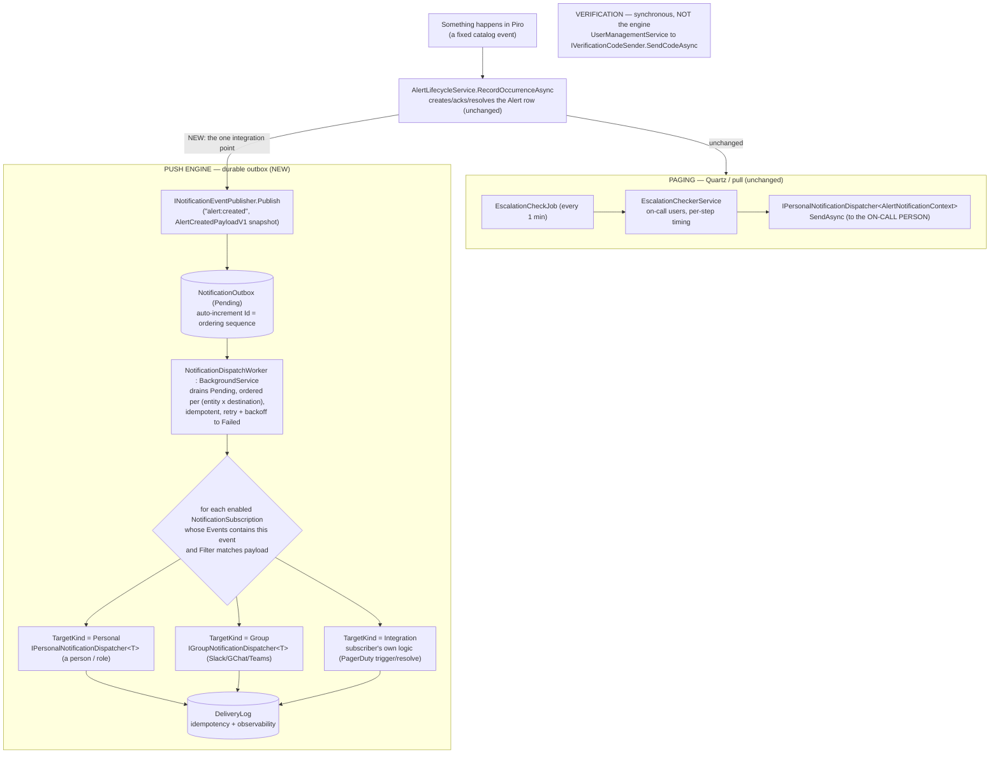

# RFC 0009 — Notification system revamp: an event catalog, contracted payloads, and a durable push engine

Status: proposal
Author: Arael Espinosa (https://github.com/cl8dep)
Date: 2026-07-18

## 1. Problem

Every outbound notification in Piro is forced through one interface shaped for one job, and the whole notification surface is bent around that mismatch. `INotificationDispatcher` (`src/Piro.Application/Interfaces/INotificationDispatcher.cs:8-28`) has exactly two methods and both address *one person's* handle:

```csharp
IntegrationType Type { get; }                                                       // :10
Task<bool> DispatchPersonalAsync(Integration? integration, string handle,
    AlertNotificationContext context, CancellationToken ct = default);              // :19
Task<bool> SendPersonalMessageAsync(Integration? integration, string handle,
    string message, CancellationToken ct = default);                               // :27
```

Four concrete problems follow from that single shape.

**1. Six dispatchers are dead stubs because the personal mould does not fit them.** `SlackDispatcher`, `DiscordDispatcher`, `MsTeamsDispatcher`, `GoogleChatDispatcher`, `OpsgenieDispatcher`, and `WebhookDispatcher` (all in `src/Piro.Infrastructure/Alerts/`) implement both methods as `Task.FromResult(false)` — e.g. `SlackDispatcher.cs:15-19`. Their `IntegrationType` values are `[Obsolete("Not supported for now.")]` (`src/Piro.Domain/Enums/IntegrationType.cs`: `Webhook=3` :49-50, `Slack=4` :56-57, `MSTeams=7` :93-94, `GoogleChat=10` :122-123, `Discord=11` :129-130), and none is registered (`InfrastructureServiceExtensions.cs:241-244` registers only Email, Telegram, Twilio, Ntfy). They return `false` not because they are unfinished but because they *cannot honestly implement a personal-handle method*: Slack, Discord, MS Teams, and Google Chat post to a **shared channel a whole team watches**, not to one individual. The `false` is the interface admitting a type mismatch.

**2. There is no way to notify a team channel at all.** A team that wants their Google Chat or Slack to know a service is down — *regardless of who is paged* — has no path. `EscalationCheckerService` walks a service's `EscalationPolicy` to on-call users' personal handles with an explicit "No fallback to any global channel." Group notification is not a missing dispatcher; it is a missing *delivery mode* the single interface cannot express.

**3. There is no event model, and no durable, retrying path for anything that is not on-call paging.** The only code that ever sends a notification is `EscalationCheckerService`, driven by a Quartz cron job firing every minute. Nothing publishes "an alert opened" or "an incident resolved" as a *fact* that other subscribers could react to. So there is no way to say "send alerts to Slack **and** Google Chat **and** PagerDuty," and no durable path that survives a restart for the notifications that are *not* timed on-call paging.

**4. Delivery contracts are entangled, so integrations cannot subscribe to what they care about.** PagerDuty is fundamentally different from Slack: Piro does not "send it a message," it **hands it the fact that an alert happened** and PagerDuty decides whether to page. RFC 0004 already models this as `ISystemEventDispatcher` (`src/Piro.Application/Interfaces/ISystemEventDispatcher.cs`, `trigger`/`resolve` with a dedup key). But that dispatcher is *called* with a routing key; there is no model where an integration **subscribes** to the events it handles and receives only those. Without that subscription model, third-party or hot-loaded integrations are impossible.

A fifth, smaller strain ties them together: `SendPersonalMessageAsync` is onboarding, not alerting — its sole caller delivers a one-time verification code (`src/Piro.Application/Services/UserManagementService.cs:369-370`) — yet it rides the alert interface, which is why every stub carries a *second* no-op method and `Pushover` is a half-stub (`DispatchPersonalAsync` works, `PushoverDispatcher.cs:21`; `SendPersonalMessageAsync` is stubbed, `:33-34`).

This RFC revamps the notification system around **one central idea**: Piro emits a fixed catalog of **events** with **contracted, stable payloads**, and everything — a person, a team channel, or an external integration like PagerDuty — is a **subscriber the admin configures against that catalog**. On-call paging is deliberately left exactly as it is (a timed, stateful, polled process); the event engine handles every *timing-free* notification.

## 2. Non-goals

- **Re-architecting on-call paging.** Paging is intrinsically temporal — "notify step 1, wait 5 minutes, if still active escalate to step 2" — which a polled Quartz job models well and an event bus models badly. `EscalationCheckerService`'s behavior (on-call resolution, per-step timing from RFC 0006, priority-ordered "first working preference wins") is unchanged. It is only recompiled against the renamed personal interface (§4.9). **Paging does not move onto the event engine.**
- **A dynamic event catalog.** Events are **hard-coded**: Piro's developers define the catalog (§4.2). An admin never invents an event; they *subscribe* to events from the fixed list. A configurable event-definition surface is explicitly out of scope.
- **Silencing / maintenance windows.** No mute rules, quiet hours, or maintenance mode in v1 (§7). Deferred until a user asks; the subscription and delivery seams are where it would grow.
- **`DeliveryLog` data retention.** The delivery log (§4.6) is built — it is what powers idempotency and admin observability — but its retention / purge policy is **out of scope for v1** (§8, tracked as a follow-up issue). The table grows unbounded in v1.
- **Tag-based subscription filters.** The tag model and selector grammar are RFC 0008's. Filtering a subscription by tag (`env:production`) is **deferred** until RFC 0008 lands (§8), tracked as a follow-up issue; a subscription works on severity alone until then.
- **A public-facing subscription surface.** End-user "subscribe to incident updates" (issues #8, #54) is per-visitor and public; it stays separate from these operator-facing subscriptions.
- **Hot-loaded `.dll` integrations.** The contracted payload (§4.3) and the subscriber contract (§4.4) are *designed to enable* pulling integrations out into independent plugins later — but v1 keeps all subscribers in the monolith. The plugin loader, its sandboxing, and its security surface are future work.

## 3. Design principle

**Piro emits a closed catalog of events with contracted payloads; everything that reacts is a subscriber the admin configures.** Three properties fall out of this and drive every decision below:

1. **The payload is a stable contract, not a domain entity.** A subscriber (a webhook, a future plugin) receives a frozen snapshot, never a live `Alert`/`Incident`. The contract evolves **additively** (§4.3) so it never breaks a consumer.
2. **The admin always decides what leaves.** An integration *declares* which events it can handle (its capability); the admin *activates* which of those actually fire, to which destination, with which filter. There is one subscription concept for people, group channels, and integrations alike.
3. **The delivery mode is a property of the dispatcher, not the provider.** Telegram and Ntfy send to a person *or* a group; expressing that requires two interfaces (§4.1), not one method with a mode flag.

Paging is the one flow that legitimately needs timed, stateful scheduling, so it keeps its own polled engine; everything else shares one durable, ordered, idempotent push engine.

## 4. Design



### 4.1 The three delivery contracts

The delivery mode is a property of the dispatcher a provider implements, not of the provider. A provider implements one, the other, or both.

| Mode | Contract | Target | Interface |
|---|---|---|---|
| **1. Personal** | Reach one person | Their own handle (chat id, phone, email) | `IPersonalNotificationDispatcher<TContent>` |
| **2. Group** | Post to a shared team space | A channel/room/topic (not a person) | `IGroupNotificationDispatcher<TContent>` |
| **3. Integration** | Hand the event to an integration that decides | The integration's own routing (e.g. a PagerDuty routing key) | the subscriber's own logic, over `ISystemEventDispatcher` (RFC 0004) for PagerDuty/Opsgenie |

Per-provider fit — the reason mode 1 and mode 2 must be *separate* interfaces, not one method with a mode flag:

| Provider | `IntegrationType` | Personal | Group | Integration | Notes |
|---|---|---|---|---|---|
| Email | `Email` | ✅ | — | — | The universal fallback (§4.10) |
| Twilio SMS | `Twilio` | ✅ | — | — | A phone number is one person |
| Pushover | `Pushover` | ✅ | — | — | User key = one person's devices |
| Telegram | `Telegram` | ✅ | ✅ | — | Same `chat_id` mechanism: private chat *or* group |
| Ntfy | `Ntfy` | ✅ | ✅ | — | A topic can be private or team-shared |
| Slack | `Slack` | — | ✅ | — | Incoming webhook → a channel |
| Google Chat | `GoogleChat` | — | ✅ | — | Webhook → a space |
| Discord | `Discord` | — | ✅ | — | Webhook → a channel |
| MS Teams | `MSTeams` | — | ✅ | — | Webhook → a channel |
| Webhook | `Webhook` | — | ✅ | — | Generic POST |
| PagerDuty / Opsgenie | — | — | — | ✅ | Subscribes to `alert:*`/`incident:*`; owns escalation (RFC 0004) |

`Telegram` and `Ntfy` implementing *both* personal and group is precisely what the single interface could not express: today a Telegram group and a Telegram DM would both squeeze through `DispatchPersonalAsync` with no way to say which is meant. Under this model they are **two subscriptions**, each resolving a different dispatcher instantiation (`IGroup…` vs `IPersonal…`) though physically the same `TelegramDispatcher` class.

> **Naming caveat.** `ISystemEventDispatcher` (RFC 0004) is unrelated to this RFC's `system:*` events. "System event" there means *an event handed to an external incident-management system* (PagerDuty). It is **not** a platform-health notification. The confusable name is RFC 0004's, already implemented; this RFC does not rename it, but every reader should keep the two apart.

### 4.2 The event catalog (closed, hard-coded)

Piro defines a fixed catalog. It is not configurable; adding an event is a code change owned by Piro's developers. v1:

| Event | Fires when | Payload |
|---|---|---|
| `alert:created` | an `Alert` row is created | `AlertCreatedPayloadV1` |
| `alert:acknowledged` | a human acks it (`Alert.AcknowledgedAt`/`AcknowledgedBy`, `Alert.cs:73,76`) | `AlertAcknowledgedPayloadV1` |
| `alert:resolved` | the alert clears (`Alert.ResolvedAt`, `Alert.cs:46`) | `AlertResolvedPayloadV1` |
| `incident:created` | an `Incident` is opened (born `Investigating`, `Incident.cs:17`) | `IncidentCreatedPayloadV1` |
| `incident:resolved` | it reaches a final state (`IsResolved` → `Resolved`/`Merged`, `Incident.cs:21`) | `IncidentResolvedPayloadV1` |
| `system:integration:expired` | an integration's connection expires/disconnects | `IntegrationExpiredPayloadV1` |

The name scheme is `domain:...:verb`, hierarchical with variable depth — the last segment is the state/verb (`system:integration:expired` leaves room for `system:job:failed`, `system:check:unschedulable` later). Incidents have no `acknowledged` (they are not acked; that is an alert concept), and their terminal contract name is `resolved`, matching `IncidentStatus.Resolved`.

### 4.3 Contracted payloads — one DTO per event, additive forever

Each event has its **own fixed DTO**. The DTO is a **complete, flat snapshot** built by the publisher at emit time (while the entity is live), **not** a live entity and **not** an id the subscriber resolves. A subscriber (a webhook, a future plugin) never touches Piro's DB. Because the snapshot carries severity, tags, service — filters (§4.5) evaluate against the payload with no DB read.

```csharp
// src/Piro.Application/Models/NotificationEvents/INotificationEvent.cs
public interface INotificationEvent
{
    string EventType { get; }   // "alert:created" — from the closed catalog
    int    Version   { get; }   // schema revision of THIS payload type
}

public record AlertCreatedPayloadV1(
    string EventType,               // "alert:created"
    int    Version,                 // 1
    int    AlertId,                 // Alert.cs:12
    string ServiceName,
    string CheckName,
    AlertSeverity Severity,         // enables the severity filter
    IReadOnlyList<string> Tags,     // ["env:production", …] — enables the tag filter (RFC 0008)
    DateTimeOffset FiredAt
) : INotificationEvent;

public record IntegrationExpiredPayloadV1(
    string EventType,               // "system:integration:expired"
    int    Version,
    Guid   IntegrationId,
    string IntegrationName,
    IntegrationType Type,
    DateTimeOffset ExpiredAt
) : INotificationEvent;
```

**Evolution rule — additive only.** The contract is one type that only grows; there is (almost) never a `V2`:

1. **Only add fields**, always optional/nullable with a safe default.
2. **Never break an existing field** — no rename, no type change, no meaning change.
3. **To retire a field**: mark it `[Obsolete]`, **keep populating it** for N releases (grace window), then remove it.
4. **`Version` is the schema revision** of the payload type — bumped when a field is added or obsoleted — so a consumer can require "version ≥ 5 for field X." It is *not* a type discriminator; all subscribers receive the same object and read the fields they know.

**A compatibility guard test** serializes each payload and diffs it against a **frozen golden snapshot** of the contract; renaming or removing a field without first `[Obsolete]`-marking it fails CI. Without this, "additive only" is broken by the first distracted PR.

Incident payloads carry the incident's real fields (title, status, affected services). **In v1 the payload is the same regardless of `IncidentVisibility` (`Incident.cs:33`)** — subscribing an integration to `incident:*` means it receives **all** incidents, private included. This is the admin's responsibility (§4.5, §4.7); the UI warns on it (§4.7).

### 4.4 Subscribers and subscriptions

Two halves, deliberately split: what an integration **declares** (code) and what an admin **activates** (data).

**What a provider declares — its capability, the menu.** A stable contract, the seam a future `.dll` grows from:

```csharp
// src/Piro.Application/Interfaces/INotificationSubscriber.cs
public interface INotificationSubscriber
{
    IntegrationType Type { get; }
    IReadOnlySet<string> SupportedEvents { get; }   // {"alert:created","alert:resolved","incident:*"…}
    NotificationTargetKind TargetKind { get; }      // Personal | Group | Integration
}
```

PagerDuty declares `SupportedEvents = {alert:*, incident:*}`, `TargetKind = Integration`. Slack declares group + the events it renders. Email declares personal. The provider **limits the menu**; the admin **orders from it**.

**What the admin activates — the subscription, the data.** One entity for all three modes:

```csharp
// src/Piro.Domain/Entities/NotificationSubscription.cs
public class NotificationSubscription
{
    public Guid   Id { get; set; }
    public string Name { get; set; } = string.Empty;   // "Prod alerts → PagerDuty"

    public string[] Events { get; set; } = [];          // ["alert:created","alert:resolved"] — subset of the destination's SupportedEvents
    public string?  FilterJson { get; set; }            // MinSeverity + (later) RFC-0008 tag selector; null = everything

    // The destination — polymorphic. TargetKind is DERIVED from the destination when the
    // provider supports a single mode; asked only when it supports both (Telegram/Ntfy).
    public NotificationTargetKind TargetKind { get; set; }   // Personal | Group | Integration
    public Guid?  IntegrationId { get; set; }            // Group/Integration — FK → Integration (Guid PK)
    public string? Target { get; set; }                  // room/space/topic; null if the integration self-addresses
    public int?    UserId { get; set; }                  // Personal — a specific person
    public SystemNotificationAudience? Role { get; set; } // Personal by role — Owners/Admins/Members

    public bool     Enabled { get; set; } = true;
    public DateTime CreatedAt { get; set; }
    public DateTime UpdatedAt { get; set; }
}

public enum NotificationTargetKind { Personal, Group, Integration }
```

The `NotificationDispatchWorker` fans an event out to every enabled subscription whose `Events` contains it and whose `FilterJson` matches the payload, then dispatches by `TargetKind`:

- `Personal` → resolve `IPersonalNotificationDispatcher<TContent>` for the user's / role members' channel(s).
- `Group` → resolve `IGroupNotificationDispatcher<TContent>` for the integration, post to `Target`.
- `Integration` → hand the payload to the subscriber's own logic (PagerDuty `trigger`/`resolve` over RFC 0004's `ISystemEventDispatcher`).

### 4.5 Filters — severity now, tags deferred

`FilterJson` is a small, fixed shape evaluated against the payload:

- **Minimum severity** — the payload's `Severity` must be ≥ the filter's floor. Available in v1.
- **Tag selector** — RFC 0008's `anyOf`/`allOf` selector matched against the payload's `Tags`. **Deferred** until RFC 0008 lands (§8); until then the field is hidden and a subscription behaves as "no tag filter." A subscription with a tag filter created before 0008 exists degrades to "no tag filter" — it never crashes the worker.

A null filter matches everything. `"send alerts tagged env:production to PagerDuty"` is a data-only edit of one subscription's filter — no code change (this is exactly the future scenario the design must support).

### 4.6 The push engine — durable outbox, ordering, idempotency

**Durable outbox.** A notification that says "your service is down" must survive a restart, and "with retries" is not honestly deliverable on an in-memory queue. The publisher writes a row; the worker drains it.

```csharp
// src/Piro.Domain/Entities/NotificationOutbox.cs
public class NotificationOutbox
{
    public long   Id { get; set; }               // auto-increment → the global monotonic ordering sequence
    public string EventType { get; set; } = "";  // "alert:created"
    public string OrderingKey { get; set; } = ""; // "alert:4821" — all events of one entity share it
    public string PayloadJson { get; set; } = "";
    public OutboxStatus Status { get; set; }      // Pending | Processing | Done | Failed
    public int    Attempts { get; set; }
    public DateTimeOffset? NextAttemptAt { get; set; }   // exponential backoff schedule
    public string? LastError { get; set; }
    public DateTimeOffset CreatedAt { get; set; }
    public DateTimeOffset? ProcessedAt { get; set; }
}
public enum OutboxStatus { Pending, Processing, Done, Failed }
```

`NotificationDispatchWorker : BackgroundService` (modeled on `StatusDrainHostedService.cs:19-38`) polls Pending rows whose `NextAttemptAt` has arrived and processes them with three guarantees:

**Ordering — per (entity × destination).** Events of one entity must reach a channel in the order they happened (`created → resolved → created → resolved` for a flapping service must not reorder). The auto-increment `Id` *is* the monotonic sequence — never wall-clock `CreatedAt`, which can tie or jump. Rule: for a given `OrderingKey`, a row is processed only when no earlier-`Id` row with the same `OrderingKey` is still `Pending`/`Processing`. Ordering is enforced **per destination**, not globally: if the `created` fails to Slack but succeeds to Google Chat, only the Slack delivery of the later `resolved` waits — Google Chat keeps flowing. A **`Failed`** (definitively dead) row **stops blocking** the entity's later events, so one broken destination cannot freeze an entity forever.

**Idempotency — effectively-once per (event × destination).** The outbox is at-least-once: a crash between "sent to Slack" and "marked Done" resends on restart. Each delivery carries a deterministic key `{eventType}:{entityId}:{subscriptionId}` (e.g. `alert:created:4821:sub-slack-ops`) — identical on every retry. Two defenses:
- **Dispatcher-native** (PagerDuty): passed as the RFC-0004 dedup key; the remote platform deduplicates.
- **No remote dedup** (Slack/GChat webhooks): `DeliveryLog` has a UNIQUE constraint on the key; before sending, an existing `Delivered` row with that key short-circuits (skip). At-least-once becomes effectively-once on Piro's side.

**Retry + poison quarantine.** On throw: `Attempts++`, `LastError` recorded, `NextAttemptAt` rescheduled with exponential backoff, until a **cap** moves the row to `Failed` (poison-message quarantine) with the error retained — never an infinite loop. A destination that fails permanently (revoked webhook) is a candidate to raise `system:integration:expired` (§4.2), which the admin can subscribe to.

**Delivery log — idempotency + observability.** Every attempt is recorded, which is both the idempotency ledger and the answer to "why didn't it reach Slack?":

```csharp
// src/Piro.Domain/Entities/DeliveryLog.cs
public class DeliveryLog
{
    public long   Id { get; set; }
    public string IdempotencyKey { get; set; } = "";   // UNIQUE → idempotency
    public string EventType { get; set; } = "";
    public Guid   SubscriptionId { get; set; }
    public string TargetKind { get; set; } = "";        // Personal | Group | Integration
    public string TargetDescriptor { get; set; } = "";  // "Slack #ops" — human-readable for the admin
    public DeliveryStatus Status { get; set; }          // Delivered | Failed | Skipped
    public string? Error { get; set; }
    public DateTimeOffset AttemptedAt { get; set; }
}
public enum DeliveryStatus { Delivered, Failed, Skipped }
```

The admin reads this when a notification does not arrive. **Its retention/purge policy is out of scope for v1** (§8) — the table grows unbounded and a follow-up issue tracks retention.

### 4.7 Admin UI

One screen in `apps/admin`: **Notification Subscriptions** — a list of rules with a "New subscription" wizard, ordered **destination → events → filter**:

1. **Destination.** A mixed list of people, roles, and connected integrations. `TargetKind` is **derived** when the provider supports a single mode (Slack ⇒ Group, PagerDuty ⇒ Integration, "me/role" ⇒ Personal). When the provider supports **both** (Telegram/Ntfy), a sub-step asks "to a person or to a group?" — driven by the provider's declared capability (`SendsPersonalNotification`/`SendsGroupNotification`/both, §4.8).
2. **Events.** Only the destination's `SupportedEvents` are offered — the admin cannot subscribe a channel to an event it cannot render.
3. **Filter (optional).** Minimum severity now; the RFC-0008 tag selector when it ships (§4.5). Subscribing to `incident:*` shows a **warning that the destination will also receive private incidents** (§4.3).

One component per file (`AGENTS.md`), `export default` at the bottom, `props: Props` destructured in the body.

### 4.8 The manifest declares the mode

Which delivery contracts a type honors becomes a manifest fact, so UI and runtime read it instead of hardcoding lists. `IntegrationCapability` (`src/Piro.Domain/Enums/IntegrationCapability.cs:9-40`) is `[Flags]`; its highest bit today is `SendsAlertEvents = 1 << 6` (`:37`, added by RFC 0004). Add the next free bit:

```csharp
SendsPersonalNotification = 1 << 0,   // existing (:15) — has a registered IPersonalNotificationDispatcher<>
SendsGroupNotification    = 1 << 7,   // NEW           — has a registered IGroupNotificationDispatcher<>
```

> **Bit correction.** An earlier draft of this RFC proposed `SendsGroupNotification = 1 << 5`. Since it was written, RFC 0004 (now implemented) took `1 << 5` (`RequiresOAuthConnection`) and `1 << 6` (`SendsAlertEvents`). `1 << 5` is occupied — the next free bit is `1 << 7`. Using `1 << 5` would silently mark every group channel as "requires OAuth."

Manifests updated: keep `SendsPersonalNotification` on Email/Twilio/Ntfy/Telegram/Pushover; **add** `SendsGroupNotification` to Telegram and Ntfy; drop `[Obsolete]` and add a full `[IntegrationManifest(… SendsGroupNotification …)]` to Slack/GoogleChat/Discord/MSTeams/Webhook; PagerDuty/Opsgenie keep their RFC-0004 `SendsAlertEvents` capability (mode 3). The flag is what the UI branches on. It flows through the existing `manifest.Capabilities.HasFlag(...)` reads (`IntegrationAppService.cs:76,114`) and `IntegrationManifestExtensions.CapabilityNames` (`src/Piro.Application/Extensions/IntegrationManifestExtensions.cs:44-48`) with no new plumbing.

### 4.9 Verification codes leave the alert interface

`SendPersonalMessageAsync` moves off the dispatchers into its own interface — sending a one-time code is transactional onboarding, not alerting, and stays **synchronous** (the user is waiting; it does not go through the async outbox):

```csharp
// src/Piro.Application/Interfaces/IVerificationCodeSender.cs
public interface IVerificationCodeSender
{
    IntegrationType Type { get; }
    Task<bool> SendCodeAsync(Integration? integration, string handle, string code, CancellationToken ct = default);
}
```

Personal plain-text channels (Email, Telegram, Twilio, Ntfy) implement it. `UserManagementService.SendNotificationPreferenceCodeAsync` (`UserManagementService.cs:354-373`) resolves from a `Dictionary<IntegrationType, IVerificationCodeSender>` — a one-line change to its lookup (`:363`) — and its existing "Channel does not support verification" guard (`:364`) now means "no `IVerificationCodeSender` registered," which is exactly right: a group-only type can never verify a personal handle, and the type system says so.

### 4.10 Email as the universal fallback

Email is the floor of the whole system — the channel assumed always available:

- When a destination fails permanently (poison, §4.6), the admin is notified **by email** (via the admin-role subscription) that it died — `system:integration:expired` carries this.
- When the failed thing *is* the notification channel itself, email still reaches the admins.
- Residual honest gap: if the broken thing is **SMTP itself**, there is no fallback — but the event is still **persisted** in `DeliveryLog` (and the outbox), so a future in-app admin feed surfaces it. v1 accepts this; it is strictly better than today's silence.

### 4.11 What does NOT change

- **Paging behavior.** `EscalationCheckerService`'s on-call resolution, per-step timing (RFC 0006), priority-ordered "first working preference wins," and "no fallback to a global channel" are unchanged. Paging stays polled/Quartz; it does not move onto the push engine, and (there being no silencing in v1) nothing here mutes it.
- **The alert lifecycle/evaluation** (`AlertEvaluationService`, `AlertLifecycleService`, `AlertConfig`, thresholds). The engine reads the *outcome* — the one addition is a single `Publish` at the point an `Alert`/`Incident` is created/acked/resolved.
- **`AlertNotificationContext`** — reused verbatim as the personal/group alert content; no field changes.
- **The `Channel<CheckStatusChangedEvent>` status pipeline** (`InfrastructureServiceExtensions.cs:132`, `StatusDrainHostedService`) — untouched; it recomputes public status and is unrelated to notifications.
- **`UserNotificationPreference`/`PersonalNotificationChannel`, the on-call/escalation model, the public status page, `ServiceStatus`/`PublicStatus`.**

### 4.12 Interfaces recompiled when `INotificationDispatcher` is deleted

Deleting the old interface is behavior-neutral at the call sites — two consumers recompile:

- `EscalationCheckerService`: `Dictionary<IntegrationType, INotificationDispatcher>` → `<…, IPersonalNotificationDispatcher<AlertNotificationContext>>`; `DispatchPersonalAsync(...)` → `SendAsync(...)`; injected `IEnumerable<INotificationDispatcher>` → `IEnumerable<IPersonalNotificationDispatcher<AlertNotificationContext>>`.
- `UserManagementService`: resolves `IVerificationCodeSender` instead (§4.9).

Both are mechanical renames — no logic change — and are the whole of phase 1.

## 5. Data / schema scope

New tables (one migration, auto-applied on startup — `db.Database.Migrate()`, `src/Piro.Api/Program.cs:205`):

- **`NotificationOutbox`** — §4.6. `Id` (bigint PK, the ordering sequence); `EventType`, `OrderingKey`, `PayloadJson`, `Status` (enum-as-string), `Attempts`, `NextAttemptAt?`, `LastError?`, `CreatedAt`, `ProcessedAt?`. Index on `(Status, NextAttemptAt)` for the drain query and `(OrderingKey, Id)` for the ordering check.
- **`DeliveryLog`** — §4.6. `Id` PK; **UNIQUE `IdempotencyKey`**; `EventType`, `SubscriptionId`, `TargetKind`, `TargetDescriptor`, `Status` (enum-as-string), `Error?`, `AttemptedAt`. No retention policy in v1 (§8).
- **`NotificationSubscriptions`** — §4.4. FK `IntegrationId` → `Integration` (`Guid`), `ON DELETE CASCADE`; nullable `UserId`, `Role`; `Events` (string[]), `FilterJson?`.

New enum flag: `IntegrationCapability.SendsGroupNotification = 1 << 7` (§4.8) — a new high bit, no ordinal shift, existing persisted capability sets unaffected.

New enums / types (no schema): `OutboxStatus`; `DeliveryStatus`; `NotificationTargetKind`; the `INotificationEvent` interface + the per-event payload records (`AlertCreatedPayloadV1`, `AlertAcknowledgedPayloadV1`, `AlertResolvedPayloadV1`, `IncidentCreatedPayloadV1`, `IncidentResolvedPayloadV1`, `IntegrationExpiredPayloadV1`); `INotificationSubscriber`.

New config: `SystemNotificationAudience` (`Owners`/`Admins`/`Members`) is reused as the `Role` target on subscriptions (audience by named role set — `Owners` = {Owner}, `Admins` = {Owner, Admin}, `Members` = {Owner, Admin, Member}), resolved by unioning `UserManager.GetUsersInRoleAsync(...)` (already used at `SetupController.cs:239`). The audience is never empty: the last Owner cannot be demoted (`UserManagementService.cs:174-178`).

New DbSets on `PiroDbContext` (`src/Piro.Infrastructure/Persistence/PiroDbContext.cs:18-53`): `NotificationOutbox`, `DeliveryLog`, `NotificationSubscriptions` (each with an auto-discovered `IEntityTypeConfiguration`, `:61`).

New DI (`InfrastructureServiceExtensions.cs`): the dispatchers re-registered under `IPersonalNotificationDispatcher<AlertNotificationContext>` / `IGroupNotificationDispatcher<AlertNotificationContext>` / `IVerificationCodeSender` per their modes (currently registered at `:241-244`); each `INotificationSubscriber`; `INotificationEventPublisher`; `NotificationDispatchWorker` as `IHostedService`.

**Manifest edits (no schema):** un-obsolete + add `[IntegrationManifest]` to Slack/GoogleChat/Discord/MSTeams/Webhook; add `SendsGroupNotification` to Telegram/Ntfy. `IntegrationType` ordinals frozen.

**Removed:** `INotificationDispatcher` (§4.12). **No changes to:** `Alert`/`AlertConfig`/`AlertNotificationContext` fields; `AppRole`/`AppUser`/Identity; `ServiceStatus`/`AlertSource`/`PersonalNotificationChannel`; the `Channel<CheckStatusChangedEvent>` pipeline.

## 6. Phased plan

Each phase is independently shippable.

1. **Interface split + verification extraction (pure refactor, no behavior change).** Introduce `IPersonalNotificationDispatcher<TContent>`, `IGroupNotificationDispatcher<TContent>`, `IVerificationCodeSender`; migrate the four registered dispatchers + Pushover; recompile `EscalationCheckerService` and `UserManagementService` (§4.12); delete `INotificationDispatcher`. Covered by recompilation + existing tests.
2. **Event catalog + contracted payloads.** `INotificationEvent`, the per-event payload DTOs (§4.3), and the **compatibility guard test** (frozen golden snapshot). No transport yet — payloads exist and are frozen.
3. **The push engine.** `NotificationOutbox` + `DeliveryLog` + `INotificationEventPublisher` + `NotificationDispatchWorker` with ordering, idempotency, retry/backoff (§4.6). Testable by publishing an event and asserting the outbox drains once, in order, idempotently — no source wired yet.
4. **Subscriptions + admin UI.** `NotificationSubscription` + `INotificationSubscriber` (§4.4) + CRUD + the wizard (§4.7), severity filter only. Wire the alert-path `Publish` (`AlertLifecycleService`) for `alert:created`/`alert:acknowledged`/`alert:resolved`.
5. **Group + integration dispatchers.** Implement `IGroupNotificationDispatcher<AlertNotificationContext>` for Slack/GoogleChat/Discord/MSTeams/Webhook (+ Telegram/Ntfy group paths); add `SendsGroupNotification`, un-obsolete, register; wire PagerDuty/Opsgenie as `INotificationSubscriber` over RFC 0004. Delivers the motivating case end-to-end (alerts → Google Chat + Slack + PagerDuty).
6. **Incident events + `system:integration:expired`.** Wire `incident:created`/`incident:resolved` publishes and the integration-expiry source.
7. **Tag filters (gated on RFC 0008 Part A).** Enable the tag selector in `FilterJson` and surface RFC 0008's selector editor.
8. **In-app admin feed (optional).** A read view over `DeliveryLog` and persisted `system:*` events.

## 7. Alternatives considered

- **Keep one dispatcher interface, add a `DispatchGroupAsync` method.** Rejected — personal-only types (Twilio) would carry a no-op group method and group-only types (Slack) a no-op personal method; "does this dispatcher support this call" stays a runtime `bool`. Separate generic interfaces make "Slack cannot page a person" unrepresentable at wiring time, and let Telegram/Ntfy honestly implement both.
- **Content renders itself (`INotificationContent.RenderFor(channel)`).** Rejected — it forces an `Application` content type to know every channel's format (an `Infrastructure` concern) and cross the layer boundary. The channel-renders-content model keeps rendering in `Infrastructure` where `AlertMessageTemplates` (`src/Piro.Infrastructure/Alerts/AlertMessageTemplates.cs:10-16`, Scriban) already lives.
- **Event payload = just an id, subscriber resolves from the DB.** Rejected — the payload is a **public contract** consumed by webhooks and future `.dll` plugins that cannot (and must not) query Piro's DB. A full, frozen snapshot is the only stable, self-contained form, and it is what lets filters run without a DB read.
- **Version the payload as `V1 → V2` coexisting types.** Rejected in favor of one additive-only type (§4.3) — it avoids per-version branches in every dispatcher; a consumer reads the fields it knows. `Version` is a schema-revision hint, not a routing discriminator.
- **A configurable/dynamic event catalog.** Rejected — a fixed, code-owned catalog is simpler and safe; an admin subscribes to events, they do not define them. The catalog is an enum, not a table.
- **An in-memory `Channel<T>` for the push engine.** Rejected — a broadcast/system notification must survive a restart, and "with retries" is not deliverable on a queue that loses events on crash. The durable outbox is the same event→drain idea with persistence, ordering, and idempotency the in-memory form cannot provide. It reuses no external mediator (no MediatR), keeping one event idiom.
- **Move paging onto the push engine too (one universal bus).** Rejected — escalation is inherently timed and stateful ("wait 5 min, if still active escalate"); on an event bus that means scheduling and cancelling future events per delay, reinventing the Quartz scheduler paging already uses correctly (RFC 0006). Paging stays polled; the engine handles only timing-free flows.
- **Per-service broadcast channels (`Service.BroadcastChannels`).** Rejected — does not scale: hundreds of services means configuring the same "→ #ops" hundreds of times. Central filter-matched subscriptions auto-cover present and future services.
- **Two separate subscription concepts (admin config vs integration code).** Rejected as the user-facing model — unified into one `NotificationSubscription` the admin configures, where the integration *declares* its `SupportedEvents` (the menu) and the admin *activates* which fire (the order). One place the admin controls flow, for all three modes.
- **Filter incident notifications by visibility.** Deferred, not designed, in v1 — subscribing to `incident:*` accepts all incidents including private ones, made the admin's explicit, warned-about choice. A visibility-aware payload/filter is a later refinement.
- **Silencing / maintenance windows in v1.** Cut — no user has asked yet; building it now is speculative. The subscription and delivery seams are where a `SilenceRule` (by service, time window, or ad-hoc snooze) would attach when the need is real.

## 8. Risks

- **Coupling to RFC 0008 for tag filters.** The selector grammar/`Tag` tables (subscription phase 7) are 0008's, unimplemented today. Mitigation: phases 1–6 carry no 0008 dependency; `FilterJson`'s tag part is optional and degrades to "no tag filter"; a subscription works on severity alone. **Tracked as a follow-up issue**, deferred until RFC 0008 Part A lands.
- **`DeliveryLog` grows unbounded — no retention in v1.** The log is essential for idempotency and observability but has no purge policy here. Mitigation: **out of scope, tracked as a follow-up issue**; a later job (like existing Quartz jobs) or a configurable retention window handles it. v1 accepts unbounded growth.
- **The outbox is new infrastructure with its own failure modes.** A stuck `Processing` row (worker crash mid-handle) or a poison event that always throws. Mitigation: a `Processing` row past a lease timeout is reclaimed to `Pending`; `Attempts` past a cap moves the row to `Failed` (quarantine) with `LastError` retained; a `Failed` row stops blocking its entity's ordering.
- **At-least-once delivery.** Without the idempotency ledger a crash mid-send double-posts to Slack/GChat. Mitigation: the deterministic `{event}:{entity}:{subscription}` key + `DeliveryLog` UNIQUE constraint make delivery effectively-once (§4.6); PagerDuty additionally dedups remotely.
- **Head-of-line blocking within an entity.** Ordering means a failing `created` delays that entity's later events **to that destination**. Intended (you must not send `resolved` before `created`), and bounded: it is per (entity × destination), so other entities and other destinations are unaffected, and a `Failed` row releases the block.
- **Fan-out volume and provider rate limits.** A datacenter-wide outage produces N services × M subscriptions of deliveries; Slack/GChat webhooks have rate limits. **Documented, not addressed in v1** — no throttling/batching yet; the per-integration seam is where rate-limiting would attach.
- **Private incidents leave Piro.** Subscribing an integration to `incident:*` sends private incident details to that destination. By design in v1 (§4.3), made the admin's explicit choice with a UI warning; a visibility-aware payload is deferred.
- **Un-obsoleting the six group types resurrects config classes that don't exist.** Slack/Discord/etc. have no `[IntegrationManifest]` and no `ConfigType` today. Each needs a real, validated config shape (webhook URL, bot token) in phase 5 — skipping it makes them creatable-but-broken.
- **Group message rendering is per-provider and unspecified here.** Each group dispatcher must render its payload into its provider's format (Slack blocks, Google Chat cards). This RFC defines the contract, not the payloads; poor rendering is a phase-5 quality risk and real per-provider work.
- **SMTP itself being the broken thing.** If email — the universal fallback (§4.10) — is what failed, its own failure notice cannot be emailed. Mitigation: the event is still persisted in `DeliveryLog`/outbox for a future in-app feed. v1 accepts the gap; it beats today's silence.
