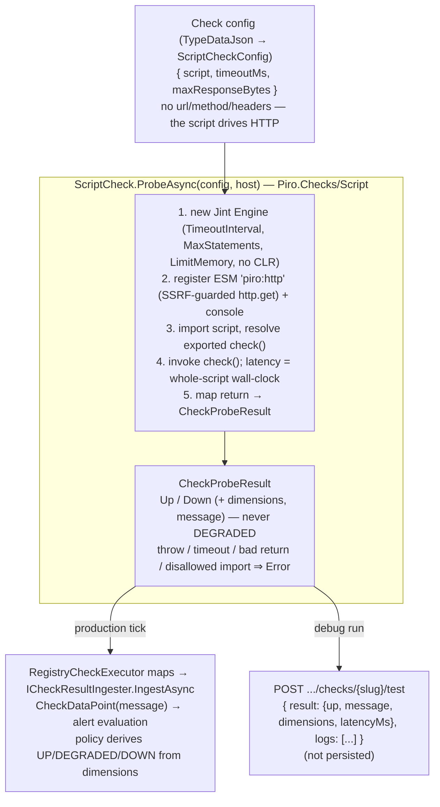

# RFC 0010 — Script check type (sandboxed JavaScript, operator-driven HTTP)

Status: accepted
Author: Arael Espinosa (https://github.com/cl8dep)
Date: 2026-07-17

> **Revised 2026-07-24 for the RFC 0016 check SDK.** This RFC was first written against the pre-0016
> architecture (`ICheckExecutor.ExecuteAsync(Check check, ...)`, the `CheckType` enum, `AllowedAlertFors`,
> `CheckExecutionResult`, checks in `Piro.Infrastructure/Checks/`, and a `check()` that returned
> `UP`/`DEGRADED`/`DOWN`). RFC 0016 replaced all of that: a check is a self-describing `ICheck` /
> `Check<TConfig>` whose `ProbeAsync(TConfig config, ICheckHost host, ct)` returns a raw `CheckProbeResult`
> (`Up`/`Down`/`Error` + dimensions), reaches Piro only through an allow-listed `ICheckHost`, and **never
> decides severity** — `DEGRADED` is the alert policy's decision, derived from the check's declared
> `DimensionSpec`s. The one operator-facing consequence: **`check()` no longer returns `DEGRADED`.** It
> returns `up` plus optional dimensions; the policy raises severity from those, exactly as the HTTP check
> now does with its `BodyRuleFailures` dimension (soft-rule failures keep the probe `Up` but feed a count
> the policy can threshold to DEGRADED). §3–§5 are rewritten to that model; the sandbox, `piro:http`
> module, SSRF guard, two-run-modes, and editor design are unchanged.

## 1. Problem

Piro can already fetch an HTTP endpoint and assert against its body, but it cannot **build a human-meaningful message out of what it read**, and it cannot express any logic more complex than a flat list of single-path assertions.

Concretely, the HTTP check's response rules (`HttpResponseRule`, `src/Piro.Application/Models/TypeData/HttpCheckData.cs:62-78`) evaluate one JSONPath/XPath/substring/regex per rule, and on failure emit a **fixed, machine-shaped message** built by string interpolation in `HttpCheckExecutor.EvaluateJsonPath` (`src/Piro.Infrastructure/Checks/HttpCheckExecutor.cs:152-155`):

```
JSONPath '$.status.indicator' = 'minor', expected 'none'.
```

Watching a status page like Stripe's Atlassian-style feed (`GET /api/v2/status.json` → `{ "status": { "indicator": "minor", "description": "Elevated Issuing API Errors" } }`) exposes both limits at once:

1. **The message is the wrong text.** The operator wants the alert to read *"Elevated Issuing API Errors"* — the value at `$.status.description`, which is sitting right there in the same body the rule already parsed — not the enum `minor` echoed back with the expected value. The rule has no way to pull one field into the message while asserting on another.
2. **The logic ceiling is too low.** Real status feeds need conditional/derived logic: *"DOWN only if `indicator` is `major` or `critical`; DEGRADED if `minor`; and if there's an active incident, put its `name` in the message."* That is three coupled decisions over two-to-three fields — impossible to express as an ordered list of independent `(path, expected)` rules, where the first failure wins and nothing composes.

A brief detour proved a plain "custom failure message with `{$.json.path}` placeholders" is a dead end: a template can substitute a field but can't branch, and the moment the operator needs "DOWN vs DEGRADED depending on the value" the template has to grow an expression language — at which point it *is* a scripting language, minus the sandbox story.

This RFC proposes a first-class **`Script` check type**: the operator writes a small JavaScript function that **makes its own HTTP request(s)** — importing an `http` module for that — runs arbitrary read-only logic over the response(s), and returns a raw verdict `{ up, message?, dimensions? }`. Piro does **not** pre-fetch anything; the script is the sole driver of what to call, when, and how many times. Its output becomes an ordinary `CheckProbeResult` (RFC 0016) — `Up`/`Down` plus any dimensions it measured — so alerting, dedup, and notifications work through the existing pipeline with **no special path** (§4.5). Like every RFC 0016 check, the script reports raw state; **severity (including DEGRADED) is the alert policy's call**, derived from the dimensions the script emits (§4.2).

The contract is:

```js
import http from 'piro:http';

export function check() {
  const r = http.get('https://www.stripestatus.com/api/v2/status.json');
  if (r.json.status.indicator === 'none') return { up: true };
  return { up: false, message: 'Stripe: ' + r.json.status.description };
}
```

`http` arrives via `import` (not as a `check` parameter) deliberately: it makes the capability surface **extensible** — a future module (`piro:dns`, `piro:crypto`, a templating helper) is just another `import x from 'piro:x'`, with no change to `check`'s signature and no growing parameter list. The set of importable modules is a Piro-controlled allowlist (§4.2).

## 2. Non-goals

- **A general compute/automation runtime.** This is a *check* — it observes and returns a verdict. It is not a place to run cron logic, mutate Piro state, or orchestrate side effects. The only egress is read-only HTTP GET via the `piro:http` module (§4.3), and the only output is `{ up, message?, dimensions? }`.
- **The script deciding severity.** `check()` returns a raw `up` boolean plus optional dimensions; it cannot return `DEGRADED` (or any severity). Turning outcome + dimensions into UP/DEGRADED/DOWN is the alert policy's job (RFC 0016), the same for a script as for HTTP. A script that wants a "degraded" middle ground emits a numeric dimension and the policy thresholds it (§4.2).
- **Write access to anything.** No filesystem, no database, no environment variables, no Piro entities, no CLR interop. The sandbox is deny-by-default (§4.4): the script can only `import` modules Piro has put on the allowlist (§4.2), and today that is exactly one — `piro:http`.
- **Arbitrary npm / ES modules.** `import` resolves **only** Piro-provided `piro:*` modules from an in-memory allowlist (§4.2); there is no `node_modules`, no filesystem module resolution, no network module fetch. `import x from 'node:fs'` (or any unlisted specifier) fails at load.
- **Languages other than JavaScript.** Lua/WASM/C#-scripting were weighed (§7); v1 is JavaScript via Jint. Not a plugin system for arbitrary engines. (Per the issue this implements, this is also explicitly **not** an OS script/binary runner — no shell command, child process, or exit-code contract; that framing was rejected for its arbitrary-execution blast radius.)
- **`POST`/other verbs or a full HTTP client in `http`.** v1 exposes `http.get` only (§4.3). Verbs with bodies widen the abuse surface for no status-page use case on the table. A future `http.post` is an additive change to the same module, not a new contract.
- **Persisting script logs in production.** `console.log` is captured only in the on-demand debug run (§4.6); in scheduled production runs it is a no-op. Piro grows **no** log-storage column for scripts (§5).
- **Replacing the HTTP check.** The HTTP check with response rules stays exactly as-is for the common "assert status code + one path" case. Script is the escape hatch for logic that doesn't fit, not a deprecation of rules.
- **A general per-job wall-clock deadline in the dispatcher.** Today each executor owns its own timeout (`HttpCheckExecutor` via `client.Timeout`, `HttpCheckExecutor.cs:34`); this RFC follows that convention (§4.4) rather than introducing a dispatcher-level deadline for all check types.

## 3. Design principle

**The script is a self-contained `check() → { up, message?, dimensions? }` function that pulls its capabilities via `import` and whose output is an ordinary `CheckProbeResult`; every hard problem it raises — sandboxing, egress, timeout — is solved inside the check's `ProbeAsync`, and nothing downstream learns that a script was involved.** Everything below traces to this: `ScriptCheck` is one more RFC 0016 `ICheck` picked up by the check registry (§4.1); capabilities are a Piro-controlled module allowlist resolved through the `ICheckHost` so the surface grows without changing the contract (§4.2); the raw result flows through the same ingester → alert-evaluation path every check uses, with the alert policy deciding severity from the declared dimensions (§4.5); the two "modes" (§4.6) differ **only** in what `console.log` does, so there is a single execution path and no "worked in test, failed in prod" gap.

## 4. Design



The operator's script:

```js
import http from 'piro:http';
export function check() { const r = http.get(url); return { up, message, dimensions }; }
```

### 4.1 `ScriptCheck` and the `Script` check type

A new `ScriptCheck : Check<ScriptCheckConfig>` in `Piro.Checks/Script/`, mirroring the other checks
(`HttpCheck`, `SslCheck`). Its `CheckId` is the string `"Script"` (the RFC 0016 discriminator, persisted
on every `Check` row); no `CheckType` enum is involved (RFC 0016 killed it).

```csharp
public sealed class ScriptCheck : Check<ScriptCheckConfig>
{
    public override string CheckId => "Script";
    public override CheckManifest Manifest => new()
    {
        Label = "Script",
        Description = "Run a small sandboxed JavaScript check() that drives its own HTTP and returns a verdict.",
        ConfigType = typeof(ScriptCheckConfig),
        Dimensions = [CommonDimensions.Status, CommonDimensions.Latency],  // + any the script emits (§4.2)
        DefaultIntervalSeconds = 300,   // 5-min floor: a script runs arbitrary code (§5)
    };
    public override Task<CheckProbeResult> ProbeAsync(ScriptCheckConfig config, ICheckHost host, CancellationToken ct = default) { ... }
}
```

This reuses the RFC 0016 check plumbing **entirely**: registering `ScriptCheck` in the check registry is
all that is needed for the scheduler → `RegistryCheckExecutor` path to pick it up and for it to appear in
`GET /api/v1/checks/types` with an auto-generated config form. There is no per-type executor and no
dispatcher change — `RegistryCheckExecutor` is the single adapter for every check.

**HTTP egress comes through the host, not an injected client.** The check resolves an `IHttpClientFactory`
via `host.GetRequiredService<IHttpClientFactory>()` (already on the check-host allow-list, used by the
HTTP and GCP checks) and takes the named `"piro-http"` client, which backs the `piro:http` module's
`http.get` (§4.3) — the **only** outbound path. That client carries the SSRF `ConnectCallback` (§4.4). The
check never sees a repository, the `Check` entity, or the DbContext; the boundary is unchanged.

**Alert dimensions are declared, not switched on.** The manifest's `Dimensions` list (`Status`, `Latency`,
plus any the script emits) is what the generic alert evaluator uses — there is no `AllowedAlertFors` switch
to extend (that mechanism was replaced by `DimensionSpec` in RFC 0016). A script's verdict is status-oriented
(`Up`/`Down` + optional numeric dimensions), so `Status` is always present and any script-emitted metric is
declared alongside it.

### 4.2 The script contract, the module system, and injected APIs

The script is an **ES module** that imports what it needs and exports a parameterless function named `check`:

```js
import http from 'piro:http';

export function check() {
  const r = http.get('https://www.stripestatus.com/api/v2/status.json');
  return { up: boolean, message?: string, dimensions?: { [name: string]: number } };
}
```

`check()` takes **no parameters** — every capability arrives through `import`. There is no Piro-issued "primary response": the script decides which URL(s) to fetch and when. This is what makes the Stripe case (§1) and multi-endpoint feeds (a summary + an incidents call) both natural — the script simply calls `http.get` as many times as it needs.

**The return is a raw verdict, not a severity.** `up` is the outcome (`true` → `Up`, `false` → `Down`); `message` is the human detail; `dimensions` is an optional bag of named numeric measurements the script wants the alert policy to be able to threshold. The script **cannot** return `DEGRADED` — that is the policy's decision. To express a "degraded" middle ground, the script emits a numeric dimension (e.g. `{ dimensions: { Severity: 1 } }`, or a domain metric like an error-rate percentage) that it also **declares in the manifest** so the alert form offers it; the operator then configures a threshold that maps to a DEGRADED-severity alert. This is exactly the pattern the HTTP check uses with its `BodyRuleFailures` dimension (a soft-rule failure keeps the probe `Up` but raises the count the policy alerts on).

**The module allowlist.** `import` resolves against a Piro-controlled, **in-memory** allowlist — not `node_modules`, not the filesystem, not the network. Each allowed module is registered on the Jint engine before the script runs; any `import` of an unregistered specifier fails at module-load and maps to `FAILURE` (§4.4). A spike confirmed both halves: `import http from 'piro:http'` resolves to a C#-backed object and its export is invocable, while `import fs from 'node:fs'` is rejected with *"Module 'node:fs' is not available."* The v1 allowlist is exactly one module:

**`piro:http`** — default export is the `http` object; its one method is `http.get` (§4.3).

Extending the surface later is purely additive: register `piro:dns`, `piro:crypto`, a `piro:template` helper, etc., on the engine and document it; existing scripts and the `check()` signature are unaffected. This is the core reason `import` was chosen over passing capabilities as `check(...)` arguments.

**`console.log`** — a global (not an import), mode-dependent (§4.6): captures to a buffer in a debug run, no-op in production. Same script, same verdict either way.

**Standard JS** available via Jint: `JSON`, `String`, `Number`, `Boolean`, `Array`, `Object`, `Math`, `RegExp`, `Date`. **Absent by construction:** `fetch`, `XMLHttpRequest`, `require`, `process`, `setTimeout`/timers, and any CLR/`System.*` type (§4.4). `import` exists but resolves *only* the allowlist.

**Editor typing (JS runtime, TS-grade ergonomics).** The runtime is plain JavaScript — Jint executes JS, not TypeScript, and no transpile step is introduced (rejected in §7). To give operators autocomplete and type-checking *as they write*, the admin editor (§4.7) loads a hand-maintained **`.d.ts`** describing the `piro:http` module, the `HttpResponse` shape, and the `check` return type. The operator gets a TypeScript-like authoring experience; what is stored and run is the JS they typed. The ESM `import … export function check()` syntax is valid in both JS and TS, so nothing about the contract changes.

**The Stripe case, fully expressed** (the motivating example from §1). The script maps Stripe's
`indicator` to a numeric `Severity` dimension and reports `up` — the alert policy turns `Severity` into
DEGRADED vs DOWN via thresholds, so the script never names a severity:

```js
import http from 'piro:http';

// The check declares a "Severity" dimension in its manifest; the operator sets thresholds:
//   Severity >= 1  → DEGRADED-severity alert,  Severity >= 2 → DOWN-severity alert.
export function check() {
  const s = http.get('https://www.stripestatus.com/api/v2/status.json').json.status;
  if (s.indicator === 'none')  return { up: true, dimensions: { Severity: 0 } };
  if (s.indicator === 'minor') return { up: true, message: 'Stripe: ' + s.description, dimensions: { Severity: 1 } };
  return { up: false, message: 'Stripe: ' + s.description + ' (' + s.indicator + ')', dimensions: { Severity: 2 } };
}
```

(If the operator only cares about hard up/down, they skip the dimension entirely and return `{ up }` — the
"degraded middle" is opt-in, expressed as a measurement plus a threshold, never as a status the script picks.)

### 4.3 The `piro:http` module — GET only, full-object return, opt-in per-call timeout

`http.get` is the script's only network egress. It is deliberately minimal:

```js
const r = http.get(url);                          // simplest form
const r = http.get(url, { headers: {...} });      // custom headers
const r = http.get(url, { timeoutMs: 3000 });     // opt-in per-call timeout
// r.statusCode, r.body, r.json, r.headers
```

- **GET only** (§2) — a future `http.post` is additive to this same module.
- **Returns the full object** `{ statusCode, body, json, headers }` (not just parsed JSON), so a script can branch on status code / content-type and degrade gracefully when a body isn't JSON (`r.json` is `null` then).
- **SSRF-guarded** (§4.4) on every call, including re-validation of the resolved IP (anti-rebinding).
- **`body` capped** at `maxResponseBytes` (§4.4, §5).
- **Per-call timeout is opt-in, not a config field.** There is no global `httpGetTimeoutMs`; the whole-script `timeoutMs` (§4.4) is the only budget Piro imposes. If an operator wants to bound a *specific* slow call, they pass `{ timeoutMs }` to that `http.get` — fine-grained control lives in the script, where the operator can see which call it applies to, rather than as an opaque global. An un-timed `http.get` is still bounded by the script-wide `timeoutMs` (a hung call can never exceed the total budget).

### 4.4 Sandbox and resource limits

The sandbox is **deny-by-default** — a fresh `Jint.Engine` exposes no host capabilities; the script can touch only the globals and the allowlisted modules §4.2 registers. On top of that, three limits, a constrained module loader, and one network guard:

```csharp
var engine = new Engine(o => o
    .EnableModules(new AllowlistModuleLoader())                  // in-memory; rejects any non-piro: specifier
    .TimeoutInterval(TimeSpan.FromMilliseconds(data.TimeoutMs))  // whole-script wall-clock kill
    .MaxStatements(MaxStatements)                                // CPU-spin / infinite-loop guard
    .LimitMemory(MaxMemoryBytes)                                 // allocation ceiling
    .Strict());                                                  // no sloppy-mode footguns
engine.Modules.Add("piro:http", b => b.ExportObject("default", new ScriptHttp(httpClient)));
// console bound per mode (§4.6). No engine.SetValue of any other CLR type;
// Jint CLR interop is left OFF (default) — the primary escape vector, kept shut.
```

The `AllowlistModuleLoader` is a custom `IModuleLoader` that resolves specifiers **in memory** (no filesystem base path) and refuses to load anything not pre-registered — the spike verified `node:fs` is rejected cleanly this way. `TimeoutInterval` and `MaxStatements` are complementary: a spike proved `while(true){}` is caught by `MaxStatements` almost instantly, while `TimeoutInterval` bounds a script blocked on a slow `http.get`.

**The `Engine` is ephemeral — one per `ExecuteAsync`, never shared or cached.** Jint's `Engine` is **not thread-safe**, and Piro runs checks concurrently (Quartz `MaxConcurrency = ProcessorCount * 2`, `InfrastructureServiceExtensions.cs:136`), so distinct script checks execute on parallel threads. A shared/pooled engine would corrupt state across those threads. The executor therefore constructs a fresh `Engine` inside each `ExecuteAsync` call and discards it when the method returns — the construction cost is negligible next to the network calls the script makes, and it guarantees no cross-check state leakage (a script cannot stash a value in one run and read it in another). This is a hard invariant, not an optimization choice.

**Timeout is kill-and-report against the whole script.** `timeoutMs` (default 10 000, §5) is the total budget for `check()` — all its logic plus every `http.get` it makes. If the script runs past it (e.g. a 10 s budget reached at 11 s), Jint's `TimeoutInterval` aborts it and `ProbeAsync` returns `CheckProbeResult.Failed("Script timed out after {timeoutMs} ms.")` (outcome `Error`). There is no separate network budget; a per-call `{ timeoutMs }` on an individual `http.get` (§4.3) is an optional refinement *within* this total.

**Latency = whole-script wall-clock.** With no Piro-issued primary fetch, the reported `Latency` dimension is the wall-clock time of the entire `check()` invocation (JS logic + all `http.get` calls) — measured by a stopwatch around `engine.Invoke(check)` and emitted via `CommonDimensions.Latency.Measure(ms)`. This is what the operator perceives as "how long the check took," and it feeds the same latency dimension every other check reports.

**SSRF guard — new, because none exists to reuse.** There is today **no** private-IP / metadata-endpoint protection anywhere: `piro-http`/`piro-http-noredirect` have no `ConnectCallback` at all (`InfrastructureServiceExtensions.cs:94-96`), and the two handlers that *do* have one (`oidc-http` `:76-82`, `piro-webhook` `:110-116`) resolve DNS only to force IPv4, with an explicit comment to that effect (`:109`) and no address validation. So this RFC **introduces** a guard: a shared `SocketsHttpHandler.ConnectCallback` that resolves the host and **rejects** loopback (`127/8`, `::1`), link-local / cloud metadata (`169.254/16`, notably `169.254.169.254`), and RFC-1918 private ranges (`10/8`, `172.16/12`, `192.168/16`), plus `localhost`/`metadata.google.internal` by name. Because the guard validates the **resolved IP** (not the hostname), it also defeats DNS-rebinding — a host that resolves to a public IP at check-authoring time but a private one at run time is caught at connect. The guard is applied to the `"piro-http"` client that backs `piro:http` — and since *all* of a script's network egress goes through that one module, there is a single guarded choke point with no unguarded path around it. **It is retrofittable to `piro-webhook` and the HTTP check's own clients** (which are equally unguarded today), so this RFC's guard doubles as the fix for a pre-existing exposure — but hardening those other paths is called out as follow-up, not folded into this RFC's blast radius.

**Threat model.** The script author is the Piro **operator**, not an anonymous end user — someone who already has server access. The guard therefore targets *accidental* SSRF (a copy-pasted script pointed at an internal URL) and defense-in-depth against a compromised-config scenario, not a fully hostile tenant. This is why deny-by-default + resource limits + IP guard is proportionate, and a full VM/WASM jail (§7) is not.

**Failure mapping.** A script that throws, times out, exceeds a limit, or returns something that is not `{ up: boolean, ... }` produces `CheckProbeResult.Failed(...)` (outcome `Error`) with a diagnostic message. `RegistryCheckExecutor` maps `Error` to the `FAILURE` status, which the ingester **excludes from alert evaluation** — so a broken script does **not** spam alerts; it records a `FAILURE` datapoint the operator sees on the check, exactly as an unregistered check type or a crashed executor does. This is the RFC 0016 `CheckOutcome.Error` contract ("the check itself failed to run — the policy treats this apart from a real Down"), not a Script-specific rule.

The script chooses only `up: true`/`false`. It cannot select a status string, a severity, or `Error`/`NO_DATA` — those are Piro-owned (severity is the policy's; `Error`/`NO_DATA` are outcomes Piro assigns).

### 4.5 What flows downstream — reuse, no parallel path

`ScriptCheck.ProbeAsync` returns a `CheckProbeResult` **identical in shape** to every other check's, so `RegistryCheckExecutor` and the entire post-execution pipeline are reused verbatim:

- `RegistryCheckExecutor` maps the outcome to a status and the dimensions to the datapoint, then the dispatcher calls `ICheckResultIngester.IngestAsync`.
- The `message` lands in `CheckDataPoint`'s message field and becomes the alert's frozen text — **the script's `message` becomes the alert message with no new code**.
- The generic alert evaluator reads the check's declared `Dimensions` (Status, Latency, plus any the script emitted such as `Severity`) and applies the operator's `AlertConfig` thresholds — **this is where DEGRADED vs DOWN is decided**, uniformly with every other check.
- `AlertLifecycleService` fingerprints the message and folds repeats into `OccurrenceCount`.

The check is configured with an ordinary `AlertConfig` whose severity/thresholds/escalation behave exactly as for an HTTP check. **No alert-pipeline change is required** — this is the point of returning an ordinary `CheckProbeResult` rather than inventing a script-specific alert path or letting the script name a severity.

**The one downstream subtlety — dedup (documented, not code-changed).** Fingerprinting is exact-match over the normalized message (`AlertLifecycleService.Fingerprint`, `:143-148`: trim + lowercase + collapse whitespace). If a script embeds a **volatile** value in `message` (a timestamp, a rotating incident id, a counter), every run yields a different fingerprint, so each occurrence opens a *new* alert instead of incrementing `OccurrenceCount` on the existing one — the "Occurrence: 13" folding breaks. This is not a Script-specific bug (any check whose message varies per run hits it), but Script makes it easy to trigger — most directly via `Date` (available in the JS environment, §4.2): a `message` that includes `new Date().toISOString()` or `Date.now()` changes every run. The mitigation is **documentation + UI guidance** (§4.7), not a mechanism change: advise keeping `message` stable for a given failure condition and putting volatile detail (timestamps, ids) in `console.log` (debug-only) rather than the returned message. Auto-normalizing volatile substrings out of the fingerprint is explicitly rejected (§7) — it guesses at intent and would mask genuinely distinct failures.

### 4.6 Two run modes, one execution path

There are two ways a script runs, differing in **exactly one thing** — what `console.log` does:

| | Production (scheduled) | Debug (`POST …/test`) |
|---|---|---|
| Trigger | Quartz `CheckExecutionJob` → dispatcher | Operator clicks "Test" in the admin |
| `console.log` | **no-op** (executes without error, captures nothing) | captured to an in-memory buffer, returned to the caller |
| `http.get` | real, SSRF-guarded | **real, SSRF-guarded** (identical — not mocked) |
| Result persisted? | yes (`CheckDataPoint`, alert eval) | **no** (returned in the HTTP response only) |
| Output | `CheckProbeResult` | `{ result: {up, message, dimensions, latencyMs}, logs: [...] }` |

Keeping `http.get` **real in debug** (a design decision) means the operator tests the *exact* code path production runs — eliminating the classic "passed in test, failed live" gap that a mocked egress would create. The only asymmetry is log capture, which cannot change the verdict.

Production is a no-op-`console` rather than "persist logs only on failure" (an earlier idea) because that heuristic is muddy — a permanently-failing check would spam log rows — and Piro has **no** column to store them anyway (§5). Debug logs live only for the duration of the HTTP response.

Mechanically, the mode is a parameter to a shared internal run method; both call sites build the same engine and register the same `piro:http` module, differing only in the `console` object bound (`{ log: buffer.Add }` vs `{ log: _ => {} }`).

### 4.7 UI — Script config editor and the Test panel (`apps/admin`)

The admin panel is the Vite SPA (`apps/admin`). Since RFC 0011/0016 the check config form is **entirely
schema-driven**: `SchemaConfigSection` renders `DynamicConfigForm` from the type's `configSchema` (reflected
from `ScriptCheckConfig`), so there is **no per-type `ScriptConfig.tsx` to write** — declaring the config
record is enough for the form to appear. Because the script drives its own HTTP (§4.2), there is no
URL/method/headers form; the schema surfaces the `Script` code field plus the numeric limits.

**(a) The code field — a CodeMirror upgrade already stubbed for this RFC.** `ScriptCheckConfig.Script`
carries `[CodeField]`, which the schema engine emits as `ConfigFieldType.Code`. `FieldControl` already
renders `Code` today (as a monospace `<textarea>`) with an explicit `TODO(RFC 0010): swap for a CodeMirror
editor once that dependency lands`. This RFC lands that dependency: a shared `CodeEditor.tsx` wrapping
**CodeMirror 6** (`@uiw/react-codemirror` + `@codemirror/lang-javascript`) with JS highlighting, line
numbers, bracket matching, and a theme-aware look; `FieldControl`'s `Code` case renders it instead of the
textarea, so **every** `Code` field (not just Script) gets the editor. A hand-maintained `.d.ts` for
`piro:http` / `HttpResponse` / the `check` return type is loaded for autocomplete (JS runtime, TS-grade
ergonomics, §4.2). The field seeds a template and shows the §4.5 dedup warning inline. `@codemirror/lint`
renders a Test-panel FAILURE that carries a line as an inline diagnostic on that line.

  CodeMirror 6 (not Monaco) is modular, bundles cleanly under Vite without Monaco's web-worker setup, and
  is proportionate to a ~20-line function. It can be `React.lazy`-split so non-code pages don't pay for it.

The numeric limits (`timeoutMs`, `maxResponseBytes`, §5) render as ordinary number fields from the same
schema. Validation and defaults come from the schema too (`seedDefaults(typeMeta.configSchema)`), so there
is no hand-written Zod branch or `typeDataJson` serializer to add — another consequence of the schema-driven
form replacing the old per-type wiring.

**(b) The Test panel.** A **"Test"** button (distinct from the detail page's "Run now", which triggers the
*real, persisted* run) posts the current form's config to the debug endpoint (§4.8) and renders the response
inline: the returned outcome (**up/down** badge, or a distinct **FAILURE** state), the **message**, the
**latency** and any **dimensions** the script emitted, and a scrollable **logs** list (captured `console.log`).
The operator iterates the script against the live endpoint and sees the verdict + logs without saving or
firing an alert. A new `checksApi.test` action method (mirroring the existing `run`/`logs`) calls it. The
Test panel shows the raw outcome, **not** a severity — severity is the alert policy's, decided from the
dimensions once the check is saved with an `AlertConfig`. The FAILURE state renders its diagnostic message
(blocked SSRF host, timeout, thrown error) so the operator can fix the script.

### 4.8 API — the debug endpoint

One new endpoint on `ChecksController` (`src/Piro.Api/Controllers/ChecksController.cs`, route `api/v1/services/{serviceSlug}/checks`), alongside the existing `POST /{checkSlug}/run` (`:74-83`):

```
POST /api/v1/services/{serviceSlug}/checks/{checkSlug}/test   -> { result, logs }
```

Unlike `run` — which calls `checkRunner.RunAsync` and goes through the full persist-and-alert path — `test` runs the `ScriptCheck` **in debug mode** and returns `{ result: { up, message, dimensions, latencyMs }, logs: string[] }` **without** writing a `CheckDataPoint` or touching alert evaluation. To support editing-before-saving, it accepts the candidate `ScriptCheckConfig` in the request body (so the operator tests unsaved edits), falling back to the persisted config when the body is empty. `http.get` runs for real under the same SSRF guard. The response carries the raw outcome and dimensions, not a status/severity — mirroring what the check itself returns.

### 4.9 What does NOT change

- **The dispatch mechanism and the check SDK.** The scheduler → `RegistryCheckExecutor` path, the routing/dispatch, and the SignalR `WorkerExecuteMessage` contract are untouched — `ScriptCheck` is resolved from the check registry by its `"Script"` discriminator like every other check, and its config rides the existing `TypeDataJson` field with no new wire field (subject to the size ceiling in §8). No change to `ICheck` / `ICheckHost` / `CheckManifest` / `CheckProbeResult`; Script only *uses* them. The worker gains Jint transitively via `Piro.Checks` (§5).
- **The alert pipeline.** `AlertConfig`, the generic alert evaluator, `AlertLifecycleService`, the ingester, notification dispatchers, and escalation are reused as-is (§4.5). Script is a new *producer* of an ordinary `CheckProbeResult`, not a parallel evaluator, and it does **not** decide severity.
- **`CheckProbeResult` / `CheckDataPoint` schema.** No new fields (§5). The script's `message` reuses the datapoint message; its dimensions reuse the existing jsonb dimensions bag; debug logs are never persisted, so they need no column.
- **The HTTP check.** `HttpCheck` and its response rules are unchanged; Script is additive, not a replacement (§2).
- **`ServiceStatus` semantics and the public status page.** No new status value; the check reports `Up`/`Down`, the policy derives UP/DEGRADED/DOWN, and a broken script is `FAILURE` (non-alerting), exactly as today.

## 5. Data / schema scope

- **New check class + discriminator:** `ScriptCheck` with `CheckId = "Script"` (RFC 0016 string discriminator; no `CheckType` enum — it was killed by RFC 0016). Registered in the check registry.
- **New config record:** `ScriptCheckConfig` in `Piro.Checks/Script/` (beside the check, where the other check configs live), round-tripped through the existing `Check.TypeDataJson` string column. No `url`/`method`/`headers` — the script issues its own requests via `piro:http` (§4.2). Fields:

  ```csharp
  public record ScriptCheckConfig
  {
      [CodeField]  // ConfigFieldType.Code — already exists in Piro.Contracts; FieldControl renders it
      public string Script { get; init; } = string.Empty;   // the ESM: import + export function check()
      [JsonPropertyName("timeout")]
      public int TimeoutMs { get; init; } = 10_000;          // whole-script wall-clock; kill-and-report on overrun
      public int MaxResponseBytes { get; init; } = 1_048_576;// cap on any http.get body (1 MiB)
  }
  ```

  `[CodeField]` and `ConfigFieldType.Code` **already exist** (`Piro.Contracts`), with `FieldControl`
  already rendering the type and a `TODO(RFC 0010)` to upgrade it to CodeMirror (§4.7) — so the config
  form needs no new field-type work, only the editor upgrade.

  A per-`http.get` timeout is **not** a field here — it is passed opt-in inside the script (`http.get(url, { timeoutMs })`, §4.3), always within the whole-script `TimeoutMs` budget.

- **Script size limit — 4 KB (v1).** The `Script` string is capped at **4096 bytes (UTF-8)**, validated on write in `CheckAppService` (the same guard site as `EnsureScheduleWithinBounds`, RFC 0011) and mirrored in the editor for immediate feedback; the backend is authoritative. 4 KB is a conservative v1 ceiling — comfortably under the SignalR frame (§8), and generous for a status-page check (the Stripe example is ~200 bytes) while foreclosing pathological payloads. It is deliberately raisable later (a named constant, not a magic number), hence "v1".

- **Minimum interval: 5 minutes, declared in the manifest.** Because a script runs arbitrary code, its schedule floor is more conservative than other types' — 5 minutes vs the 1-minute global floor. This is expressed via the check's `CheckManifest` (`DefaultIntervalSeconds = 300` and the interval-limit validation RFC 0011 enforces), not a hard-coded special case. `TimeoutMs`'s effective ceiling is the check's own interval, which combined with `[DisallowConcurrentExecution]` means a script run always finishes before its next scheduled fire — no overlap accumulation.

- **No new DB migration.** `Script` config lives in the existing `TypeDataJson` column; no new entity, table, or column. `CheckDataPoint`/`Alert`/`AlertConfig`/`CheckProbeResult` are unchanged (§4.9).
- **New NuGet dependency:** `Jint` added to `src/Piro.Checks/Piro.Checks.csproj` (the check lives there; decentralized package management, inline `Version` per `.csproj`). Because both `Piro.Api` and `Piro.Worker` transitively reference `Piro.Checks`, Jint reaches both processes with no additional `.csproj` edits.
- **New frontend dependencies (`apps/admin`):** `@uiw/react-codemirror`, `@codemirror/lang-javascript`, and (for inline lint) `@codemirror/lint`, added via `pnpm`. These back the `CodeEditor.tsx` that `FieldControl`'s `Code` case renders (§4.7). No backend or `apps/web` impact.
- **No changes to:** `CheckProbeResult`, `CheckDataPoint`, `Alert`, `AlertConfig`, `ServiceStatus`, `AlertSeverity`, the check SDK contracts (`ICheck`/`ICheckHost`/`CheckManifest`), or the SignalR worker messages.

## 6. Phased plan

Each phase is independently shippable.

1. **`ScriptCheck` + sandbox core (backend).** The `ScriptCheck : Check<ScriptCheckConfig>` with its manifest (Status/Latency dimensions, 5-min floor) and registry registration, the Jint engine + limits inside `ProbeAsync` (`EnableModules` with the allowlist loader, `TimeoutInterval`=`timeoutMs`/`MaxStatements`/`LimitMemory`/no-CLR), the ESM import + `export function check()` invocation, whole-script wall-clock latency, and the return→`CheckProbeResult` mapping (incl. `Error` cases: throw, timeout, disallowed import, bad return). `console.log` is a no-op (production semantics). Ships with the `piro:http` module and its guard (Phase 2) — because the script *cannot do anything* without egress, this phase and Phase 2 are effectively co-dependent and may ship together; they are split only to let the security surface be reviewed on its own.
2. **SSRF guard + `piro:http` module.** The shared `ConnectCallback` IP guard on `"piro-http"`, and the `piro:http` module exposing `http.get` (GET only, opt-in per-call `timeoutMs`, `maxResponseBytes` cap, full-object return). This is the security-sensitive surface, reviewed on its own.
3. **Debug mode + test endpoint (backend).** The shared run method parameterized by mode, `console.log` buffer capture in debug, and `POST …/checks/{slug}/test` returning `{result, logs}`.
4. **Admin UI.** The shared `CodeEditor.tsx` (CodeMirror 6) wired into `FieldControl`'s `Code` case (replacing the textarea stub for every `Code` field), and the Test panel calling Phase 3 (with FAILURE diagnostics fed into the editor's lint gutter). No per-type config component or Zod/serializer wiring — the schema-driven form already renders the fields (§4.7). Depends on 3.
5. **Retrofit the SSRF guard to `piro-webhook` and the HTTP check clients (optional, follow-up).** Extend Phase 2's guard to the other currently-unguarded outbound paths (`InfrastructureServiceExtensions.cs:94-96,110-116`). Outside this feature's core but closes a pre-existing exposure the guard makes trivial to fix.

## 7. Alternatives considered

- **Custom failure message with `{$.json.path}` placeholders on `HttpResponseRule`.** Rejected — a template can substitute a field into the message but cannot branch (DOWN vs DEGRADED by value) or combine fields conditionally (§1 #2). The moment it needs conditionals it becomes a scripting language without the sandbox story. Script subsumes it.
- **Extend `HttpResponseRule` with an expression language (JSONata/CEL/JMESPath).** Rejected — a second, weaker DSL to learn and sandbox, still short of "compose a message from multiple fields with branching." If we're taking on an evaluator, a real (sandboxed) scripting language is more capable for the same integration cost.
- **ClearScript + V8 instead of Jint.** Rejected for v1 — V8 is faster and more JS-complete, but ships a **native binary** (complicating the multi-arch Docker builds in `release.yml`) and is a full engine whose sandboxing needs more work to lock down. A status-page check evaluates a tiny body; Jint's pure-C# interpreter is fast enough and sandbox-friendly by default (deny-by-default, `MaxStatements`/`LimitMemory`/`TimeoutInterval` built in). Revisit only if scripts grow CPU-heavy.
- **Lua (MoonSharp) instead of JavaScript.** Rejected — MoonSharp is also pure-C# and sandbox-friendly, but JavaScript is far more familiar to the operators who administer status pages, and the response bodies are JSON (native to JS). Lua buys nothing here.
- **C# via Roslyn scripting.** Rejected outright — full access to the .NET runtime, no practical sandbox. It is the opposite of deny-by-default.
- **WASM (Wasmtime/Extism).** Rejected as massively over-scoped — strongest isolation, but a huge dependency and authoring-toolchain burden for evaluating a JSON body, against a threat model (trusted operator, §4.4) that doesn't demand VM-grade isolation.
- **`POST`/full HTTP client in `http.get` for v1.** Rejected — no status-page case on the table needs a request body, and verbs-with-bodies widen the SSRF/abuse surface. GET-only now; revisit as an additive `http.post` on the same module (§2, §4.3).
- **Passing capabilities as `check(...)` parameters instead of `import`.** Rejected — parameters don't scale: every new capability (`http`, then `dns`, `crypto`, templating) grows the signature and every existing script must be aware of positions. `import x from 'piro:x'` lets a script pull *only* what it uses, keeps `check()` parameterless and stable, and makes the capability set a documented allowlist rather than an ever-widening argument list (§4.2). The spike confirmed Jint's ESM support makes this clean.
- **Piro pre-fetching a "primary response" and injecting it as `res`.** Rejected (this was an earlier draft of this very RFC) — it forced a `url`/`method`/`headers` config *and* let the script fetch more via `http.get`, so there were two egress paths (one guarded implicitly, one explicitly) and an awkward split between "the response Piro got for you" and "responses you got yourself." Letting the script make *all* calls through the single `piro:http` module is simpler, gives one guarded choke point (§4.4), and makes multi-endpoint feeds first-class instead of a bolt-on.
- **TypeScript as the script language (transpiled at runtime).** Rejected — Jint executes JavaScript, not TypeScript, so this would require a TS→JS transpiler running inside the .NET backend (the TS compiler is itself JS/Node, absent here) — a heavy, fragile dependency for the benefit. Instead the runtime is plain JS and the *editor* loads a `.d.ts` (§4.2, §4.7) to give TypeScript-grade autocomplete and type-checking while authoring; the ESM `import`/`export` syntax is identical in both, so the operator writes what reads like typed code and Jint runs the JS unchanged.
- **A script-specific alert path, or letting the script name a severity.** Rejected — the whole design principle (§3) is that a script produces an ordinary `CheckProbeResult` (raw `Up`/`Down` + dimensions), so it flows through the generic alert evaluator unchanged (§4.5) and DEGRADED is the policy's call. A parallel path, or a `check()` that returns `DEGRADED`, would both duplicate/short-circuit the pipeline and break the RFC 0016 "check reports raw, policy decides" invariant for no gain.
- **Auto-normalizing volatile substrings out of the fingerprint** (to "fix" the §4.5 dedup foot-gun automatically). Rejected — stripping timestamps/ids by heuristic guesses at intent and would silently merge genuinely distinct failures. Guidance + a stable-message convention (§4.5, §4.7) is correct; the fingerprint stays exact-match.
- **A plain monospace `<textarea>` (or the `highlight.js`-overlay hack) instead of CodeMirror for the script editor.** Rejected — a textarea gives no line numbers, no highlighting, and nowhere to render Jint's line-anchored errors; the "transparent textarea over a highlighted `<pre>`" trick reuses the already-installed `highlight.js` but is fragile (scroll/wrap desync, no reliable gutter, no lint). For a field where operators author real logic and need error feedback, a proper editor (CodeMirror 6) is worth one modular dependency. **Monaco** was rejected in turn: it is VS Code's editor, heavy, and needs web-worker configuration under Vite — over-scoped for a ~20-line function.
- **Persisting `console.log` output in production** (e.g. a new `CheckDataPoint.Logs` column). Rejected — no clear retention story (a permanently-failing check spams rows), it adds a schema column for a debug-only concern, and the debug endpoint (§4.8) already gives operators logs when they need them. Production `console.log` is a no-op (§4.6).

## 8. Risks

- **DNS-rebinding against `http.get`.** A host that resolves to a public IP when the operator authors/tests the script but to `169.254.169.254` (or an internal address) at scheduled run time would bypass a hostname-based allowlist. Mitigation: the guard validates the **resolved IP at connect time** on every call (§4.4), not the hostname, so rebinding is caught on the connection that actually matters — including inside `http.get`, which re-runs the guarded `ConnectCallback` per request.
- **Jint performance / a pathological script starving the worker.** A script with heavy allocation or deep recursion could consume CPU/memory on the worker (which is the same process running other regions' checks). Mitigation: `MaxStatements` + `LimitMemory` + `TimeoutInterval` bound each run (§4.4); a runaway script is killed and mapped to `FAILURE`. Residual risk: many scripts scheduled densely could still add aggregate load — acceptable for a trusted-operator feature, and observable via the `FAILURE` datapoints and latency.
- **Volatile-message dedup breakage (§4.5).** The sharpest *behavioral* foot-gun: a script that interpolates a changing value into `message` turns one alert into a stream of new alerts, defeating `OccurrenceCount` and potentially the notification throttling that rides on a stable active alert. Mitigation is guidance-only by design (§4.5, §4.7) — surfaced in the editor help text — because the alternative (fuzzy fingerprinting) is worse (§7). Worth watching whether operators trip on it enough to justify a lint/warning in the Test panel later.
- **`http.get` memory under a huge response.** A script that fetches a multi-hundred-MB endpoint would blow memory before any logic runs. Mitigation: `maxResponseBytes` (default 1 MiB, §5) caps every `http.get` body; the read is bounded, not "download then check."
- **A script that never calls `http.get` (all-local logic) or loops on many calls.** Since the script drives egress, a buggy script could make zero requests (always returns a static verdict) or fire a burst of `http.get`s in a loop. The former is harmless (just a useless check the operator sees in Test); the latter is bounded by the whole-script `timeoutMs` and `MaxStatements` (§4.4), and every call is SSRF-guarded and size-capped — so a loop can slow the one check but cannot exhaust the worker or reach internal hosts.
- **The SSRF guard is genuinely new code on a security-sensitive path.** Getting the blocked-range list wrong (missing IPv6 private ranges like `fc00::/7`, or `0.0.0.0`, or IPv4-mapped IPv6) would leave a hole. Mitigation: the guard is its own phase (§6 Phase 2) with focused review and tests per range, and it is written once and shared — the same code that (Phase 5) hardens `piro-webhook`, so it gets scrutiny beyond just the script feature.
- **CodeMirror bundle weight / Vite build.** Adding a code editor to `apps/admin` grows the bundle and is a new build-time dependency. Mitigation: CodeMirror 6 is tree-shakeable and modular (only `lang-javascript` + `lint` are pulled in), imports cleanly under Vite without Monaco's web-worker setup, and is loadable lazily (the editor only mounts on the Script check form). If bundle size regresses meaningfully, the `CodeEditor.tsx` import can be `React.lazy`-split so non-Script pages don't pay for it. Verified prerequisite: `apps/admin` is React 19 + Vite 8 (`apps/admin/package.json`), both supported by current `@uiw/react-codemirror`.
- **Script size vs SignalR message limit (remote workers).** A `Script` check reaches a remote worker inside `WorkerExecuteMessage.TypeDataJson` (`src/Piro.Application/Models/Worker/WorkerMessages.cs:20`), sent over SignalR on every execution. No `MaximumReceiveMessageSize` is configured anywhere (grep is empty), so SignalR's **default 32 KB** cap applies to the whole message — a very large script (plus the rest of the check payload) could exceed it and fail the send to the worker, silently in a multi-region setup. A normal script is a few hundred bytes, so this is a ceiling, not a routine concern. Mitigation: the **4 KB script cap (§5)**, validated on write in `CheckAppService` and mirrored in the editor, sits an order of magnitude under the SignalR frame — the whole `WorkerExecuteMessage` stays well within 32 KB even with the rest of the check payload. In-process (`PIRO_API_WORKER=true`, the single-region default) is unaffected — nothing crosses SignalR.
- **A broken script is invisible without looking at the check.** Because a script error maps to `FAILURE` and `FAILURE` skips alert evaluation (§4.4), a script that has been failing for days produces `FAILURE` datapoints but **no alert** — the operator only sees it by opening the check. This is deliberate (a broken script must not page as if the monitored service were down), but it is a real observability gap: there is no "your script check itself is broken" signal. Accepted for v1; a possible follow-up is a distinct low-severity notification for a check stuck in `FAILURE`, which would apply to every check type (an unregistered type, a crashing executor), not just Script — so it belongs to a general check-health effort, not this RFC.
- **Who may author a script check (authorization).** A script is code executing on Piro's server, so the permission to create/edit a `Script` check is more sensitive than for an HTTP check. This RFC assumes the existing "edit check" permission gates it (the same guard `ChecksController` already applies) and does **not** add a separate, elevated permission. If a deployment has roles that may edit checks but should not run arbitrary code, that is an authorization gap to close separately — called out here so it is a conscious acceptance, not an oversight. The trusted-operator threat model (§4.4) rests on this assumption.
- **Operator confusion between "Run now" and "Test".** Two buttons that both "execute the check" — one persists and can fire alerts (`CheckDetailPage` "Run now"), one doesn't ("Test" in the config editor). Mitigation: label and place them distinctly (§4.7) — "Test" lives in the script editor as a dry-run with logs; "Run now" stays on the detail page as the real trigger — and the Test panel's non-persisted, log-carrying output makes the difference visually obvious.
```
