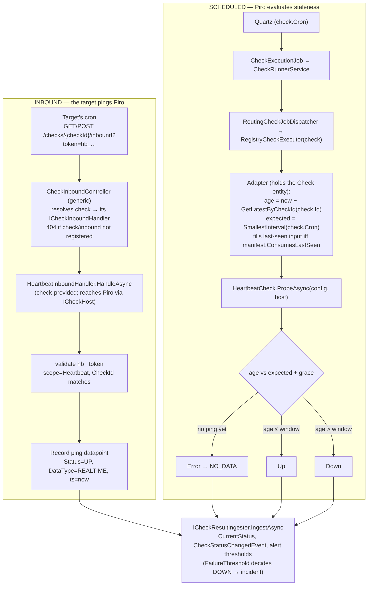

# RFC 0013 — Heartbeat check type

Status: accepted
Author: Arael Espinosa (https://github.com/cl8dep)
Date: 2026-07-18

> **Revised 2026-07-24 for the RFC 0016 check SDK.** This RFC was first written against the
> pre-0016 architecture (`ICheckExecutor.ExecuteAsync(Check check, ...)`, the `CheckType`
> enum + `[CheckTypeManifest]` attribute, `AlertFor`, `CheckExecutionResult`, checks living in
> `Piro.Infrastructure/Checks/`). RFC 0016 replaced all of that: a check is now a
> self-describing `ICheck` / `Check<TConfig>` whose `ProbeAsync(TConfig config, ICheckHost host, ct)`
> receives **only** its typed config plus a narrow allow-listed host, never the `Check` entity, a
> repository, or the DbContext ("checks know nothing about Piro"). Alerting is dimension-driven off
> `CheckManifest.Dimensions` (`AlertFor` is gone). §3 and §4 below are rewritten to that model; the
> decision on *how* Heartbeat fits it was taken by council (see §3.1). The parts that did not depend
> on the old executor shape (the inbound ping endpoint, the scoped `ApiKey` token, the single
> `GracePeriodSeconds` config, forced single-region, `NO_DATA` before the first ping) carry over
> essentially unchanged.

## 1. Problem

Every check Piro runs today is **outbound**: a worker actively probes a target and reports what it saw. Under the RFC 0016 SDK a check's `ProbeAsync(TConfig config, ICheckHost host, ct)` is a pull — HTTP fetches a URL, TCP opens a socket, gRPC calls the health service. This model can't observe a target that Piro cannot reach: a cron job, a batch worker, a backup script, a device behind NAT, a private k8s pod with no Ingress. Their liveness signal only exists at the target; there is nothing for a worker to connect to.

Heartbeat is the missing inverse, and GitHub issue [#1](https://github.com/Heva-Co/piro/issues/1) tracks it. It has no check class today, so there is no `"Heartbeat"` entry in the RFC 0016 check registry and it does not appear in `GET /api/v1/checks/types`. (`IncidentTitleFactory` still maps the title to `"Heartbeat missing"` — pre-wired for when the type lands.)

A Heartbeat check inverts the direction: **the monitored target pings Piro** on a schedule, and Piro marks the check DOWN when a ping is overdue. This RFC defines how that inversion fits the existing check, scheduling, ingestion, alerting, and auth machinery **without introducing a parallel pipeline** — the constraint that, under RFC 0016, drove the whole design (§3.1).

## 2. Non-goals

- **A generic inbound webhook / push-metrics API.** Heartbeat is a single binary liveness signal ("I'm alive"), not an arbitrary metric ingest. RFC [0001](0001-third-party-alert-ingestion.md) already covers third-party *alert* ingestion; this is narrower and check-shaped.
- **Payload-carrying pings.** The first version records only *that* a ping arrived and *when*. Attaching a status body, exit code, or duration to a ping is a natural extension but out of scope here.
- **A new authentication subsystem.** Heartbeat pings authenticate with a token that reuses the existing `ApiKey` table and `ApiKeyService` hashing — see §4.4. No new credential store, no per-endpoint secret column on `Check`.
- **Per-region heartbeats for a target deployed in multiple regions.** v1 models one check as one global "last-seen": every replica of the target pings the same endpoint and any ping resets the timer, so the check answers "is the service alive *somewhere*?". It deliberately does **not** answer "is it alive in *each* region?" — a target running in us-east + eu-west where only eu-west keeps pinging would still read UP. Doing that right needs machinery this RFC omits on purpose: the ping must carry a region/instance identifier (the inbound context is anonymous today), a **per-region** last-seen (the check records `"default"` for `WorkerRegion`, not the source region), and an **aggregation policy** ("DOWN if any region is silent" vs "if N are" vs a configurable quorum) — the kind of severity decision that warrants its own design. A heartbeat is therefore forced single-region at the *evaluation* level (§4.6), and per-region liveness of a multi-region target is a **follow-up RFC**, not this one.
- **Changing how outage *sensitivity* is configured.** "How many missed pings before alerting" is already expressible via `AlertConfig.FailureThreshold` ([`AlertConfig.cs:19`](../../src/Piro.Domain/Entities/AlertConfig.cs)); this RFC deliberately does not add a competing knob to the check config (§3, §4.2).

## 3. Design principle

**A heartbeat check is a normal RFC 0016 check whose `ProbeAsync` reads a stored timestamp instead of making a network call.** It rides the exact same Quartz-cron tick every other check uses; on each tick it compares "now vs. last-seen" and returns `Up` or `Down`. Everything downstream of `CheckProbeResult` — the `RegistryCheckExecutor` mapping, datapoint persistence, status recomputation, `CheckStatusChangedEvent`, alert-threshold evaluation, incident creation — is reused unmodified. The only genuinely new surfaces are (a) an inbound endpoint that records "last seen = now" and (b) the small amount of glue that gets the last-seen value *to* the probe (§3.1).

Two corollaries shape every choice below:

1. **The check reports raw state; the alert config decides significance.** Each scheduled tick emits `Up` or `Down` by comparing `now − lastSeen` against a minimal jitter threshold. *Whether a run of DOWNs is worth alerting on* is `AlertConfig.FailureThreshold`, exactly as for every other check type (this is the same "check reports raw, policy decides" split RFC 0016 enforces for all checks via `CheckProbeResult` + the generic evaluator). The heartbeat config therefore carries only a jitter allowance, never an outage-tolerance count.
2. **Cron is the source of truth for cadence.** The check's `Cron` ([`Check.cs:23`](../../src/Piro.Domain/Entities/Check.cs)) *is* the expected ping interval — the user sets their pinger and the check to the same schedule. The expected interval is derived from the cron via the existing `ICronIntervalCalculator.SmallestInterval` ([`ICronIntervalCalculator.cs:16`](../../src/Piro.Application/Interfaces/ICronIntervalCalculator.cs)), not stored as a duplicate field.

### 3.1 The RFC 0016 reconciliation (decided by council)

RFC 0016 removed the very things the original design leaned on: `ProbeAsync(config, host)` no
longer receives the `Check` entity, so it cannot read `check.Id` (to find the last datapoint) or
`check.Cron` (to derive the expected interval), and the check may not touch a repository — the
`ICheckHost` allow-list is **global by type** (a `HashSet<Type>`), so anything resolvable through
it is resolvable by *every* check. Three shapes were weighed:

- **A — Heartbeat is not an `ICheck`; a dedicated hosted sweep service evaluates staleness.** Rejected:
  it rebuilds the parallel evaluation pipeline RFC 0016 collapsed into one `RegistryCheckExecutor`
  (re-implementing config deserialize, outcome mapping, grace), and the type catalog / auto config-form /
  Status dimension are all projected from registered `ICheck` instances (`CheckTypeManifestExtensions.ToMetaDto`),
  so a non-`ICheck` Heartbeat would need a second, manifest-only registration seam that does not exist.
- **B — widen `ICheckHost` with a per-probe context (`CheckId`, `Cron`, `GetLatestDataPointAsync`).**
  Rejected outright: because the allow-list is global-by-type, this hands *every* check its id, schedule,
  and a repository-shaped history read — the exact "checks know nothing about Piro" boundary RFC 0016
  was built to hold, weakened permanently to serve one consumer.
- **C (chosen, in repaired form) — Heartbeat is a genuine `ICheck<HeartbeatCheckConfig>` whose
  `ProbeAsync` really runs**, evaluating staleness from a last-seen value **handed to it as data by the
  adapter**. Because Heartbeat wants the scheduled tick (the staleness sweep *is* the tick), it needs no
  "skip scheduling" guard and no hosted service; it flows through the normal
  `CheckSchedulerService → CheckExecutionJob → CheckRunnerService → RegistryCheckExecutor` path like every
  check. `RegistryCheckExecutor` already resolves the `Check` entity, so it computes "age since last seen"
  there and passes it into the probe. `HasExecutor` stays truthfully `true` (the probe genuinely
  executes — it reads a timestamp instead of a socket), so no honesty-test exemption is needed, and the
  catalog/config-form/Status dimension come for free because Heartbeat *is* a registered check.

**The discipline that keeps C from becoming B (dissent preserved).** The adapter must not learn about
Heartbeat by a hardcoded `if (check.Type == "Heartbeat")`. Instead, the manifest **declares** that this
check consumes a last-seen probe input (a typed capability flag on `CheckManifest`, §4.6), and the adapter
populates that input for any check that declares it. The branch is data-driven, not name-matched — a
name-matched branch would be Option B's boundary leak in miniature. If a second push-based check type
appears, revisit whether an explicit `ExecutionModel { Pull, Push }` on the manifest (or the manifest-only
catalog seam of Option A) pays off; for one consumer today, the declared-capability adapter input is the
lowest-lifetime-cost move that keeps both the boundary and the single-pipeline invariant intact.

**The inbound endpoint ships *with* the check, not in core (§4.5).** For the same reason a retired
integration's webhook simply stops existing, Heartbeat's ping endpoint must not be a controller hardcoded
in `Piro.Api` that lingers whether or not the check is installed. It is modeled exactly like RFC 0016's
integration webhooks: the check supplies an `ICheckInboundHandler`, and a single generic
`CheckInboundController` resolves the check by id and dispatches to its handler — a ping to a check whose
type isn't registered is a 404. The inbound exists only because the check does.

## 4. Design

Two independent write paths, both landing in the same `CheckDataPoint` table through the same
`ICheckResultIngester.IngestAsync`. The inbound path records a ping; the scheduled path is the *ordinary*
RFC 0016 check tick evaluating staleness — no second executor, no hosted service.



### 4.1 The `HeartbeatCheck` class and its manifest

Under RFC 0016 a check type *is* a class. `Heartbeat` becomes a `HeartbeatCheck : Check<HeartbeatCheckConfig>`
in `Piro.Checks/Heartbeat/`, mirroring the shape of `PingCheck` / `SslCheck`:

```csharp
public sealed class HeartbeatCheck : Check<HeartbeatCheckConfig>
{
    public override string CheckId => "Heartbeat";   // permanent discriminator, persisted on every Check row

    public override CheckManifest Manifest => new()
    {
        Label = "Heartbeat",
        Description = "External systems ping an inbound URL on a schedule; a missed ping marks the check DOWN.",
        ConfigType = typeof(HeartbeatCheckConfig),
        Dimensions = [CommonDimensions.Status],          // Status only — no latency/cert/name-server metric
        ConsumesLastSeen = true,                         // declares the adapter-fed probe input (§4.6, §3.1)
    };

    public override Task<CheckProbeResult> ProbeAsync(HeartbeatCheckConfig config, ICheckHost host, CancellationToken ct = default)
        => // evaluates ageSinceLastSeen vs expected+grace (§4.6)
}
```

- **`Dimensions = [CommonDimensions.Status]`.** Heartbeat alerts only on Status (UP/DOWN). Latency, cert
  expiry, and name-server metrics are meaningless for it, so it declares no numeric dimension. The generic
  dimension-driven alert form and evaluator (RFC 0016) then work for Heartbeat with no special-casing —
  this replaces the old `AllowedAlertFors = [AlertFor.Status]`, since `AlertFor` no longer exists.
- **Registration** is one line in the check registry block alongside the other built-in checks
  (`AddChecks` / the static registry array). Being registered is what makes Heartbeat appear in
  `GET /api/v1/checks/types` with its auto-generated config form (§4.5) — `CheckTypesController` projects
  `checkRegistry.All` through `ToMetaDto`, which reads exactly `CheckId` + `Manifest`.
- **`ConsumesLastSeen`** is the manifest capability flag from §3.1 that tells the adapter to compute and
  hand this check its last-seen age. It is declared here, not inferred from the check's id.

### 4.2 `HeartbeatCheckConfig`

A new config record beside the check class in `Piro.Checks/Heartbeat/`, following the `[ConfigField]`
convention of the other check configs (the attribute lives in `Piro.Contracts`, RFC 0016 §4.7):

```csharp
/// <summary>Configuration for a push-based Heartbeat check.</summary>
public record HeartbeatCheckConfig
{
    [ConfigField("Grace period (seconds)",
        HelpText = "Slack beyond the expected ping interval (derived from the schedule) to absorb "
                 + "network jitter and clock drift before a tick reports DOWN.")]
    public int GracePeriodSeconds { get; init; } = 30;
}
```

**One field, on purpose.** The config holds *only* a jitter allowance. It deliberately does **not** hold an "expected interval" (derived from `Cron` — §4.3) nor a "missed pings tolerated" count. That second knob already exists, correctly, as `AlertConfig.FailureThreshold` ("Consecutive failures before the alert is triggered", [`AlertConfig.cs:18-19`](../../src/Piro.Domain/Entities/AlertConfig.cs)). Duplicating it in the check config would create two overlapping sensitivity controls with undefined interaction. The split is clean:

- **`GracePeriodSeconds`** (check config) = tolerance for *clock noise* — the ping and the sweep are independent clocks, so a live target's `now − lastSeen` naturally oscillates up to one full interval plus jitter. Grace absorbs that so a healthy target never flaps DOWN.
- **`FailureThreshold`** (alert config) = tolerance for *real missed pings* — how many consecutive overdue ticks constitute an outage worth paging on.

Worked example, cron `* * * * *` (every minute), `GracePeriodSeconds = 30`, `FailureThreshold = 2`:

| t (s) | event | `now − lastSeen` | tick result |
|---|---|---|---|
| 0 | ping | — | (UP on ingest) |
| 60 | sweep | 60 | UP (≤ 90) |
| 59 | ping | — | (UP) |
| 120 | sweep | 61 | UP (≤ 90) |
| — | *pings stop* | | |
| next sweep | sweep | 90–150 | first DOWN |
| following sweep | sweep | 150–210 | second DOWN → alert fires |

A live target with normal jitter never crosses `expected + grace = 90s`; a genuinely dead target produces consecutive DOWNs, and the *alert* waits for `FailureThreshold` of them.

### 4.3 Expected interval from cron

The expected ping interval is derived from the check's own schedule using the existing singleton
`ICronIntervalCalculator` ([registered at `InfrastructureServiceExtensions.cs:167`](../../src/Piro.Infrastructure/Extensions/InfrastructureServiceExtensions.cs)):

```csharp
var expected = cronIntervalCalculator.SmallestInterval(check.Cron) ?? TimeSpan.FromSeconds(60);
```

`SmallestInterval` samples consecutive fire times and returns the tightest gap, or `null` for a malformed / un-sampleable cron ([`QuartzCronIntervalCalculator.cs:16-46`](../../src/Piro.Infrastructure/Jobs/QuartzCronIntervalCalculator.cs)). The `?? 60s` fallback keeps it safe if the cron can't be sampled (which shouldn't happen for a persisted check, since scheduling already parsed it). No new interval field on `Check` or in the config — the schedule the user already set *is* the expected cadence. **Under the chosen model (§3.1) this computation lives at the adapter** (`RegistryCheckExecutor`, which holds the `Check` entity and its `Cron`), not inside the check — the check receives the resulting `expected` (and the measured age) as its probe input, so it stays free of the schedule and the repository.

### 4.4 Token: `ApiKey` extended with a scope

The inbound endpoint is called by machines (the target's cron/CI/systemd), not by a logged-in user, so it needs a credential embedded in a URL or header. Rather than add a bespoke `HeartbeatTokenHash` column to `Check` and re-implement generation/hashing/masking/revocation, this reuses the existing `ApiKey` infrastructure — the `ApiKeys` DbSet ([`PiroDbContext.cs:37`](../../src/Piro.Infrastructure/Persistence/PiroDbContext.cs)), the SHA-256-hash-at-rest scheme, `MaskedKey`, `LastUsedAt`, and `RevokeAsync` ([`ApiKeyService.cs`](../../src/Piro.Infrastructure/Auth/ApiKeyService.cs)).

**The constraint that forces a change.** A plain `ApiKey` authenticates *as its owning user with all their roles*: `ApiKeyAuthenticationHandler` resolves the user and copies every role into the claims so `[Authorize(Roles=...)]` works unchanged ([`ApiKeyAuthenticationHandler.cs:47-55`](../../src/Piro.Infrastructure/Auth/ApiKeyAuthenticationHandler.cs)). A heartbeat token travels in cron logs, CI configs, and copy-pasted URLs — treating it as a full-privilege user key would mean a leaked ping URL is total account compromise. Relaxing that (e.g. making the handler emit fewer roles for *some* keys without a discriminator) would silently weaken every API key. The right move is the smallest structural addition that lets a key say "I am not a user credential."

Two new columns on `ApiKey`:

```csharp
public ApiKeyScope Scope { get; set; } = ApiKeyScope.Full;   // Full | Heartbeat
public int? CheckId { get; set; }                            // set iff Scope == Heartbeat
```

with a new enum:

```csharp
public enum ApiKeyScope { Full, Heartbeat }
```

- **`Full`** (default) — today's behavior, unchanged. Existing rows migrate to `Full` with `CheckId = null`.
- **`Heartbeat`** — bound to exactly one check (`CheckId`), authorizes *only* pinging that check, carries **no** role claims and **no** owning-user identity into the pipeline.

Generation reuses `ApiKeyService` with a distinct prefix so the two kinds are visually unmistakable: `hb_{64 hex}` instead of `pk_{64 hex}` ([`ApiKeyService.cs:24`](../../src/Piro.Infrastructure/Auth/ApiKeyService.cs)). A heartbeat key is created together with the check (and re-issuable via a "rotate token" action, which revokes the old row and issues a new one). The raw token is shown once, exactly like `pk_` keys.

**Auth handler split.** `ApiKeyAuthenticationHandler` continues to serve `Full` keys unchanged. Heartbeat validation does **not** go through that handler at all — the inbound endpoint validates the token itself (§4.4 below mirrors the webhook pattern), because a heartbeat key must never produce a `ClaimsPrincipal` that any `[Authorize]` endpoint would accept. Concretely, `ApiKeyService` gains a scoped lookup, e.g.:

```csharp
Task<ApiKey?> ValidateHeartbeatAsync(string rawKey, int checkId, CancellationToken ct = default);
```

which matches on `HashedKey`, `Status == Active`, `Scope == Heartbeat`, **and** `CheckId == checkId`, updates `LastUsedAt`, and returns the row (or null). It never touches `UserManager`. The existing `ValidateAsync(rawKey)` used by the auth handler is additionally constrained to `Scope == Full` so a heartbeat key can never authenticate a normal API request even if someone puts it in an `X-Api-Key` header.

### 4.5 Inbound ping — a check-provided handler, not a bespoke controller

The inbound endpoint must not be a `HeartbeatController` hardcoded in `Piro.Api`. Under RFC 0016 a
check is a self-describing, removable unit; an inbound endpoint hardwired in core would sit there whether
or not the Heartbeat check is registered, breaking the "the check ships everything of its own" principle.
This mirrors exactly what RFC 0016 did for **integration** webhooks: there is no per-source controller,
only one generic `WebhooksController` (`api/v1/webhooks/{integrationId}/{**rest}`) that resolves the
integration instance and dispatches to the `IInboundWebhookHandler` **the integration itself supplies**;
if the integration isn't registered there is no handler and the route is a 404.

Checks get the same seam, new to the check SDK (a small RFC 0016 extension):

```csharp
// Piro.Checks.Abstractions — mirror of IInboundWebhookHandler
public interface ICheckInboundHandler
{
    string CheckId { get; }                       // which check type this inbound belongs to ("Heartbeat")
    string InboundPathTemplate { get; }           // segments after the check id; "" for a fixed no-param ping
    Task<CheckInboundOutcome> HandleAsync(CheckInboundContext ctx, ICheckHost host, CancellationToken ct = default);
}
```

- **The `HeartbeatCheck` provides its own handler.** `ICheck` gains `ProvidedInboundHandler() => null`
  (default: a check has no inbound), and `HeartbeatCheck` overrides it to return a `HeartbeatInboundHandler`.
  The handler lives in `Piro.Checks/Heartbeat/` beside the check — it is only present because the check is
  registered, exactly like `IIntegration.ProvidedChecks()` composes checks only when their integration is.
- **One generic endpoint resolves and dispatches.** A single `CheckInboundController` in `Piro.Api`,
  unauthenticated at the pipeline level (no `[Authorize]`, self-validated token) like `WebhooksController`:

  ```
  GET  /api/v1/checks/{checkId}/inbound/{**rest}?token=hb_...
  POST /api/v1/checks/{checkId}/inbound/{**rest}    token via ?token= or X-Heartbeat-Token header
  ```

  It resolves the check by id, asks the check registry for that check type's `ICheckInboundHandler`, and
  dispatches. **If the check id is unknown, or its type registered no inbound handler (i.e. Heartbeat isn't
  installed), it is a 404** — the inbound only exists because the check does. Both GET and POST are
  accepted so a cron/CI pinger can call it with no body.
- **The handler validates and records — through the host, never a repository.** `HeartbeatInboundHandler.HandleAsync`:
  1. Validates the `hb_` token via an allow-listed capability it resolves from the `ICheckHost`
     (`ApiKeyService.ValidateHeartbeatAsync(token, checkId)` behind a host-exposed service, constant-time
     hash comparison). Missing / wrong / wrong-check / revoked → `AuthFailed` (401).
  2. Records a ping datapoint (`Status = UP`, `DataType = REALTIME`, `Timestamp = now`) through the same
     `ICheckResultIngester` the scheduled tick uses (resolved from the host, allow-listed) so `CurrentStatus`
     flips to UP immediately, a `CheckStatusChangedEvent` fires, and recovery-side alert thresholds evaluate
     — the target is back the instant its ping lands, without waiting for the next tick.
  3. Returns `Accepted` (204).

  The handler is a plain `(context) → outcome` unit with no ASP.NET types, reaching Piro only through the
  `ICheckHost` allow-list — so it obeys the same "checks know nothing" boundary as the probe, and is
  unit-testable without HTTP. Only a wrong/missing token (401) or an unknown check / no-inbound type (404)
  is non-2xx, matching the webhook contract's posture.

**Friendlier ping URL.** The `{checkId}` route is the canonical, always-valid form. The admin detail
panel (§4.7) may still present the ping URL under the human `service/check` slugs and 302-redirect to the
canonical id form, or simply show the id URL — a presentation choice, not a second endpoint.

### 4.6 The probe + the adapter's last-seen input

The staleness evaluation is `HeartbeatCheck.ProbeAsync`, a genuine RFC 0016 probe that makes no network
call — it reads the last-seen age it was handed and returns a raw `CheckProbeResult`:

```csharp
// HeartbeatCheck : Check<HeartbeatCheckConfig>
public override Task<CheckProbeResult> ProbeAsync(HeartbeatCheckConfig config, ICheckHost host, CancellationToken ct = default)
{
    var input = host.GetRequiredService<ILastSeenProbeInput>();   // adapter-populated; allow-listed
    if (input.AgeSinceLastSeen is null)
        return Task.FromResult(CheckProbeResult.Failed("No heartbeat received yet."));   // → NO_DATA

    var withinWindow = input.AgeSinceLastSeen <= input.ExpectedInterval + TimeSpan.FromSeconds(config.GracePeriodSeconds);
    return Task.FromResult(withinWindow
        ? CheckProbeResult.Ok(CommonDimensions.Status.Measure(/* Up */))
        : CheckProbeResult.DownWith(
            $"No heartbeat in {(int)input.AgeSinceLastSeen.Value.TotalSeconds}s " +
            $"(expected within {(int)(input.ExpectedInterval + TimeSpan.FromSeconds(config.GracePeriodSeconds)).TotalSeconds}s)."));
}
```

**Where the last-seen value comes from (§3.1).** `RegistryCheckExecutor.ExecuteAsync(Check check)` already
holds the `Check` entity. When a check's manifest declares `ConsumesLastSeen`, the adapter — *before*
calling `ProbeAsync` — reads the latest datapoint (`GetLatestByCheckIdAsync(check.Id)`, §5), computes
`AgeSinceLastSeen` and `ExpectedInterval` (from `check.Cron`, §4.3), and exposes them as a scoped
`ILastSeenProbeInput` the check resolves through the host. This is the *one* piece of glue the model needs,
and it is **declared, not name-matched**: the adapter branches on `manifest.ConsumesLastSeen`, never on
`check.Type == "Heartbeat"` (§3.1 dissent). A `Check<TConfig>` that does not declare the flag never sees
the input, so the "checks know nothing about Piro" boundary is unchanged for every other check.

- **`NO_DATA` before the first ping ever.** A freshly created heartbeat check whose target hasn't been
  wired up yet is *not* an outage — the probe returns `Error`, which `RegistryCheckExecutor.MapStatus`
  turns into `NO_DATA`/`FAILURE` (kept out of the alerting the way absent data already is), not `DOWN`.
- **Up/Down thereafter** by the age comparison. The check reports raw outcome only; the *alert* decision on
  a run of DOWNs is `FailureThreshold`, untouched here — the standard RFC 0016 "policy decides significance".

**Runs in-process (single-region).** Heartbeat is forced `IsMultiRegion = false` so it evaluates on the
in-process API worker (`LocalCheckJobDispatcher`), where its ingested pings live — a remote worker can't see
the region the pings landed in. Enforced at check create/update validation (a heartbeat check with
`IsMultiRegion = true` is rejected) and the admin form hides the multi-region toggle for Heartbeat (§4.7).
This is the same reason the GCP Cloud Run Job check is API-only.

### 4.7 Admin UI (`apps/admin`)

Heartbeat is configured and operated from the admin panel; nothing on the public status page (`apps/web`) changes.

**Config form — auto-generated.** Because `HeartbeatCheck` is a registered `ICheck`, `GET /api/v1/checks/types` includes it automatically: `CheckTypesController` projects `checkRegistry.All` through `ToMetaDto` ([`CheckTypeManifestExtensions.cs`](../../src/Piro.Application/Extensions/CheckTypeManifestExtensions.cs)), which reflects a `ConfigSchema` from `HeartbeatCheckConfig` via the shared `ConfigSchemaBuilder` (`Piro.Contracts`, RFC 0016 §4.7) and carries the `Status` dimension. `HasExecutor` is truthfully `true` — the probe genuinely runs (§4.6), so no honesty-test exemption is needed. The existing admin check-config form renders the single **Grace period (seconds)** number input (label + help text from `[ConfigField]`) with no bespoke component — the same mechanism that renders every other check's form.

**Multi-region toggle hidden.** The check-create/edit form suppresses the "multi-region" control when the selected type is Heartbeat (§4.6), so the user can't build an invalid configuration.

**Ping URL + token — the one bespoke surface.** The check *detail* page gains a "Heartbeat" panel that shows:
- the full ping URL with the token substituted in, `.../services/{slug}/checks/{checkSlug}/heartbeat?token=hb_…`, with a **Copy** button and a short "call this from your cron / CI on the same schedule as the check" hint;
- a **Rotate token** action (revokes the current `hb_` `ApiKey` row and issues a new one, showing the new raw token once);
- the masked token and `LastUsedAt` ("last ping received") read back from the `ApiKey` row, so the user can confirm pings are arriving.

The raw token is returned exactly once — on check creation and on rotate — mirroring the existing `pk_` key UX. After that only the `MaskedKey` is shown.

**Type generation.** After the DTO/enum changes land, regenerate the admin API types (`pnpm run generate:api-types` in `apps/admin`) so `HeartbeatCheckConfig`, the new `ApiKeyScope`, and any create/rotate response shape are available to the frontend without hand-written interfaces.

### 4.8 What does NOT change

The point of this design is that the inversion is confined to the two new surfaces (inbound endpoint +
the adapter's last-seen input); everything else is reused verbatim:

- **The RFC 0016 check contract** — `HeartbeatCheck` is an ordinary `ICheck`; its `ProbeAsync` reads a
  timestamp instead of a socket. The SDK gains two additive, opt-in seams, both defaulting to "nothing"
  for every existing check: `CheckManifest.ConsumesLastSeen` (§4.6) and `ICheck.ProvidedInboundHandler()`
  returning `null` by default (§4.5). No change to the existing probe path, `ICheckHost`, or any current check.
- **Scheduler → job → runner → adapter chain** — `CheckSchedulerService`, `CheckExecutionJob`,
  `CheckRunnerService`, `RoutingCheckJobDispatcher`, `RegistryCheckExecutor` are structurally untouched;
  the adapter gains only the "if the manifest declares `ConsumesLastSeen`, populate the probe input" branch.
  Heartbeat rides the exact Quartz-cron path every other check uses, so there is **no separate sweep
  service and no "skip scheduling" guard**.
- **`ICheckResultIngester`** — both the inbound ping and the scheduled tick call `IngestAsync` ([`ICheckResultIngester.cs`](../../src/Piro.Application/Interfaces/ICheckResultIngester.cs)); status recomputation, `CheckStatusChangedEvent`, and alert-threshold evaluation are entirely reused. No new ingest path.
- **`AlertConfig` / alert lifecycle** — no new fields. Alertability is the manifest's `Status` dimension (RFC 0016), and outage sensitivity is `FailureThreshold` ("consecutive failures before alert"). Incident titling already handles Heartbeat ([`IncidentTitleFactory.cs:15`](../../src/Piro.Application/Services/IncidentTitleFactory.cs)).
- **`ApiKeyAuthenticationHandler` for `Full` keys** — unchanged; heartbeat keys never flow through it (§4.4).
- **`CheckDataPoint` schema** — a ping is an ordinary datapoint (`REALTIME` / `UP`). No new columns; the config lives in `TypeDataJson` and the token on `ApiKey`.
- **Public status page (`apps/web`)** — a heartbeat check's UP/DOWN renders like any other check's status; no changes needed.

## 5. Data / schema scope

**Migrations (one, on `ApiKey`):**
- `ApiKey.Scope` — new column, enum stored as string (following the existing `Status` `HasConversion<string>()` convention in `ApiKeyConfiguration`, [`MiscConfiguration.cs:19`](../../src/Piro.Infrastructure/Persistence/Configurations/MiscConfiguration.cs)), default `Full`. Backfills existing rows to `Full`.
- `ApiKey.CheckId` — new nullable `int?` FK to `Check`, `OnDelete(Cascade)` (deleting a check removes its heartbeat key). Null for `Full` keys.
- Precedent: the ApiKey table has been migrated before for exactly this kind of additive change — `20260710164541_ApiKeyLastUsedAtAndStatusEnum` added `LastUsedAt` and converted `Status` to the enum-name representation.

**New enum:**
- `ApiKeyScope { Full, Heartbeat }` in `src/Piro.Domain/Enums/`.

**Manifest (additive, no schema):**
- `CheckManifest.ConsumesLastSeen` (bool, default false) — the opt-in flag the adapter branches on to
  populate the last-seen probe input (§3.1, §4.6). Additive; every existing check leaves it false.

**No changes to:**
- The check discriminator — `HeartbeatCheck.CheckId` is the string `"Heartbeat"`, matching the retired enum member name so no stored data migrates (RFC 0016 §3). No `CheckType` enum (it was killed by RFC 0016).
- `CheckDataPoint`, `DataPointType`, `AlertConfig`, `Check` — no schema changes. (`Check` stores heartbeat config in the existing `TypeDataJson`; the token lives on `ApiKey`, not on `Check`.)
- `ServiceStatus` — reuses `UP` / `DOWN` / `NO_DATA`.

**Check SDK additions (`Piro.Checks.Abstractions`, additive):**
- `CheckManifest.ConsumesLastSeen` (bool, default false) — §4.6.
- `ICheckInboundHandler` + `CheckInboundContext` + `CheckInboundOutcome`, and `ICheck.ProvidedInboundHandler() => null` (default) — the inbound seam (§4.5), a mirror of `IInboundWebhookHandler` / `IIntegration.ProvidedChecks()`.
- A check-inbound registry (lookup side) so the generic controller can resolve a check type's handler, mirroring `IInboundWebhookRegistry`.

**New code (no schema):**
- `HeartbeatCheck` + `HeartbeatCheckConfig` + `HeartbeatInboundHandler` in `Piro.Checks/Heartbeat/`, added to the check registry (§4.1); the check returns the handler from `ProvidedInboundHandler()`.
- `ILastSeenProbeInput` (the adapter-populated, allow-listed probe input, §4.6) and the `RegistryCheckExecutor` branch that fills it when `manifest.ConsumesLastSeen`.
- `CheckInboundController` (`src/Piro.Api/Controllers/`) — the single generic inbound endpoint (§4.5), not a per-check controller.
- `ICheckDataPointRepository.GetLatestByCheckIdAsync(int checkId, string? region = null, CancellationToken ct = default)` — a per-check "latest datapoint" accessor. Today the only "latest" method is `GetLatestByServiceIdAsync` ([`ICheckDataPointRepository.cs`](../../src/Piro.Application/Interfaces/ICheckDataPointRepository.cs)), which is service-scoped; the adapter needs per-check. (Achievable today via `GetByCheckIdAsync(checkId, limit: 1)` since it's newest-first, but a dedicated single-result method is clearer.)
- `ApiKeyService.ValidateHeartbeatAsync` + scope constraint on `ValidateAsync` (§4.4), and a heartbeat-key create/rotate method, exposed to the inbound handler through an allow-listed `ICheckHost` capability.

## 6. Phased plan

Each phase is independently shippable and testable.

1. **Check class + config + adapter input (backend liveness detection).** Add `HeartbeatCheck` +
   `HeartbeatCheckConfig` to the registry, the `CheckManifest.ConsumesLastSeen` flag,
   `GetLatestByCheckIdAsync`, the `ILastSeenProbeInput` and the `RegistryCheckExecutor` branch that fills it.
   At the end of this phase a heartbeat check evaluates staleness on its Quartz tick and reports
   NO_DATA/UP/DOWN — but there is not yet a way to *send* a ping (tested by seeding a `REALTIME` datapoint
   directly). Heartbeat also appears in `GET /checks/types` with its auto-generated config form.
2. **Scoped token + check-provided inbound.** Add `ApiKeyScope`, the `ApiKey.Scope` / `ApiKey.CheckId` migration, `ValidateHeartbeatAsync` + the `ValidateAsync` `Full` constraint, heartbeat-key creation on check-create; the `ICheckInboundHandler` SDK seam + its lookup registry + the generic `CheckInboundController` (GET + POST); and `HeartbeatInboundHandler` returned from `HeartbeatCheck.ProvidedInboundHandler()`. At the end of this phase, external systems can ping and flip the check UP; a ping to a check whose type is not installed is a 404; single-region enforcement is validated here.
3. **Admin UI.** The auto-generated config form already works once Phase 1 lands; this phase adds the bespoke check-detail Heartbeat panel (ping URL + copy, rotate token, last-ping-received), hides the multi-region toggle for Heartbeat, and regenerates `api-types.ts`.

## 7. Alternatives considered

- **A separate `HeartbeatTokenHash` column on `Check`** (instead of a scoped `ApiKey`). Rejected — it duplicates generation, SHA-256 hashing, masking, `LastUsedAt`, and revocation that `ApiKeyService` already implements, and scatters credential logic across two subsystems. The scoped-`ApiKey` addition is two columns and reuses all of it.
- **Reusing a plain `Full` `ApiKey` unchanged.** Rejected — a full key grants the owning user's entire role set ([`ApiKeyAuthenticationHandler.cs:47-55`](../../src/Piro.Infrastructure/Auth/ApiKeyAuthenticationHandler.cs)); a heartbeat URL leaked from a cron log would be total account compromise. The `Scope` discriminator is the minimal structural fix that lets a key be non-privileged and check-bound.
- **A dedicated `IHostedService` sweep, with Heartbeat NOT an `ICheck` (council Option A).** Rejected — it rebuilds the parallel evaluation path RFC 0016 collapsed into one `RegistryCheckExecutor` (re-implementing config deserialize, outcome mapping, grace), and since the type catalog / auto config-form / dimension list are all projected from registered `ICheck` instances, a non-`ICheck` Heartbeat would need a second, manifest-only registration seam that does not exist today. Making the probe genuinely run inside the normal path (the chosen model, §3.1) gets `IngestAsync`, `CheckStatusChangedEvent`, `FailureThreshold`, and the catalog all for free.
- **Widening `ICheckHost` with a per-probe context (`CheckId`, `Cron`, `GetLatestDataPointAsync`) so Heartbeat stays a plain `Check<TConfig>` (council Option B).** Rejected — the host allow-list is global by type (`HashSet<Type>`), so this hands *every* check its id, schedule, and a repository-shaped history read, permanently weakening the "checks know nothing about Piro" boundary to serve one consumer. The chosen model keeps the state at the adapter and passes it in as a manifest-declared input instead (§3.1, §4.6).
- **A throwing `ProbeAsync` (Heartbeat is an `ICheck` only for the catalog; a separate service sweeps).** Rejected in debate — a check whose `ProbeAsync` throws while `HasExecutor` reports `true` is a lie in the type system that would need an honesty-test exemption, and "never poll this check" becomes a fragile invariant. The repair (probe genuinely runs, fed by the adapter) removes the lie rather than exempting it.
- **An explicit `ExecutionModel { Pull, Push }` discriminator on the manifest.** Not needed now — because Heartbeat's probe genuinely executes on the normal tick, there is no "don't poll" state to encode. Kept as the follow-up to revisit **if a second push-based check type appears** (§3.1 dissent), at which point a first-class push contract may beat the single `ConsumesLastSeen` flag.
- **An `ExpectedIntervalSeconds` field in the config.** Rejected — it duplicates the check's `Cron`, inviting the two to disagree. Deriving `expected` from `SmallestInterval(check.Cron)` keeps a single source of truth for cadence.
- **A "missed pings tolerated" count in the config.** Rejected — this is exactly `AlertConfig.FailureThreshold` ([`AlertConfig.cs:18-19`](../../src/Piro.Domain/Entities/AlertConfig.cs)). A second knob would create two overlapping, independently-configurable sensitivity controls.
- **Marking `NO_DATA` as `DOWN` before the first ping.** Rejected — a check whose sender isn't wired up yet is unconfigured, not down; alerting on it at creation time would be noise. `NO_DATA` defers alerting until a real baseline exists.

## 8. Risks

- **The check has no heartbeat of its own.** If the *Piro* API (where the tick runs) is itself down when a ping would have failed, or if the region ingesting pings goes dark, no tick executes and the heartbeat can't self-report the gap — the same blast-radius limitation any single-region in-process check has. This is why heartbeat is forced single-region, and why the scheduler's "we couldn't observe" datapoint (written when no worker is available) remains meaningful as a distinct signal from a real DOWN.
- **Clock skew between the target and Piro.** `now − lastSeen` compares the target's send time (as observed at ingest) against Piro's wall clock. Large skew on the *target* side is invisible (we timestamp on receipt), which is the safe direction; skew only matters if the target's *cadence* drifts, which `GracePeriodSeconds` is there to absorb. Documented in the grace-period help text.
- **Token in the URL query string.** A `GET ?token=` is convenient but lands in access logs and browser history. Mitigations: the `X-Heartbeat-Token` header is offered for POST callers who care, the token is check-scoped and non-privileged (a leak pings one check, nothing more), and rotation is one click. Accepted as the cost of GET-with-no-body convenience.
- **Grace vs. cron mismatch.** If a user sets the check's cron finer than their actual ping cadence, `expected` will be smaller than reality and the check will flap. The detail-panel hint ("call this on the same schedule as the check") and the grace default mitigate it, but it's fundamentally a user-configuration concern — the same class of mistake as setting an HTTP check's interval shorter than the endpoint's response time.
