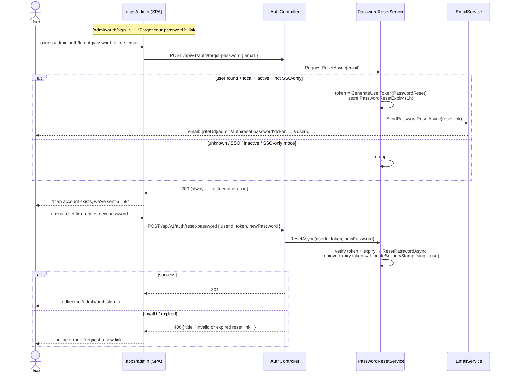

# RFC 0014 — Password Reset / Forgot Password Flow

Status: proposal
Author: Arael Espinosa (https://github.com/cl8dep)
Date: 2026-07-18

Tracking issue: [#84](https://github.com/Heva-Co/piro/issues/84)

## 1. Problem

A user who forgets their password has no way to recover their account. Piro's
`AuthController` exposes `sign-in`, `refresh`, and an authenticated
`PUT me/password` (current + new password), but there is no unauthenticated path
back in once the current password is lost — `ChangePasswordAsync`
(`src/Piro.Application/Services/UserManagementService.cs:241`) requires the old
password, and there is no admin "reset this user's password" endpoint either. The
only account-provisioning path today is the email invitation flow
(`UserManagementService.InviteAsync:62`), which creates *new* users; it does
nothing for an existing user locked out of a live account.

In a single-user deployment this is an annoyance. In a multi-user deployment it is
a support burden with no clean fix: the only recovery is direct database surgery
on `AspNetUsers.PasswordHash`, since even an Owner cannot set another user's
password through the API.

Concrete failure modes:

- A Member forgets their password and cannot sign in; no Owner action short of
  deleting and re-inviting the account (which loses their notification
  preferences, `HasSeenShowcase`, color, timezone, and API keys) can restore
  access.
- An Owner forgets their password in a single-Owner instance. There is no
  self-service recovery and no second Owner to help — the instance is effectively
  bricked at the admin level.

## 2. Non-goals

- **Admin-initiated password reset ("reset this user's password" button).** This
  RFC covers only *self-service* recovery via the user's own email. An admin-side
  force-reset is a natural follow-up but is a distinct authorization surface
  (Owner/Admin acting on another account) and is deferred — see §7.
- **Rotating the JWT signing secret or a global "sign out everywhere" feature.**
  A reset invalidates the resetting user's own sessions via their Identity
  security stamp (§4.3); it does not touch other users.
- **Password strength policy changes.** Reset reuses the existing Identity
  password policy (`RequiredLength = 8`, no complexity requirements —
  `src/Piro.Infrastructure/Extensions/InfrastructureServiceExtensions.cs:46`).
  Any policy change is out of scope.
- **Passwordless / magic-link sign-in.** This is password *reset*, not an
  alternative auth factor.
- **A public-status-page (`apps/web`) surface.** `apps/web` has no authentication
  at all; all UI here lives in `apps/admin`.

## 3. Design principle

**Reuse the invitation flow's proven token mechanics rather than invent a parallel
one, and never leak whether an email is registered.** Piro already has a working,
reviewed pattern for "email someone a time-limited, single-use link that lets them
set a password without being logged in" — the invitation flow. Password reset is
the same shape with two differences: the account already exists (so we generate
the token against a real user instead of a placeholder), and the endpoint must be
enumeration-safe (so it always returns `200` regardless of whether the email
matches an account). Everything below follows from mirroring that flow and adding
the enumeration guard.

A second, hard constraint shapes the whole feature: **password reset exists only
when SSO-only mode is off.** When SSO-only mode is enabled
(`IOidcService.GetSsoOnlyModeAsync`), Piro has decided that local passwords are not
a valid way in — sign-in itself is blocked (`AuthController.SignIn` returns `423`,
`AuthController.cs:23`) and account recovery is delegated entirely to the identity
provider. In that mode both reset endpoints are inert: `forgot-password` silently
no-ops (still `200`, for the anti-enumeration reason above) and the
"Forgot your password?" link is not rendered. There is no local password to reset,
so there is nothing for this feature to do.

## 4. Design

### 4.1 Flow



### 4.2 New endpoints (`AuthController`)

Two `[AllowAnonymous]` endpoints added to the existing controller
(`src/Piro.Api/Controllers/AuthController.cs`, `[Route("api/v1/auth")]:13`),
placed alongside `sign-in`/`refresh`. Both delegate to a new
`IPasswordResetService` (§4.3) rather than bloating `AuthService`.

```csharp
/// <summary>Starts password recovery. Always returns 200 to avoid revealing
/// whether an account exists. No-op when SSO-only mode is on, the email is
/// unknown, or the account is SSO/inactive.</summary>
[HttpPost("forgot-password")]
[AllowAnonymous]
[ProducesResponseType(StatusCodes.Status200OK)]
public async Task<IActionResult> ForgotPassword([FromBody] ForgotPasswordRequest request, CancellationToken ct)
{
    await passwordResetService.RequestResetAsync(request.Email, ct);
    return Ok();
}

/// <summary>Completes password recovery using a token from the reset email.</summary>
[HttpPost("reset-password")]
[AllowAnonymous]
[ProducesResponseType(StatusCodes.Status204NoContent)]
[ProducesResponseType(StatusCodes.Status400BadRequest)]
public async Task<IActionResult> ResetPassword([FromBody] ResetPasswordRequest request, CancellationToken ct)
{
    try
    {
        await passwordResetService.ResetAsync(request.UserId, request.Token, request.NewPassword, ct);
        return NoContent();
    }
    catch (InvalidOperationException ex)
    {
        return BadRequest(new { title = ex.Message, status = 400 });
    }
}
```

`forgot-password` mirrors `SignIn`'s SSO-only handling but *silently* — where
`SignIn` returns `423` when `oidcService.GetSsoOnlyModeAsync(ct)` is true
(`AuthController.cs:23`), `RequestResetAsync` treats SSO-only mode as a reason to
no-op and still return `200`. Surfacing "reset is disabled" here would itself be a
signal; the sign-in page already tells SSO-only users to use SSO.

`ResetAsync` also re-checks SSO-only mode at completion time and rejects with the
generic "Invalid or expired reset link." message if it is now on. This closes the
window where a reset link was mailed *before* an Owner flipped SSO-only on: once
the instance is SSO-only, no local password may be set, even with an otherwise
valid token. SSO-only is thus enforced at both ends of the flow, not just at
request time.

The `catch (InvalidOperationException)` shape on `reset-password` matches the
existing `ChangePassword` handler (`AuthController.cs:82`) exactly.

### 4.3 `IPasswordResetService` (Application) + implementation

New interface in `src/Piro.Application/Interfaces/` and implementation in
`src/Piro.Application/Services/` (co-located with `UserManagementService`, its
direct model). It depends on the same collaborators the invitation flow already
uses: `UserManager<AppUser>`, `ISiteConfigRepository`, `IEmailService`,
`IConfiguration`, and `IOidcService` (for the SSO-only check).

**`RequestResetAsync(string email, CancellationToken ct)`** — mirrors
`InviteAsync:62` minus the user-creation half:

```csharp
public async Task RequestResetAsync(string email, CancellationToken ct = default)
{
    // Enumeration guard: every early return is silent, and the method always
    // returns normally so the controller can return 200 uniformly.
    if (await oidcService.GetSsoOnlyModeAsync(ct)) return;

    var user = await userManager.FindByEmailAsync(email);
    if (user is null) return;
    if (!user.IsActive) return;
    if (user.ExternalProvider is not null) return; // SSO account: no local password

    var token = await userManager.GenerateUserTokenAsync(user, TokenOptions.DefaultProvider, PasswordResetTokenPurpose);
    var expiry = DateTimeOffset.UtcNow.Add(ResetExpiry).ToUnixTimeSeconds().ToString();
    await userManager.SetAuthenticationTokenAsync(user, "Piro", "PasswordResetExpiry", expiry);

    var siteConfig = await siteConfigRepo.GetAsync(ct);
    var baseUrl = siteConfig.Url?.TrimEnd('/')
        ?? configuration["App:BaseUrl"]?.TrimEnd('/')
        ?? "http://localhost:5173";
    var resetUrl = $"{baseUrl}/admin/auth/reset-password?token={Uri.EscapeDataString(token)}&userId={user.Id}";

    await emailService.SendPasswordResetAsync(user.Email!, resetUrl, ct);
}
```

Notes:

- `PasswordResetTokenPurpose` is a distinct purpose string (e.g. `"PasswordReset"`)
  so a reset token cannot be replayed against the invitation-accept endpoint and
  vice-versa — `VerifyUserTokenAsync` binds the purpose. This parallels
  `InvitationTokenPurpose` (`UserManagementService.cs:90`).
- `ResetExpiry = TimeSpan.FromHours(1)` per the issue (invitations use 48h; reset
  is deliberately shorter).
- The expiry is stored as a separate auth token (`"PasswordResetExpiry"`) exactly
  as invitations store `"InvitationExpiry"` (`UserManagementService.cs:92`).
  Identity's own token lifetime and this stored expiry are independent guards;
  the stored value is the one we enforce.
- The URL includes `/admin` because the reset page lives in the admin SPA served
  under that path prefix; the invitation link builds `{baseUrl}/invite/...` and is
  handled by the same SPA at `/admin/invite/:token`
  (`apps/admin/src/App.tsx:100`). Both rely on `SiteConfig.Url` being the origin.
- If email is not configured, `IEmailService` already **logs a warning and
  silently no-ops** per provider (`src/Piro.Infrastructure/Email/EmailService.cs:25`,
  `ResendEmailService.cs:26`). No token is wasted meaningfully and the user still
  sees the generic "check your email" screen. The frontend surfaces the
  "email not configured" caveat as static copy (§4.5) rather than the backend
  leaking configuration state through this endpoint.

**`ResetAsync(int userId, string token, string newPassword, CancellationToken ct)`**
— mirrors `AcceptInviteAsync:103`, but keyed by `userId` (carried in the link) so
we do not linearly scan all users:

```csharp
public async Task ResetAsync(int userId, string token, string newPassword, CancellationToken ct = default)
{
    // SSO-only may have been turned on after the link was mailed — no local
    // password may be set in that mode. Generic message (no enumeration signal).
    if (await oidcService.GetSsoOnlyModeAsync(ct))
        throw new InvalidOperationException("Invalid or expired reset link.");

    var user = await userManager.FindByIdAsync(userId.ToString());
    // Generic message — do not distinguish "no such user" from "bad token".
    if (user is null || user.ExternalProvider is not null || !user.IsActive)
        throw new InvalidOperationException("Invalid or expired reset link.");

    var valid = await userManager.VerifyUserTokenAsync(
        user, TokenOptions.DefaultProvider, PasswordResetTokenPurpose, token);
    if (!valid)
        throw new InvalidOperationException("Invalid or expired reset link.");

    var expiryStr = await userManager.GetAuthenticationTokenAsync(user, "Piro", "PasswordResetExpiry");
    if (expiryStr is null || !long.TryParse(expiryStr, out var expiryUnix) ||
        DateTimeOffset.UtcNow.ToUnixTimeSeconds() > expiryUnix)
        throw new InvalidOperationException("Invalid or expired reset link.");

    var resetToken = await userManager.GeneratePasswordResetTokenAsync(user);
    var result = await userManager.ResetPasswordAsync(user, resetToken, newPassword);
    if (!result.Succeeded)
    {
        var errors = string.Join("; ", result.Errors.Select(e => e.Description));
        throw new InvalidOperationException($"Password validation failed: {errors}");
    }

    await userManager.RemoveAuthenticationTokenAsync(user, "Piro", "PasswordResetExpiry");
    await userManager.UpdateSecurityStampAsync(user); // single-use: invalidates the link + all sessions
}
```

Single-use is enforced the same way invitations enforce it:
`UpdateSecurityStampAsync` (`AcceptInviteAsync:146`) rotates the stamp the reset
token was derived from, so the link cannot be replayed. It also invalidates the
user's existing refresh tokens/sessions, which is the correct security posture for
a credential change performed by someone who may not be the account owner.

Note the two-token dance: the *link* token is a `GenerateUserTokenAsync` custom-
purpose token (so it can carry our 1h expiry and share the invitation flow's
mechanics), and only after it validates do we mint Identity's native
`GeneratePasswordResetTokenAsync` to actually call `ResetPasswordAsync`. This
keeps the externally-exposed token under our expiry/purpose control while still
using Identity's first-class reset primitive to change the hash.

### 4.4 `IEmailService.SendPasswordResetAsync` + template

Add one method to `IEmailService`
(`src/Piro.Application/Interfaces/IEmailService.cs:4`), mirroring
`SendInvitationAsync:12`:

```csharp
Task SendPasswordResetAsync(string to, string resetUrl, CancellationToken ct = default);
```

Implement it in all three email classes that implement the interface —
`EmailServiceFactory` (delegates to the selected provider,
`src/Piro.Infrastructure/Email/EmailServiceFactory.cs:35`), `SmtpEmailService`
(`EmailService.cs:47`), and `ResendEmailService` (`ResendEmailService.cs:44`) —
each rendering a new Scriban template and calling its own `SendAsync`, exactly as
`SendInvitationAsync` does today.

Add a `reset-password.scriban` beside `invitation.scriban`
(`src/Piro.Infrastructure/Email/Templates/`) and a
`EmailTemplates.PasswordReset(resetUrl)` renderer beside
`EmailTemplates.Invitation` (`src/Piro.Infrastructure/Email/EmailTemplates.cs:37`).
The template mirrors the invitation email: a single call-to-action button linking
to `{{ reset_url }}`, plus plain-text fallback of the URL and a "if you didn't
request this, ignore this email; your password is unchanged" line and the 1-hour
expiry notice.

### 4.5 Admin UI (`apps/admin`)

All UI lives in the Vite admin SPA (`apps/admin`); `apps/web` is untouched. Two
new public pages plus one link, following the login page's react-hook-form + zod +
Base-UI-primitive pattern (`apps/admin/src/features/auth/pages/SignInPage.tsx`).

**Routes** — added as public routes in `App.tsx` alongside the other auth routes
(`apps/admin/src/App.tsx:96-100`, outside the `ProtectedLayout` wrapper), with
constants added to the `AUTH` block in
`apps/admin/src/constants/routes.ts:5`:

```ts
FORGOT_PASSWORD: "/admin/auth/forgot-password",
RESET_PASSWORD:  "/admin/auth/reset-password",
```

**`ForgotPasswordPage.tsx`** (`features/auth/pages/`) — one component per file per
the admin conventions.

- One field: `email` (`Input`, type `email`, required) validated by a zod schema,
  same shape as `SignInPage`'s schema (`SignInPage.tsx:26`).
- On submit: call `authApi.forgotPassword({ email })` (§4.6). Regardless of
  success, switch to a static confirmation state: *"If an account exists for that
  address, we've sent a password reset link. Check your email."* — never reveal
  whether the email matched (mirrors the backend's uniform `200`).
- Below the form, static caveat copy: *"Reset emails require email to be
  configured. If you don't receive one, contact your administrator."* This is
  static text, not a live check — the backend deliberately does not expose email-
  configuration state through this unauthenticated endpoint.
- Submit disabled while `isSubmitting` (matches `SignInPage.tsx:146`).

**`ResetPasswordPage.tsx`** (`features/auth/pages/`).

- Reads `token` and `userId` from the query string (`useSearchParams`). If either
  is missing, render an invalid-link state with a link back to
  `/admin/auth/forgot-password`.
- Fields: `newPassword` (`PasswordInput`,
  `apps/admin/src/components/ui/password-input.tsx`) and `confirmPassword`
  (`PasswordInput`), zod schema enforcing min length 8 (matching the Identity
  policy) and `newPassword === confirmPassword` via `.refine`.
- On submit: `authApi.resetPassword({ userId, token, newPassword })`. On `204`,
  toast success (`sonner`) and `navigate(ROUTES.AUTH.SIGN_IN)`. On `400`, show the
  returned `title` (e.g. "Invalid or expired reset link.") inline; offer the
  "request a new link" link.

**Sign-in link** — add a *"Forgot your password?"* link on `SignInPage.tsx`
pointing to `ROUTES.AUTH.FORGOT_PASSWORD`, positioned under the password field.
It should be hidden when SSO-only mode is active — `SignInPage` already knows the
SSO-mode / providers state it renders below the form, so gate the link on the same
condition (no local password sign-in ⇒ no reset link).

Each page is its own file with a trailing `export default`; any repeated
sub-markup (e.g. the centered `Card` auth shell already used by `SignInPage`)
is extracted to `features/auth/components/` rather than duplicated inline, per the
admin one-component-per-file rule.

### 4.6 API types + actions module

Per the admin conventions, request/response types are generated from the backend
OpenAPI spec, not hand-written. Add the two new DTOs (§5) to the backend, run
`pnpm run generate:api-types` to refresh `apps/admin/src/lib/api-types.ts`, then
create the first **`src/lib/actions/auth/index.ts`** module (there is none today —
login currently lives inline in `AuthProvider.tsx:70`), aliasing the generated
schemas and following the `setup`/`profile` action pattern
(`apps/admin/src/lib/actions/setup/index.ts`):

```ts
import api from "@/lib/axios";
import { ENDPOINTS } from "@/constants/api";
import type { components } from "@/lib/api-types";

export type ForgotPasswordRequest = components["schemas"]["ForgotPasswordRequest"];
export type ResetPasswordRequest  = components["schemas"]["ResetPasswordRequest"];

export const authApi = {
  forgotPassword: (data: ForgotPasswordRequest) => api.post(ENDPOINTS.AUTH.FORGOT_PASSWORD, data),
  resetPassword:  (data: ResetPasswordRequest)  => api.post(ENDPOINTS.AUTH.RESET_PASSWORD, data),
};
```

Add `FORGOT_PASSWORD` / `RESET_PASSWORD` endpoint constants to the `AUTH` block in
`apps/admin/src/constants/api.ts:14` (`${API_BASE}/auth/forgot-password` etc.).
These calls use the plain axios instance (`apps/admin/src/lib/axios.ts:29`) with
no auth header — they are anonymous endpoints.

### 4.7 What does NOT change

- **`AuthService` and the sign-in / refresh / JWT path** — untouched. Reset logic
  lives in a new `IPasswordResetService`; `TokenService` (`src/Piro.Infrastructure/Auth/TokenService.cs`)
  is not modified. After a reset the user signs in normally through the existing
  flow.
- **The invitation flow** (`InviteAsync` / `AcceptInviteAsync`) — untouched. Reset
  *copies its mechanics* into a separate service rather than overloading the
  accept-invite endpoint, because the two carry different semantics (new
  placeholder user vs. existing active user) and different token purposes.
- **The Identity password policy** — reused as-is
  (`InfrastructureServiceExtensions.cs:46`).
- **`IEmailService.SendAsync` and the alert/notification email path**
  (`src/Piro.Infrastructure/Alerts/EmailDispatcher.cs`) — untouched. Reset is a
  transactional email sent directly via `IEmailService` like invitations, not
  routed through the `INotificationDispatcher` alert pipeline.
- **The `AspNetUsers` / `AspNetUserTokens` schema** — no migration needed. Reset
  reuses the existing `SetAuthenticationTokenAsync` mechanism, which writes to the
  existing `AspNetUserTokens` table (§5).

## 5. Data / schema scope

- **No new tables, no new columns, no migration.** The reset token's expiry is
  stored via `UserManager.SetAuthenticationTokenAsync(user, "Piro",
  "PasswordResetExpiry", …)`, which writes a row into the existing Identity
  `AspNetUserTokens` table — the same table the invitation flow already uses for
  `"InvitationExpiry"` (`UserManagementService.cs:92`). The reset link token
  itself is stateless (derived from the user's security stamp by Identity's
  `DataProtectorTokenProvider`, registered via `AddDefaultTokenProviders()` at
  `InfrastructureServiceExtensions.cs:54`) and is not persisted.
- **New DTOs** (in `src/Piro.Application/DTOs/`, e.g. alongside the auth/user DTOs):
  - `ForgotPasswordRequest(string Email)` — `Email` required, `[EmailAddress]`.
  - `ResetPasswordRequest(int UserId, string Token, string NewPassword)` —
    `NewPassword` `[MinLength(8)]` to match the Identity policy and the existing
    `ChangePasswordRequest` (`src/Piro.Application/DTOs/UserManagementDto.cs:40`).
- **No enum changes.** `EmailProvider`, `IntegrationType`, roles, etc. are
  unaffected.
- **No changes to `UserProfileDto` or `GET /auth/me`.**

## 6. Phased plan

Each phase is independently shippable and reviewable.

1. **Backend token + service.** Add `IPasswordResetService` + implementation,
   `PasswordResetTokenPurpose`, the two DTOs, and the two `AuthController`
   endpoints. Enumeration-safe `200` on `forgot-password`; single-use +
   security-stamp invalidation on `reset-password`. Unit-testable against
   `UserManager` without email or UI.
2. **Email delivery.** Add `IEmailService.SendPasswordResetAsync` to all three
   implementations, the `reset-password.scriban` template, and the
   `EmailTemplates.PasswordReset` renderer. After this phase the full backend flow
   works end-to-end with a configured mailer.
3. **Admin UI.** `ForgotPasswordPage`, `ResetPasswordPage`, the `actions/auth`
   module, endpoint/route constants, and the "Forgot your password?" link on the
   sign-in page (SSO-only-gated). Regenerate `api-types.ts`.
4. **Admin-initiated reset (follow-up, optional).** An Owner/Admin
   "Send reset link" action from Configuration → Users, reusing
   `RequestResetAsync` for an arbitrary user id. Deferred to keep this RFC scoped
   to self-service; called out here so the service in Phase 1 is designed to be
   callable with an explicit user rather than only by self-supplied email.

## 7. Alternatives considered

- **Overload the invitation accept-endpoint / reuse `AcceptInviteAsync`.**
  Rejected — `AcceptInviteAsync` is scoped to *pending* users (`!IsActive &&
  PasswordHash == null`, `UserManagementService.cs:107`) and calls
  `AddPasswordAsync`, which throws when a password already exists. Reset targets
  active users with an existing hash and must use `ResetPasswordAsync`. Bending
  one endpoint to serve both would blur the "new user" vs "existing user"
  invariant that keeps the invitation logic simple.
- **Return `404`/`400` when the email is unknown.** Rejected — that turns
  `forgot-password` into a user-enumeration oracle. The uniform `200` (issue #84's
  explicit requirement) is the whole point of the enumeration guard in §4.3.
- **Store reset tokens in a dedicated table with explicit rows.** Rejected — the
  invitation flow already proves the `AspNetUserTokens` + custom-purpose-token +
  security-stamp approach works, needs no migration, and gets single-use for free
  via the stamp. A bespoke table would be a parallel mechanism for no benefit.
- **Reuse Identity's native token lifetime instead of a stored 1-hour expiry.**
  Rejected — the default `DataProtectorTokenProvider` lifetime is not the 1 hour
  the issue specifies and is awkward to configure per-purpose. Storing an explicit
  Unix expiry (as invitations do) makes the 1-hour window unambiguous and
  consistent with existing code.
- **Put the reset UI in `apps/web`.** Rejected — `apps/web` has no auth surface at
  all and is the public status page; all account/auth UI belongs in `apps/admin`,
  where sign-in and accept-invite already live.

## 8. Risks

- **Email misconfiguration is silent.** If no mailer is configured, the send is a
  logged no-op (`EmailService.cs:25`) and the user sees the generic "check your
  email" screen with nothing arriving. This is a deliberate anti-enumeration
  trade-off; the static caveat copy (§4.5) and the admin-side email config page
  (`EmailConfigController`) are the mitigations. An admin who has not set up email
  should know self-service reset won't work.
- **Single-Owner lockout is only partly solved.** If the sole Owner forgets their
  password *and* email is unconfigured, they remain locked out — the reset email
  can't be delivered. The Phase-4 admin-reset follow-up does not help here either
  (there's no second admin). A documented "reset the Owner via the DB / a CLI
  bootstrap" escape hatch is worth considering separately; this RFC does not add
  one.
- **Security-stamp rotation logs the user out everywhere.** `UpdateSecurityStampAsync`
  invalidates the resetting user's refresh tokens/sessions. This is intended
  (a credential change should end existing sessions), but it means a user who
  resets on one device is signed out on all others — worth a one-line note in the
  reset-success UI so it isn't surprising.
- **Link token carries `userId` in the query string.** The token is bound to the
  user's security stamp and a distinct purpose, so a mismatched or tampered
  `userId` fails `VerifyUserTokenAsync`; exposing the numeric id is not itself
  sensitive (it is already visible to any authenticated admin). No additional
  signing of the `userId` is required.
