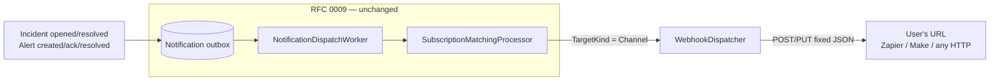

# RFC 0015 — Generic outbound webhook (Zapier / Make compatible)

Status: proposed
Author: Arael Espinosa (https://github.com/cl8dep)
Date: 2026-07-22

Implements [#67](https://github.com/Heva-Co/piro/issues/67).

## 1. Problem

Piro can notify a fixed set of destinations — email, Telegram, Twilio, ntfy, Google Chat, PagerDuty — each with provider-specific formatting baked into its dispatcher. There is no way to send an event to an arbitrary HTTP endpoint. A user who wants an incident to trigger a Zapier Zap, a Make.com scenario, an internal service, or any other automation has no path: their only options are integrations Piro happens to have hand-built.

Every no-code automation platform (Zapier, Make, n8n) exposes an inbound "catch webhook" trigger that fires when it receives an HTTP request with a JSON body. What is missing on Piro's side is the outbound half: *"when an incident opens or resolves, POST a JSON body to this URL."* That single primitive turns Piro's event stream into something any of those platforms can consume, without Piro building a dedicated integration per platform.

## 2. Non-goals

- **A user-editable body template.** The request body is a fixed, versioned JSON schema Piro owns (§4.3). Letting users template the body (Mustache/Handlebars) is deliberately deferred — it adds a templating-injection surface and a per-user contract Piro would have to keep stable, for a v1 whose consumers (Zapier/Make) map fields out of a *stable* JSON shape anyway. A frozen schema serves them better than a malleable one.
- **A retry/delivery-guarantee engine beyond what the existing pipeline provides.** Delivery rides the existing notification outbox and its per-attempt logging (§4.5); this RFC does not add exponential-backoff queues, dead-letter handling, or delivery SLAs.
- **Inbound webhooks.** This is strictly outbound (Piro → your URL). Inbound ingestion (a third party POSTing *to* Piro) is a separate concern served today only by `GcpCloudMonitoringWebhook` and is not touched here.
- **Per-service routing keys.** The webhook is a Channel-target destination, not a paging platform; it does not use `ServiceIntegrationMapping` (§4.2).
- **HMAC request signing.** Authenticating the outbound request to the receiver (a signed body, an HMAC header) is deferred; v1 authenticates via a user-supplied static header (§4.4, phase 2).

## 3. Design principle

**Reuse the RFC 0009 notification pipeline unchanged; the webhook is one more Channel-target dispatcher, not a new delivery path.** Everything below follows from that: routing, subscription matching, the outbox, and delivery logging already exist and already carry both alert and incident events to Channel destinations (Google Chat proves the path end-to-end today). The only genuinely new code is (a) an HTTP dispatcher that serializes a fixed payload and POSTs it, and (b) the admin config for the destination.

## 4. Design

The webhook is a new `IntegrationType.Webhook` integration whose dispatcher implements `IChannelNotificationDispatcher<T>` for both `AlertNotificationContext` and `IncidentNotificationContext`. An admin creates a Webhook integration (URL + method + optional auth header), then creates a `NotificationSubscription` selecting which events route to it — exactly as they would wire "prod alerts → Google Chat" today.



### 4.1 `IntegrationType.Webhook` — revive the reserved ordinal

`IntegrationType.Webhook = 3` already exists but is marked `[Obsolete("Not supported for now.")]` (`src/Piro.Domain/Enums/IntegrationType.cs:58`) — a legacy personal-notification stub that was never implemented, kept only for ordinal stability. This RFC revives that ordinal as the real outbound webhook: remove the `[Obsolete]` attribute and attach an `[IntegrationManifest(...)]` declaring:

- `Category`: Notification (it appears in the "Notification" section of the type picker, `IntegrationTypeGrid.tsx:36-61`).
- `Direction`: Outbound.
- `Capabilities`: `SendsChannelNotification` (`src/Piro.Domain/Enums/IntegrationCapability.cs:40`) — the flag that means "has a registered `IChannelNotificationDispatcher`". No `WebhookPath` (that field is for *inbound* types like `GcpCloudMonitoringWebhook`).
- `ConfigType`: `WebhookConfig` (§4.4).

Reviving the ordinal rather than adding a new one keeps the enum contiguous and avoids stranding `3` permanently; nothing persisted references the old obsolete meaning because it was never creatable.

### 4.2 Routing — reuse `NotificationSubscription` and the Channel path, no processor change

Routing is already solved by the RFC 0009 subscription system. A `NotificationSubscription` (`src/Piro.Domain/Entities/NotificationSubscription.cs`) is one admin-configured rule: "these events → this destination". For the webhook the destination is `TargetKind = Channel` with `IntegrationId` pointing at the Webhook integration.

The critical point: **the Channel delivery path does not touch `ServiceIntegrationMapping` or any per-service routing key.** `DeliverIncidentChannelAsync` (`src/Piro.Infrastructure/Notifications/SubscriptionMatchingProcessor.cs:153`) and `DeliverChannelAsync` (`:261`) resolve the dispatcher from the channel dictionary by `sub.Integration.Type` and call `dispatcher.SendAsync(sub.Integration, sub.Target, context, ct)` — `sub.Integration` holds the config, `sub.Target` is an optional label. Only the *Integration* target (`DeliverIntegrationAsync`, `:289`, used by PagerDuty) requires a `ServiceIntegrationMapping` routing key.

This matters because the processor deliberately skips the *Integration* target for incidents in v1 (`SubscriptionMatchingProcessor.cs:108-120`, `RecordSkippedAsync` with reason "Incident delivery to integration platforms is not supported in v1."). That skip is **irrelevant to this design**: the webhook is a Channel destination, and the Channel branch for incidents is fully live — Google Chat receives `IncidentCreated`/`IncidentResolved` over the Channel path today (registered at `InfrastructureServiceExtensions.cs:276`, subscribing to `AlertAndIncidentEvents` at `:305`). The webhook mirrors that exact wiring.

No changes to `SubscriptionMatchingProcessor`, `NotificationSubscription`, or `ServiceIntegrationMapping`.

### 4.3 The fixed payload schema

The body is not user-editable. Piro serializes a fixed envelope per event, with a top-level discriminator and a versioned schema. This is the public contract Zapier/Make map against, so it is versioned (`schemaVersion`) and stable.

Fields are drawn directly from the existing notification-context records, so the dispatcher has nothing to compute:

- `IncidentNotificationContext` (`src/Piro.Application/Models/IncidentNotificationContext.cs:12-22`): `IncidentId`, `Title`, `Status` (`IncidentStatus`), `IsResolved`, `Visibility` (`IncidentVisibility`), `AffectedServices` (`IReadOnlyList<string>` of service names), `OccurredAt`.
- `AlertNotificationContext` (`src/Piro.Application/Models/AlertNotificationContext.cs:26-71`): `ServiceName`, `CheckName`, `CurrentStatus` (`ServiceStatus`), `AlertDescription`, `Severity` (`AlertSeverity`), `IsRecovery`, `FiredAt`, plus the resource URLs (`IncidentUrl`, `ServiceUrl`, `CheckUrl`, `AlertUrl`).

Incident-opened envelope (illustrative — `incident.resolved` is identical with `event` swapped and `status`/`isResolved` reflecting the resolution):

```json
{
  "schemaVersion": 1,
  "event": "incident.opened",
  "sentAt": "2026-07-22T18:00:00Z",
  "incident": {
    "id": 42,
    "title": "API latency elevated",
    "status": "Investigating",
    "isResolved": false,
    "visibility": "Public",
    "affectedServices": ["Public API", "Dashboard"],
    "occurredAt": "2026-07-22T17:59:30Z"
  }
}
```

Alert-created envelope:

```json
{
  "schemaVersion": 1,
  "event": "alert.created",
  "sentAt": "2026-07-22T18:00:00Z",
  "alert": {
    "serviceName": "Public API",
    "checkName": "GET /health",
    "currentStatus": "DOWN",
    "severity": "Critical",
    "isRecovery": false,
    "description": "Connection timed out",
    "firedAt": "2026-07-22T17:59:30Z",
    "incidentUrl": "https://…/incidents/42",
    "serviceUrl": "https://…/services/7",
    "checkUrl": "https://…/checks/13",
    "alertUrl": "https://…/alerts/99"
  }
}
```

`event` values: `incident.opened`, `incident.resolved`, `alert.created`, `alert.acknowledged`, `alert.resolved` — one per subscribable `NotificationEventType` the webhook declares (§4.6).

**Serialization.** There is no shared outbound-JSON serializer today: `GoogleChatDispatcher` flattens its context to a plain-text string and serializes `new { text }` with default options (`src/Piro.Infrastructure/Alerts/GoogleChatDispatcher.cs:38`), and `JsonUtils` uses PascalCase with integer enums (`src/Piro.Infrastructure/JsonUtils.cs:8`). The webhook therefore defines its own `JsonSerializerOptions`: `PropertyNamingPolicy = JsonNamingPolicy.CamelCase` plus a `JsonStringEnumConverter`, so enums serialize as their names. Note `ServiceStatus` members are already upper-snake in source (`src/Piro.Domain/Enums/ServiceStatus.cs:5-14`), so `currentStatus` appears as `"UP"`, `"DOWN"`, `"DEGRADED"`, `"NO_DATA"`, `"MAINTENANCE"`, `"FAILURE"` regardless of naming policy. The other enum wire values: `IncidentStatus` = `Investigating|Identified|Monitoring|Resolved|Merged` (`IncidentStatus.cs:4-14`); `IncidentVisibility` = `Private|Public` (`IncidentVisibility.cs:4-8`); `AlertSeverity` = `Warning|Critical` (`AlertSeverity.cs:4-8`).

### 4.4 `WebhookConfig` and the admin UI

The destination config is a new `WebhookConfig` class under `src/Piro.Domain/Integrations/Config/`, declaring fields with the same `[ConfigField]` / `[Required]` / `[SecretField]` attributes every other integration uses (`ConfigFieldAttribute` at `src/Piro.Domain/Attributes/ConfigFieldAttribute.cs:12`). The admin panel renders these automatically from the config schema exposed at `GET /api/v1/integrations/types` (`src/Piro.Api/Controllers/IntegrationsController.cs:24-33`), via the integrations form renderer `DynamicConfigField.tsx` (`apps/admin/src/features/integrations/components/DynamicConfigField.tsx:34-124`).

v1 fields:

| Field | Control | Backend declaration | Notes |
|---|---|---|---|
| **Endpoint URL** | text input (`url`) | `[Required, Url] [ConfigField("Endpoint URL")]` | The destination. Rendered as a plain `Input` (DynamicConfigField `:106-113`). |
| **HTTP method** | select (POST / PUT) | `[ConfigFieldOptions("POST", "PUT")] [ConfigField("HTTP Method")]` | `ConfigFieldOptions` makes it an `Enum` field, which the integrations renderer already draws as a shadcn `Select` (DynamicConfigField `:88-98`). Precedent: `OpsgenieConfig.Region`. |
| **Auth header value** | secret input | `[SecretField] [ConfigField("Authorization header", HelpText = "Optional. Sent as the Authorization request header, e.g. 'Bearer …' or an API key.")]` | Optional. Encrypted at rest via the existing `SecretField` pipeline (`IntegrationExtensions.ReadDecryptedConfigJson`, `src/Piro.Application/Extensions/IntegrationExtensions.cs:104`). Rendered as a `password` input. |

This form lives in `apps/admin`, in the existing integration create/edit flow: `IntegrationFormPage.tsx` → `IntegrationTypeGrid` (type picker; Webhook appears in the Notification section once its manifest is `Creatable`) → `IntegrationConfigForm.tsx`, whose "Configuration" section maps `configSchema` to `DynamicConfigField` (`IntegrationConfigForm.tsx:238-251`). No new admin screens; the Webhook type slots into the generic flow.

**Deferred to phase 3 — arbitrary custom headers.** Issue #67 lists "custom headers" (a dictionary) as optional. The integrations renderer cannot express a key-value dictionary today: its value model is a flat `Record<string, string>` (`IntegrationConfigForm.tsx` `parseConfigJson:33-41`) and `DynamicConfigField` has no `KeyValue` case, so any field it can't type falls through to a single plain `Input` (`:106-113`). A `KeyValueControl` exists but only in the *shared* config-form renderer used by Checks (`apps/admin/src/components/config-form/KeyValueControl.tsx`), not wired into integrations. Supporting a full custom-headers dictionary therefore requires either migrating the integrations form onto the shared `DynamicConfigForm`/`FieldControl` (structured values + full type coverage) or adding a `KeyValue` case to the feature-local renderer. v1 ships the single optional Authorization header (a scalar field the current renderer handles), which covers the common auth case; the general headers dictionary is phase 3.

### 4.5 Delivery and logging — reuse the outbox and the `piro-webhook` HttpClient

The dispatcher's `SendAsync` reads and decrypts its config exactly as `GoogleChatDispatcher` does — `JsonUtils.DeserializeAndValidate<WebhookConfig>(integration.ReadDecryptedConfigJson(secretProtector))` (`GoogleChatDispatcher.cs:34-36`) — then issues the request on the named `HttpClient` `"piro-webhook"` already configured (HTTP/1.1, IPv4-forced, 15 s timeout; `InfrastructureServiceExtensions.cs:112-130`), setting the method from config and the `Authorization` header when present. It returns `true`/`false` and never throws, matching the `IChannelNotificationDispatcher` contract (`src/Piro.Application/Interfaces/IChannelNotificationDispatcher.cs:24`) — the subscription matcher records `Delivered`/`Failed` per attempt in the existing `NotificationDeliveryLog`, so failures are already observable without new logging.

### 4.6 Registration — mirror Google Chat exactly

`WebhookDispatcher` today is an alert-only stub returning `false` (`src/Piro.Infrastructure/Alerts/WebhookDispatcher.cs`). The implementation:

1. Implement a real `SendAsync` and add the second interface so the class implements **both** `IChannelNotificationDispatcher<AlertNotificationContext>` and `IChannelNotificationDispatcher<IncidentNotificationContext>` (Google Chat implements both — `GoogleChatDispatcher.cs:18-21`).
2. Register it twice in DI, mirroring `InfrastructureServiceExtensions.cs:271` and `:276`, so it lands in both the `_channel` and `_incidentChannel` dictionaries (`SubscriptionMatchingProcessor.cs:35-44`).
3. Declare an `EventSubscriber(IntegrationType.Webhook, NotificationTargetKind.Channel, EventSubscriber.AlertAndIncidentEvents)` (mirroring `:305`) so the subscription UI offers all five events for it. `AlertAndIncidentEvents` is the existing event set covering alert created/ack/resolved + incident created/resolved (`src/Piro.Infrastructure/Notifications/Subscribers/EventSubscriber.cs:30-37`).

### 4.7 What does NOT change

- **`SubscriptionMatchingProcessor`** — untouched. It is already generic over `IntegrationType` for the Channel path; the webhook is just another dictionary entry. The v1 incident-Integration skip (`:108-120`) stays as-is and does not affect the Channel-target webhook.
- **`NotificationSubscription`, `ServiceIntegrationMapping`, `NotificationEventType`, `NotificationTargetKind`** — no schema or enum changes. The five events the webhook subscribes to already exist.
- **The notification outbox, `NotificationDispatchWorker`, `NotificationDeliveryLog`** — reused unchanged; the webhook is a consumer, not a new pipeline.
- **The PagerDuty / `ISystemEventDispatcher` path** — untouched. The webhook deliberately uses `IChannelNotificationDispatcher` (self-addressed by config URL), not the trigger/resolve + routing-key semantics of the system-event path.

## 5. Data / schema scope

- **Enum:** `IntegrationType.Webhook` — no new value; the existing ordinal `3` is revived (remove `[Obsolete]`, add `[IntegrationManifest]`).
- **New config class:** `WebhookConfig` (`src/Piro.Domain/Integrations/Config/`). Not an entity — it is serialized into the existing `Integration.ConfigJson` column (`src/Piro.Domain/Entities/Integration.cs:12`).
- **No new entities. No new tables. No database migration.** A Webhook integration is a row in the existing `Integrations` table; a route to it is a row in the existing `NotificationSubscriptions` table.
- **No changes to** `NotificationEventType`, `NotificationEventNames`, `NotificationTargetKind`, `IncidentNotificationContext`, `AlertNotificationContext`, or any existing dispatcher.

## 6. Phased plan

1. **Phase 1 — dispatcher + fixed payload (backend).** Revive `IntegrationType.Webhook` with its manifest and `WebhookConfig` (URL + method only). Implement `WebhookDispatcher.SendAsync` for both context types with the frozen §4.3 payload and the dedicated camelCase serializer. Register it twice + add the `EventSubscriber`. Shippable: an admin can wire events to a URL via a subscription, POST only, no auth header. Independently testable end-to-end against a request-bin URL.
2. **Phase 2 — optional Authorization header.** Add the `[SecretField]` Authorization field to `WebhookConfig`; send it when present. Small, isolated; covers authenticated receivers (most Zapier/Make catch-hooks accept an unauthenticated URL, so phase 1 is already useful).
3. **Phase 3 — arbitrary custom headers (optional).** Bring a key-value headers control to the integrations form (migrate onto the shared `DynamicConfigForm` or add a `KeyValue` case to the feature-local renderer, §4.4). Deferred because it needs frontend renderer work disproportionate to its value once a single auth header exists.

## 7. Alternatives considered

- **Model the webhook as an `ISystemEventDispatcher` (like PagerDuty).** Rejected — that interface carries trigger/resolve semantics keyed by a per-service routing key via `ServiceIntegrationMapping`, and its Integration target is the one path deliberately skipped for incidents in v1. A generic webhook has no routing key and must carry incidents; `IChannelNotificationDispatcher` (self-addressed by the config URL) is the correct shape and the one the existing stub already chose.
- **Add a new `IntegrationType` value instead of reviving `3`.** Rejected — the obsolete ordinal was never creatable, so nothing persisted depends on its old meaning; reviving it keeps the enum contiguous and avoids permanently stranding a number.
- **User-editable body template (Mustache) in v1.** Rejected — see Non-goals. A frozen, versioned schema is a better contract for the target consumers and avoids a templating-injection surface; the in-house `NotificationTemplateHelper` renderer remains available if a future RFC wants to revisit this.
- **A standalone webhook subsystem (own table, own delivery worker).** Rejected — it would duplicate the RFC 0009 outbox, subscription matching, and delivery logging that already carry these exact events to Channel destinations. The webhook is a new dispatcher feeding the existing pipeline, not a parallel one.

## 8. Risks

- **The fixed payload is a public contract.** Once Zapier/Make scenarios map fields out of it, changing a field name or shape breaks them silently (the receiver just stops finding the field). `schemaVersion` is the mitigation, but only if future changes actually bump it and additive-only evolution is the discipline — this must be stated when the feature ships.
- **A slow or hanging receiver consumes a delivery slot.** The `piro-webhook` HttpClient enforces a 15 s timeout (`InfrastructureServiceExtensions.cs:112-130`), so a dead endpoint fails the attempt rather than blocking indefinitely — but a receiver that reliably takes ~14 s still ties up the dispatch worker longer than any other channel. Delivery is best-effort and logged; there is no retry queue in v1 (Non-goals).
- **SSRF-adjacent surface.** The destination URL is admin-supplied and Piro will POST to it from inside its own network. This is an admin-only capability (creating integrations is privileged), which bounds the risk, but a hardened deployment may want an egress allowlist. Out of scope for v1; worth a note in the security docs.
- **`FiredAtDisplay` and other per-recipient fields are not in the payload.** The alert context carries a pre-formatted `FiredAtDisplay` (`AlertNotificationContext.cs:59`) that is only populated on the personal-notification path; the webhook payload uses the raw `FiredAt` timestamp instead, which is the correct choice for a machine consumer but means the webhook body will not match what a human sees in an email.
