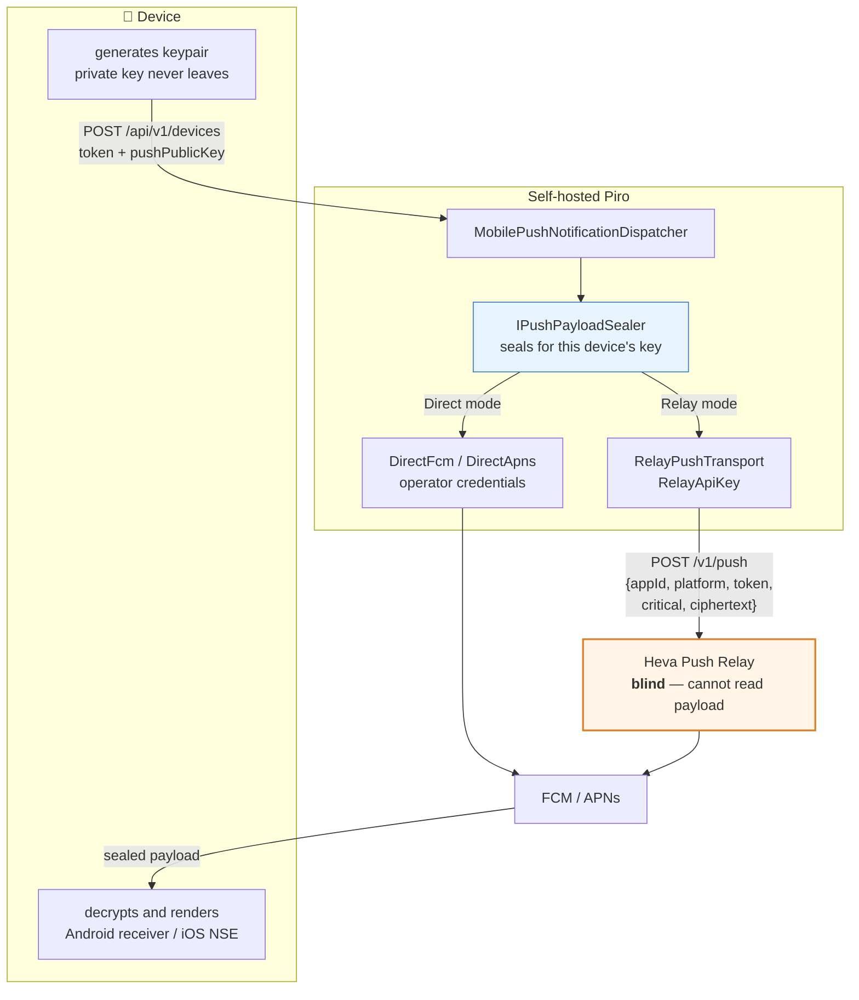
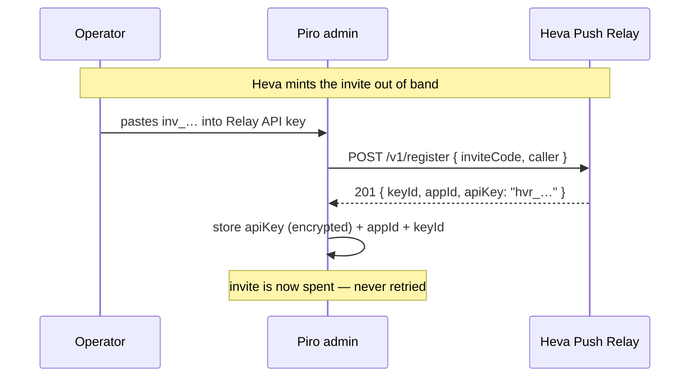

# RFC 0017 — End-to-end encrypted push, and a relay transport for the published apps

Status: implemented
Author: Arael D. Espinosa Pérez (https://github.com/cl8dep)
Date: 2026-07-27

## 1. Problem

Piro's mobile apps are published to the App Store and Play Store by Heva. A store build is bound at build time to exactly one Firebase project and one Apple bundle identifier, and the credentials for those — an FCM service account, an APNs `.p8` — belong to whoever published the app.

That creates a delivery gap the current design cannot close. `MobilePushConfig` asks each Piro operator for their own `FcmServiceAccountJson` and their own APNs `.p8` (`src/Piro.Integrations.MobilePush/MobilePushConfig.cs:20`, `:28`), and `FcmPushTransport` sends with those credentials (`src/Piro.Integrations.MobilePush/Transport/FcmPushTransport.cs:123-126`). A self-hosted operator whose team installed the *published* Piro app has no such credentials, and cannot get them: handing out Heva's service account would grant every operator send rights over every installation of the app. So today, the published app can only receive push from Heva's own backend, and a self-hosted instance can only push to an app the operator compiled and signed themselves.

There is a second problem, independent of the first and worse. Every push Piro sends today carries the alert in cleartext. `BuildData` puts `title`, `body`, `eventKey`, `alertId` and `url` into the FCM data payload as plain strings (`FcmPushTransport.cs:79-91`), and the APNs payload puts `title` and `body` directly in `aps.alert` (`src/Piro.Integrations.MobilePush/Transport/ApnsPushTransport.cs:78-83`). Alert titles routinely name hosts, services and failure modes. Anyone who can read the push — the provider, and any relay between Piro and the provider — reads the operator's incident data.

These two problems compose badly. Routing self-hosted push through Heva to reach the published app is the only way to close the delivery gap, but doing it with today's plaintext payload would mean Heva reads its customers' alerts.

## 2. Non-goals

- **Replacing direct FCM/APNs.** An operator who builds and signs their own app has their own credentials and should keep using them. Both modes are supported; neither is deprecated.
- **Running the relay.** The Heva Push Relay is a separate service in `Heva-Co/heva-notifications-backend`. This RFC specifies Piro as a *client* of its `POST /v1/push` contract and does not propose changes to it.
- **Encrypting anything other than push payloads.** Email, Telegram, Slack and webhook delivery are untouched. This is not a general end-to-end messaging feature.
- **Key escrow or recovery.** A device's private key never leaves the device. Losing it means the device re-registers with a fresh key. There is deliberately no recovery path, because a recoverable key defeats the purpose.
- **Multi-device key agreement.** Each device gets its own key and its own sealed payload. There is no shared group key, because pruning one compromised device must not require re-keying the rest.

## 3. Design principle

**Encrypt for the device, not for the transport.** The payload is sealed against a public key the device generated, before any transport is chosen, so no transport — Heva's relay, FCM, APNs, or a future one — is ever in a position to read it. Transport selection then becomes a routing decision with no security consequences, which is what makes it safe to add a relay at all.

A corollary that shapes §4: encryption is unconditional. It applies in Direct mode too, where the operator controls their own Firebase and arguably does not need it. One payload format and one client decryption path is worth more than the bytes saved by a plaintext fast path, and a mode-dependent format would mean two contracts to keep compatible with apps already shipped to stores.

## 4. Design



### 4.1 The sealed envelope

The envelope is the most expensive thing in this RFC to change later, because once apps are in the stores decrypting a given format, that format is a compatibility contract with binaries Heva cannot recall. It is therefore versioned from the first byte.

A sealed payload is a JSON object, base64url-encoded into a single string:

```json
{
  "v": 1,
  "epk": "<base64url ephemeral P-256 public key, uncompressed point, 65 bytes>",
  "n":   "<base64url nonce, 12 bytes>",
  "ct":  "<base64url AES-256-GCM ciphertext with 16-byte tag appended>"
}
```

Sealing, per device, per push:

1. Generate an ephemeral P-256 keypair. It is used once and discarded, which is what gives forward secrecy: compromising the device's long-term private key later does not decrypt pushes captured earlier.
2. ECDH against the device's `PushPublicKey` to a shared secret.
3. HKDF-SHA256 over that secret to a 256-bit key, with the info string `"piro-push-v1"` and the ephemeral public key as salt.
4. AES-256-GCM encrypt the plaintext with a random 12-byte nonce. The additional authenticated data is the literal ASCII `piro-push-v1`, binding the version so a downgrade cannot be forced.

The plaintext is the existing `PushMessage` serialized as JSON — `title`, `body`, `critical`, `url`, `eventKey`, `alertId` (`src/Piro.Integrations.MobilePush/Transport/IPushTransport.cs:24-40`). The record is unchanged; only where it is serialized moves.

The curve is NIST P-256, not X25519. .NET's `ECDiffieHellman` throws `PlatformNotSupportedException` for curve25519, and hand-rolling curve arithmetic in a security path is not worth the ideological win. P-256 needs no new dependency: the backend has no libsodium, NSec or BouncyCastle today — the only asymmetric usage anywhere is `ECDsa` signing for the APNs provider JWT (`ApnsPushTransport.cs:117-119`), and the only symmetric encryption is ASP.NET Data Protection (`src/Piro.Infrastructure/Security/DataProtectorSecretProtector.cs:15`). `ECDiffieHellman` + `AesGcm` cover the envelope in the BCL, P-256 ECDH is in Android's JCA well below our `minSdk` of 26, and CryptoKit has it on iOS.

New abstraction in `Piro.Integrations.Abstractions`, so a transport is handed an already-sealed blob and cannot accidentally send cleartext:

```csharp
public interface IPushPayloadSealer
{
    string Seal(PushMessage message, string devicePublicKey);
}
```

### 4.2 `DeviceToken` carries the device's public key

`DeviceToken` today is `Id, UserId, Platform, Token, DeviceName, CreatedAt, LastSeenAt, FailureCount` (`src/Piro.Domain/Entities/DeviceToken.cs:20-43`) with no key material. It gains one nullable column:

```csharp
public string? PushPublicKey { get; set; }   // base64url P-256 public key, uncompressed point, 65 bytes
```

Nullable, not required, and that is a deliberate compatibility decision. Devices registered before this ships have no key. A null key means "cannot receive an encrypted push", and the dispatcher skips that device with a log rather than failing the fan-out — the device re-registers with a key on its next app launch, because `onNewToken` and `registerCurrentDevice()` already run on every launch (`apps/mobile/androidApp/src/main/kotlin/co/heva/piro/android/push/PiroMessagingService.kt:29-37`).

`RegisterDeviceRequest` is `(DevicePlatform Platform, string Token, string? DeviceName)` (`src/Piro.Application/DTOs/DeviceDto.cs:6`) and gains a nullable `string? PushPublicKey`. The endpoint is unchanged: `POST /api/v1/devices` (`src/Piro.Api/Controllers/DevicesController.cs:22-33`), still `[Authorize]`, still upserting on the unique `(UserId, Token)` index (`src/Piro.Infrastructure/Persistence/Configurations/DeviceTokenConfiguration.cs:18`), so a device that re-registers with a rotated key updates in place.

`DeviceDto` (`DeviceDto.cs:9`) deliberately does **not** expose the key — it is not secret, but it has no use in the admin UI and omitting it keeps the response shape stable.

The integration boundary needs it too. `DeviceTokenInfo` is `(DevicePushPlatform Platform, string Token)` (`src/Piro.Integrations.Abstractions/IDeviceTokenReader.cs:23`) and gains `string? PushPublicKey`, mapped in `DeviceTokenReader.GetByUserIdAsync` (`src/Piro.Infrastructure/Integrations/DeviceTokenReader.cs:14-20`).

### 4.3 Transport selection becomes (Platform, Mode)

The dispatcher picks a transport with `transports.FirstOrDefault(t => t.Platform == device.Platform)` (`src/Piro.Integrations.MobilePush/MobilePushNotificationDispatcher.cs:52`). With one transport per platform that is unambiguous. Adding a relay transport for Android alongside `FcmPushTransport` would make it resolve by DI registration order — `FcmPushTransport` is registered first (`src/Piro.Infrastructure/Integrations/IntegrationServiceExtensions.cs:157-158`), so it would silently win and the relay would never be invoked. No error, no log.

`IPushTransport` therefore gains a second discriminator:

```csharp
public interface IPushTransport
{
    DevicePushPlatform Platform { get; }
    PushTransportMode Mode { get; }        // new
    bool IsConfigured(MobilePushConfig config);
    Task<PushSendResult> SendAsync(string token, string sealedPayload, bool critical, MobilePushConfig config, CancellationToken ct = default);
}

public enum PushTransportMode { Direct = 0, Relay = 1 }
```

and selection becomes `FirstOrDefault(t => t.Platform == device.Platform && t.Mode == config.Mode)`.

Note the `SendAsync` signature change: transports receive the sealed string and the `critical` flag, not the `PushMessage`. This is what makes "a transport cannot leak plaintext" a compile-time property rather than a convention. `critical` stays separate because it is routing metadata the provider needs in the clear — it drives FCM priority and APNs `interruption-level`, and it is in the relay's request schema alongside `ciphertext`.

While here, two latent bugs in the existing selection are worth fixing, since this RFC rewrites the loop: an unmatched platform is skipped with a bare `continue` (`MobilePushNotificationDispatcher.cs:53`), invisible in the summary log, and `IsConfigured` is declared on the interface but never called by the dispatcher — every transport re-checks its own config inside `SendAsync` instead. The rewritten loop logs the skip and consults `IsConfigured` before attempting a send.

### 4.4 `RelayPushTransport`

Two new transports, one per platform, both `Mode = Relay`, both POSTing to the relay's `/v1/push`:

| Relay field | Source |
|---|---|
| `appId` | From the redeemed key (§4.6), not operator-editable |
| `platform` | `"Android"` or `"iOS"` — case-sensitive; `"Ios"` is legacy-accepted but the canonical value is sent |
| `token` | The device's FCM/APNs token, unchanged |
| `critical` | The dispatcher's existing severity mapping (`MobilePushNotificationDispatcher.cs:82-83`) |
| `ciphertext` | The §4.1 sealed envelope |

The response mapping is the load-bearing part, and it maps cleanly onto the existing `PushSendResult` (`IPushTransport.cs:43-55`):

| Relay HTTP | `PushSendResult` | Effect |
|---|---|---|
| `200 Sent` | `Sent` | Delivered |
| `410 Unregistered` | `Unregistered` | Token pruned |
| `503 TransientFailure` | `TransientFailure` | **Token kept** |
| `400`, `401`, `403`, `429` | `TransientFailure` | Token kept, logged distinctly |

The rule that matters: **only `410` prunes.** The relay guarantees it never returns `410` for a relay-side fault — an expired APNs `.p8`, a missing FCM credential, an unconfigured APNs, an unknown `appId` and a relay database outage all collapse to `503` precisely so callers do not delete healthy tokens over someone else's misconfiguration. Piro must honor the other half of that contract by never pruning on anything but `410`. A `401` (revoked key) or `429` (rate limited) must not be mistaken for token death, which is why they map to `TransientFailure` rather than being lumped into a generic failure branch that prunes.

This is also a latent bug in the Direct transports that this RFC fixes. `FcmPushTransport` prunes on `MessagingErrorCode.InvalidArgument` as well as `Unregistered` (`FcmPushTransport.cs:59-69`), and FCM overloads `InvalidArgument` for both a malformed token and a malformed message — so a wrong service account prunes every Android token it touches. `ApnsPushTransport` treats `DeviceTokenNotForTopic` as token death (`ApnsPushTransport.cs:64-68`), which is really a bundle-id misconfiguration, so a wrong `ApnsBundleId` prunes every iOS token. Both classifications tighten to match the relay's discipline: blame the token only when the provider blames the token.

### 4.5 `MobilePushConfig` gains a mode and relay credentials

```csharp
[ConfigField("Delivery mode", HelpText = "…")]
public PushTransportMode Mode { get; set; } = PushTransportMode.Relay;

[ConfigField("Relay base URL", Placeholder = "https://relay.heva.co")]
public string? RelayBaseUrl { get; set; }

[SecretField]
[ConfigField("Relay API key", HelpText = "The hvr_… key issued by Heva, or paste an inv_… invite to redeem one.")]
public string? RelayApiKey { get; set; }

[ConfigField("Relay app ID")]                 // populated by redemption, read-only in the UI
public string? RelayAppId { get; set; }
```

`Mode` defaults to `Relay`, because the common case is an operator whose team installed the published app. An operator who compiled their own app switches to `Direct` and fills the existing FCM/APNs fields, which are untouched.

`RelayApiKey` carries `[SecretField]`, so it is encrypted at rest and masked on the way out through the existing reflection-driven path (`src/Piro.Application/Extensions/IntegrationExtensions.cs:111`, `:172`) with no new code.

`RelayAppId` is stored rather than configured. It arrives from redemption and exists so a failure can name *which* app the key is scoped to without revealing the key.

### 4.6 Onboarding: Piro redeems the invite

Heva mints a single-use invite with the relay admin token and sends the operator an `inv_…` code. The admin token never leaves Heva, which is the entire reason the invite path exists.

The operator pastes the invite into the Relay API key field. Piro detects the `inv_` prefix and redeems it against `POST /v1/register` with `{ inviteCode, caller }`, then stores the returned `apiKey` and `appId`. There is no `appId` in the redeem request — the invite determines it, so redeeming a code can never grant access to an app Heva did not intend.



The single-use nature is the trap to design against. If Piro retried a redemption, or re-redeemed on every config save, the second attempt would fail against a spent code and the operator would see "invalid credential" for a key that is actually fine. So: redemption is attempted exactly once, only when the submitted value carries the `inv_` prefix; on success the field is replaced by the issued `hvr_` key; on failure the error distinguishes "this invite was already used or has expired" from "the relay is unreachable", because those need opposite responses from the operator. A value already starting with `hvr_` is stored directly, which also lets an operator paste a key they obtained out of band.

### 4.7 Admin UI

The MobilePush config form is rendered generically from `ConfigField` metadata by `apps/admin/src/features/integrations/components/IntegrationConfigForm.tsx:246-247`, which maps `typeMeta.configSchema` through `DynamicConfigField` (`apps/admin/src/features/integrations/components/DynamicConfigField.tsx:35`). Field *types* are inferred from the property's CLR type by `ConfigSchemaBuilder.InferFieldType` (`src/Piro.Contracts/Schema/ConfigSchemaBuilder.cs:99`).

Three concrete UI consequences:

1. **`Mode` is an enum**, and the schema builder infers `Boolean` for `bool` and string otherwise. An enum needs to render as a select with `Direct` / `Relay` options, so `ConfigFieldType` gains an `Enum` case carrying its allowed values, and `DynamicConfigField` renders it as a shadcn `Select`. This is the one genuinely new piece of config-form machinery.
2. **Mode-dependent visibility.** The FCM/APNs fields are meaningless in Relay mode and the relay fields are meaningless in Direct mode. Showing all of them at once is how an operator ends up filling the wrong half. The checks-oriented form already has this concept — `visibleWhen` gating (`apps/admin/src/components/config-form/DynamicConfigForm.tsx:31-35`) — but the integrations form does not. The integrations renderer adopts the same `visibleWhen` predicate rather than inventing a second mechanism.
3. **`RelayAppId` is display-only**, populated after redemption, rendered as disabled text.

Two parallel generic config renderers already exist — `features/integrations/components/DynamicConfigField.tsx` and `components/config-form/DynamicConfigField.tsx`. This RFC does not merge them; it borrows `visibleWhen` into the integrations one and notes the duplication as pre-existing debt.

### 4.8 Client-side decryption

**Android.** `PiroMessagingService.onMessageReceived` reads `data["title"]`, `data["body"]`, `data["eventKey"]`, `data["alertId"]` as plain strings today (`PiroMessagingService.kt:39-60`). It instead reads a single `ciphertext` key, unseals it, and parses the plaintext JSON into the same fields, leaving the downstream rendering untouched — the critical path still goes to `IncomingAlertService.start` (`:56`) and the informational path to `postInformationalNotification` (`:63-76`).

`DeviceRegistrar.registerCurrentDevice()` (`apps/mobile/androidApp/src/main/kotlin/co/heva/piro/android/push/DeviceRegistrar.kt:17-22`) generates the keypair on first run, persists the private key, and sends the public key as a fourth argument.

Key storage has a hard constraint: `minSdk` is 26 (`apps/mobile/gradle/libs.versions.toml:20`), and Android Keystore key agreement (`PURPOSE_AGREE_KEY`) requires API 31. So the private key cannot be hardware-bound for ECDH across the supported range. It is stored in `EncryptedSharedPreferences` instead, which is already a dependency and already the pattern — `androidx.security:security-crypto` is wired at `apps/mobile/shared/build.gradle.kts:38` and used by `EncryptedTokenStorage.kt` for refresh tokens, which are comparably sensitive.

**iOS — designed here, implemented in phase 4.** `apps/mobile/iosApp` is a full SwiftUI app with real APNs registration (`apps/mobile/iosApp/Piro/Push/PushManager.swift:135-148`), but it has no Notification Service Extension: `project.yml:27-60` declares exactly one target, of `type: application`. All rendering is delegated to the system from the `aps` payload, so nothing in the app can read a custom field, let alone decrypt one.

Encrypted iOS push therefore needs, and this RFC specifies but defers:

- A new `type: app-extension` target in `project.yml`, subclassing `UNNotificationServiceExtension`.
- `mutable-content: 1` on the APNs payload, which `ApnsPushTransport.BuildPayload` does not currently set (`ApnsPushTransport.cs:72-93`). Without it the NSE never runs. The relay already sets it.
- A visible placeholder alert, since iOS requires one for the NSE to be invoked at all. The relay uses the constant `"New alert"`.
- An App Group, so the extension and app share the private key. `Piro.entitlements` has neither an App Group nor the critical-alerts entitlement today.
- Keychain storage for the private key, via CryptoKit.

Two things gate iOS beyond the code. The critical-alerts entitlement is absent from `Piro.entitlements`, and `ApnsPushTransport` sets `interruption-level: critical` for critical pages (`ApnsPushTransport.cs:82`) — APNs rejects that without the entitlement. And the relay's Development deployment has no `.p8` configured, so every `platform: "iOS"` push returns `503` with reason `apns:not_configured`, which means iOS relay delivery cannot be verified end to end until a relay deployment carries an APNs key. Deferring iOS to its own phase is a consequence of those two facts, not a scoping preference.

### 4.9 What does NOT change

- **`MobilePushNotificationDispatcher`'s orchestration.** Fan-out per device, severity mapping, `Render`/`RenderBody`, and prune-on-dead-token all stay (`MobilePushNotificationDispatcher.cs:26-112`). It gains sealing and a two-key transport lookup; it does not become relay-aware. `RelayPushTransport` is a transport, not a parallel pipeline.
- **`PushMessage`.** The record is untouched (`IPushTransport.cs:24-40`). It stops being the transport's input and becomes the sealer's input.
- **The event pipeline.** `IIntegrationEventHandler`, `EventDeliveryMode.Personal`, the `SupportedEvents` list (`src/Piro.Integrations.MobilePush/MobilePushIntegration.cs:23-27`) and RFC 0016's registry are all unmodified. This is a new transport under an existing integration, not a new integration.
- **Device registration's shape.** `POST /api/v1/devices` keeps its route, `[Authorize]`, and upsert-on-`(UserId, Token)` semantics (`DevicesController.cs:22-33`, `DeviceTokenConfiguration.cs:18`). One optional field is added.
- **Notification preferences.** `EnsureMobilePushPreferenceAsync` and the platform-wide MobilePush integration singleton (`src/Piro.Application/Services/DeviceRegistrationService.cs:44-89`) are untouched.
- **Secret handling.** `RelayApiKey` rides the existing `[SecretField]` machinery — no new encryption path, no new masking logic.

## 5. Data / schema scope

One migration, following the `{yyyyMMddHHmmss}_{PascalCase}` convention in `src/Piro.Infrastructure/Migrations/` (most recent: `20260726165808_Saml2ProviderConfig.cs`):

| Change | Detail |
|---|---|
| `DeviceTokens.PushPublicKey` | `AddColumn<string>`, **nullable**, maxLength 128 |

Additive and nullable, so it is safe against a populated production database and `Down()` is a plain `DropColumn`.

New enum: `PushTransportMode { Direct = 0, Relay = 1 }` in `Piro.Integrations.Abstractions`, not persisted as a column — it lives inside the integration's `ConfigJson`.

New `ConfigFieldType.Enum` case in `Piro.Contracts`, needed for the mode select (§4.7).

**No changes to:** `DevicePlatform` or `DevicePushPlatform` (`src/Piro.Domain/Enums/DevicePlatform.cs:5`, `IDeviceTokenReader.cs:26`) — no new platform is introduced. No changes to `Alert`, `Incident`, `Integration`, `UserNotificationPreference`, or any Quartz table. No new tables. No changes to the `DeviceTokens` unique index or its FK.

**Client-side model mirrors** that must move with the DTO: `RegisterDeviceRequest` in `apps/mobile/shared/src/commonMain/kotlin/co/heva/piro/shared/model/DeviceModels.kt:10-14` is hand-written, not OpenAPI-generated (the generator's model allow-list at `apps/mobile/shared/build.gradle.kts:73-79` excludes it), so it will not update itself.

## 6. Phased plan

**Phase 1 — Encryption, Direct mode only.** The sealer, `PushPublicKey` on `DeviceToken` plus migration, the DTO field, the `IPushTransport` signature change to sealed payloads, and the Android keypair + decryption. Both Direct transports switch to sending sealed payloads. Also tightens the over-eager pruning in both Direct transports (§4.4). Ships a real security improvement with no relay involved and no new external dependency.

**Phase 2 — Relay transport.** `PushTransportMode`, the `(Platform, Mode)` selection fix, `RelayPushTransport` for Android, the relay response mapping, and the config fields. Android-only, because iOS cannot be verified against the relay yet.

**Phase 3 — Onboarding and admin UI.** Invite redemption, `ConfigFieldType.Enum`, and `visibleWhen` in the integrations config form. Split from phase 2 so the transport can be validated with a hand-pasted `hvr_` key before any redemption code exists.

**Phase 4 — iOS.** The NSE target, `mutable-content: 1` on the Direct APNs payload, App Group, CryptoKit key storage, and the critical-alerts entitlement. Gated on a relay deployment with an APNs `.p8`.

## 7. Alternatives considered

- **Relay without encryption.** Rejected — it closes the delivery gap and opens a worse hole: Heva would read every self-hosted operator's alert content. The relay's own contract forecloses it anyway, since `ciphertext` is required and an empty value is a `400`, not a passthrough.
- **Encrypt only in Relay mode.** Rejected — two payload formats and two client decryption paths, both of which become compatibility contracts with store-published binaries. The saving is a few hundred bytes and one ECDH per push.
- **Infer the mode from which credentials are present.** Rejected — it makes a security-relevant routing decision implicitly. An operator who fills the FCM field wrong gets silently routed to Direct and a delivery failure that looks like a provider problem, instead of "you are in Relay mode and the API key is missing."
- **Distribute Heva's FCM service account to operators.** Rejected — grants every operator send rights over every installation of the published app. This is the problem the relay exists to avoid.
- **One shared key per user instead of per device.** Rejected — pruning one compromised device would force re-keying every other device that user owns, and the per-device public key is already a natural fit for the existing `(UserId, Token)` row.
- **X25519 for the key agreement.** Rejected because .NET cannot do it: `ECDiffieHellman.Create(ECCurve.CreateFromFriendlyName("curve25519"))` throws `PlatformNotSupportedException`, so it would mean implementing curve arithmetic by hand in a security path. P-256 is available in the BCL, in Android's JCA, and in CryptoKit.
- **libsodium/NSec for the envelope.** Rejected for now — `ECDiffieHellman` + `AesGcm` in the BCL cover it with no new dependency, and both mobile platforms have first-party equivalents. Worth revisiting only if the hand-assembled envelope proves awkward.
- **Symmetric pre-shared key per device.** Rejected — no forward secrecy, and it would need a secret to travel from device to server at registration rather than a public key.

## 8. Risks

- **The envelope format is a store-binary contract.** Once apps ship decrypting v1, a change needs both sides to coexist. Mitigated by the explicit `v` field and by binding the version into the GCM additional authenticated data, so a version downgrade is a decryption failure rather than a silent reinterpretation.
- **Private key loss is silent.** If a device loses its key — app data cleared, restore to new hardware — the server keeps sealing against a public key nobody can open, and every push decrypts to garbage on arrival. Registration is per-launch, so it self-heals on next open, but pushes in between are lost with no server-side signal. A decrypt-failure telemetry ping is the obvious follow-up and is deliberately out of scope here.
- **`minSdk 26` prevents hardware-bound keys.** Keystore ECDH needs API 31, so on 26-30 the private key sits in `EncryptedSharedPreferences` — strong against remote attackers, weaker than the secure element against a rooted device with physical access. Raising `minSdk` to 31 is the alternative and costs real install base.
- **Devices registered before phase 1 have no key.** They are skipped until they re-register. A quiet period of exactly one app launch per device, which is acceptable but will look like "push stopped working" to anyone watching a single device.
- **Relay quota is shared across all callers.** Every self-hosted instance draws on the same Heva FCM project quota and the same Apple Team key, which is why the relay rate-limits per `appId` on top of per key. One runaway Piro instance is a real risk to other operators' delivery, and a `429` must be treated as backpressure rather than an error to retry tightly.
- **Relay availability becomes a delivery dependency.** In Relay mode a Heva outage means no mobile push for self-hosted operators, on top of whatever incident they are being paged about. Direct mode remains the escape hatch for operators who cannot accept that coupling.
- **`DeviceTokenReader.MapPlatform` has a silent fall-through.** `_ => DevicePushPlatform.Android` (`src/Piro.Infrastructure/Integrations/DeviceTokenReader.cs:31`) means any future `DevicePlatform` value routes to FCM with no compile error. Not introduced here, but the surface this RFC touches makes it likelier to bite.
