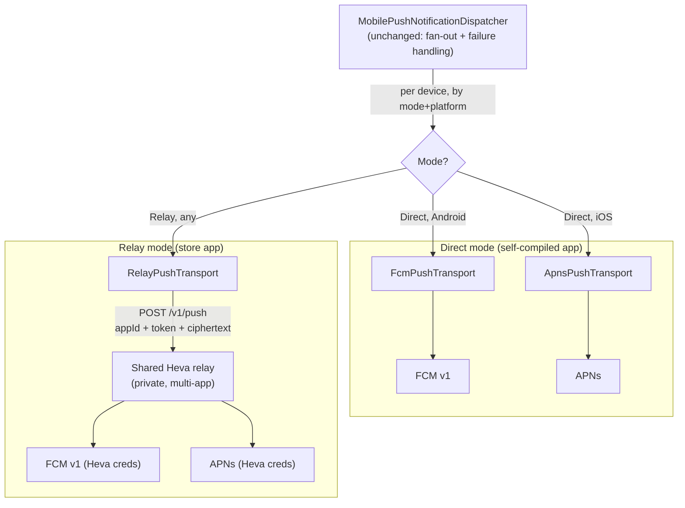
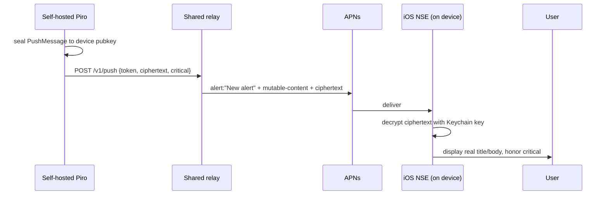

# RFC 0017 — Push Relay Server

Status: proposed
Author: Arael Espinosa (https://github.com/cl8dep)
Date: 2026-07-25

## 1. Problem

Piro ships a native on-call mobile app (KMP + Android + iOS). The MobilePush channel already sends real pushes: `FcmPushTransport` (`src/Piro.Integrations.MobilePush/Transport/FcmPushTransport.cs`) sends to Android through FCM v1 with a service-account key, and `ApnsPushTransport` (`src/Piro.Integrations.MobilePush/Transport/ApnsPushTransport.cs`) sends to iOS through APNs with a `.p8` signing key. Both read their credentials from `MobilePushConfig` (`src/Piro.Integrations.MobilePush/MobilePushConfig.cs`), encrypted at rest in the integration's `ConfigJson`.

This works only for a self-hoster who owns both the mobile-provider credentials **and** the app build those credentials were minted for. It breaks for the case Piro actually wants to support: a public app on the App Store / Play Store, installed by anyone, pointed at their own self-hosted Piro server.

The reason is structural, not a config gap:

- An FCM registration token minted by an app is only pushable by the Firebase project whose `sender_id` that app was compiled with. The published Android app is built with the publisher's `apps/mobile/androidApp/google-services.json` (its Firebase project and app package). A self-hoster's own Firebase service account **cannot** push to a token that app produced.
- APNs is the same shape with a softer wall: to push to a device token from the published iOS app you need the `.p8`, Team ID, and Bundle ID of the Apple Developer account that signed the published app. A self-hoster does not have those either.

So the published app produces tokens that only the app publisher's provider credentials can reach. A self-hosted server that receives such a token has no way to deliver to it. Handing every self-hoster the publisher's private FCM key and APNs `.p8` is a non-starter — it is the whole account's send authority, revocable only by rotating and breaking every deployment at once.

This is the same wall Bitwarden hit, and the resolution is the same shape: a **push relay** operated by the app publisher, which holds the provider credentials and forwards on behalf of self-hosted servers. Self-hosters keep pointing their app at their own server URL; only the final hop to FCM/APNs goes through the relay.

The relay is a **shared internal Heva service**, not a Piro-specific component and not part of this open-source repository — Piro is its first consumer, other Heva apps are expected to use the same service. Because the service is shared and lives outside this repo, **this RFC specifies only the client contract**: how Piro talks to the relay (`RelayPushTransport`, the `/v1/push` request shape, the mandatory end-to-end encryption of payloads) and how that plugs into the existing MobilePush channel. The relay's own internals — its provider credentials, per-app routing, tenant/onboarding model, hosting — are a private-repo concern described here only to the extent Piro must know them to be a correct client.

## 2. Non-goals

- **Not replacing the direct path.** A self-hoster who compiles their own app with their own Firebase/APNs credentials must keep sending straight to FCM/APNs with zero relay involvement. The relay is an *added* mode, not a replacement — the direct transports stay the default.
- **Not making the relay a message broker or store-and-forward queue.** It forwards one push, gets a provider result, returns it. It does not persist payloads, retry on the server's behalf, or hold state per notification. Delivery semantics (prune vs. retry) stay owned by `MobilePushNotificationDispatcher`.
- **Not specifying the relay's internal design.** The relay is a shared, private Heva service reused across the company's apps; its provider-credential model, per-app routing table, tenant catalog, storage, and hosting are defined in that service's own (private) repo, not here. This RFC stops at the client contract Piro depends on.
- **Not exposing the relay as a public API.** It is an internal Heva service, authenticated per caller (§4.7). Piro instances are one class of caller; it is not an open push endpoint anyone can use.
- **Not re-architecting device registration or escalation.** `DeviceToken`, `DeviceRegistrationService`, and the single-`MobilePush`-preference-per-user model (`src/Piro.Application/Services/DeviceRegistrationService.cs`) are untouched except for one additive column.
- **Not defining relay operational hosting** (region, autoscaling, billing) — that is a deployment concern for the internal service, out of scope for the design.

## 3. Design principle

The relay is a dumb, blind forwarder, and Piro treats it as an external dependency behind a client contract. It never learns what a notification says — **end-to-end encryption of the payload is mandatory in relay mode**, not an option, precisely because the relay is a shared service the app content must stay opaque to. It plugs in at exactly one seam Piro already has — `IPushTransport` — so that nothing above that seam (the dispatcher, fan-out, severity mapping, failure handling) knows the relay exists. The choice between sending direct or via the relay is a **server-side config decision**, invisible to the mobile app: the app registers its platform token the same way in both modes.

## 4. Design

### 4.0 Where the relay plugs in

Today the dispatcher selects a transport purely by platform. `MobilePushNotificationDispatcher.HandleAsync` (`src/Piro.Integrations.MobilePush/MobilePushNotificationDispatcher.cs`) resolves the user's devices via `IDeviceTokenReader`, renders one neutral `PushMessage`, and fans out to each device by matching `IPushTransport.Platform` (`src/Piro.Integrations.MobilePush/Transport/IPushTransport.cs:14`). The transport is the only thing that touches a provider SDK; the dispatcher is pure orchestration.

That seam is exactly where the relay belongs. The relay is a **new `IPushTransport` implementation** — it is not a new dispatcher, not a parallel pipeline, and not a change to fan-out. Selection changes from "by platform" to "by (mode, platform)":

- **Direct mode** (default, today's behavior): Android → `FcmPushTransport`, iOS → `ApnsPushTransport`.
- **Relay mode**: Android **and** iOS → `RelayPushTransport`, which POSTs an opaque encrypted blob to the shared Heva relay and lets the relay pick FCM vs. APNs by `appId` + platform.



Because `RelayPushTransport` returns the same `PushSendResult` enum (`Sent` / `Unregistered` / `TransientFailure` / `NotConfigured`, `IPushTransport.cs:43-56`), the dispatcher's existing prune-and-retry logic works verbatim — the relay just has to translate the provider's verdict into that enum in its response.

### 4.1 `MobilePushConfig` — add a push mode

`MobilePushConfig` today holds only the direct-send credentials. Add a mode selector plus the relay's connection fields:

```csharp
public enum MobilePushMode { Direct, Relay }

// new fields on MobilePushConfig
[ConfigField("Push delivery mode",
    HelpText = "Direct: this server sends to FCM/APNs itself (requires a self-compiled app with your own credentials). Relay: forward to a Piro push relay so the published app works without provider credentials.")]
public MobilePushMode Mode { get; set; } = MobilePushMode.Direct;

[ConfigField("Relay URL", Placeholder = "https://push.example.com")]
public string? RelayUrl { get; set; }

[SecretField]
[ConfigField("Relay API key",
    HelpText = "Issued when this instance registers with the relay. Identifies and authorizes this server.")]
public string? RelayApiKey { get; set; }
```

Field visibility is conditional on `Mode` in the admin form (§4.5). The existing FCM/APNs fields stay and are only relevant in `Direct` mode; the relay fields are only relevant in `Relay` mode. `IsConfigured` on each transport already gates on its own credentials, so `RelayPushTransport.IsConfigured` returns true only when `Mode == Relay` and `RelayUrl`/`RelayApiKey` are present, while `FcmPushTransport`/`ApnsPushTransport.IsConfigured` additionally return false in `Relay` mode. A device whose platform transport is `NotConfigured` is left untouched, matching current behavior.

### 4.2 `RelayPushTransport` — the client seam

New file `src/Piro.Integrations.MobilePush/Transport/RelayPushTransport.cs`, registered in `src/Piro.Infrastructure/Integrations/IntegrationServiceExtensions.cs` alongside `FcmPushTransport`/`ApnsPushTransport` (via `AddHttpClient`, like the APNs transport). It implements `IPushTransport` for **both** platforms — unlike the direct transports it is not bound to one `DevicePushPlatform`, so the dispatcher's per-device platform match is satisfied by registering it for each platform value in relay mode, or by relaxing the selection to "relay transport wins when mode is Relay" (chosen in phasing, §6).

`SendAsync` builds the request body:

```json
{
  "appId": "piro",
  "platform": "Android" | "Ios",
  "token": "<opaque provider token>",
  "critical": true,
  "ciphertext": "<base64 sealed PushMessage>"
}
```

`appId` is the routing key that makes the relay multi-app. The relay is a shared Heva service: it holds the provider credentials for several apps and uses `appId` to pick which app's FCM app-id / APNs bundle a given token belongs to. Piro sends a fixed `appId` of `"piro"`; the value is a constant of the client, configured alongside the relay URL, not something an end user sets. The self-hoster never chooses it — it identifies the *app build*, not the deployment. Everything else in the body is provider-neutral, and `ciphertext` is the only field carrying content, always encrypted (§4.3).

`ciphertext` is the encrypted `PushMessage` (§4.3). `critical` stays in the clear because the relay must know whether to send a high-priority/`interruption-level` push and, on iOS, a visible `alert` (§4.4) — but criticality is not sensitive, the alert text is. The relay's HTTP status and body map to `PushSendResult`: `200` → `Sent`, `410`/unregistered verdict → `Unregistered`, `5xx`/timeout → `TransientFailure`, misconfigured/unauthorized → surfaced as `TransientFailure` (so a revoked key doesn't silently prune every token).

### 4.3 End-to-end encryption — key lives on the device

The relay must never see notification content. That means the `PushMessage` (title, body, deep-link URL) is encrypted by the self-hosted Piro server and decrypted only on the device — the relay and even the relay operator (the app publisher) only ever handle `{platform, token, ciphertext}`.

For that to be true, the encryption key cannot come from the relay or from a publisher-held secret. It comes from the device itself. Each device generates an asymmetric keypair on first registration, keeps the private key in the platform keystore (Android Keystore / iOS Keychain), and sends the **public** key to its own Piro server as part of registration. The server seals each `PushMessage` to that device's public key before handing the ciphertext to `RelayPushTransport`.

`DeviceToken` (`src/Piro.Domain/Entities/DeviceToken.cs:18`) gains one nullable column:

```csharp
/// <summary>
/// The device's push-encryption public key (base64), generated on the device and uploaded at
/// registration. In relay mode the server seals each PushMessage to this key so the relay only
/// ever forwards opaque ciphertext. Null for devices registered before E2E or in direct mode.
/// </summary>
public string? PushPublicKey { get; set; }
```

Nullable is deliberate: direct-mode devices and pre-E2E rows don't need it, and the dispatcher falls back to sending an unencrypted `PushMessage` (direct mode only) or skips relay send with a `NotConfigured` result when relay mode is active but the device has no key yet (it will re-register and get one). This avoids a non-nullable column that would assume every existing device already did E2E enrollment.

`DeviceTokenInfo` (the neutral projection in `src/Piro.Integrations.Abstractions/IDeviceTokenReader.cs`, produced by `DeviceTokenReader`) gains the same field so the dispatcher can seal per device without reaching into `Piro.Domain`.

Sealing uses libsodium sealed boxes (X25519 + XSalsa20-Poly1305): the server needs only the public key to encrypt, and only the device's private key can open it — no shared secret, no key exchange round-trip, no publisher-held master key. The .NET side uses the same crypto primitive already available to the platform; the exact library is an implementation detail for the phase that builds it.

### 4.4 iOS: the data-only vs. visible-alert conflict, and the Notification Service Extension

iOS is where E2E collides with how APNs actually behaves, and this RFC resolves it explicitly rather than assuming a data-only push suffices.

A pure data-only APNs push (`content-available: 1`, no `alert`) is throttled and unreliable in the background — iOS does not guarantee it wakes the app, so it cannot be the transport for a critical on-call page. A reliable, DND-bypassing page needs a **visible `alert` payload** and, for full bypass, `interruption-level: critical` (which requires Apple's Critical Alerts entitlement on the published app). But a visible `alert` carries its title and body in the APNs payload — which, in relay mode, would pass through the shared relay in the clear, defeating E2E.

The resolution is a **Notification Service Extension (NSE)** in the iOS app (`apps/mobile/iosApp`). The push is sent with:

- A visible `alert` block containing only **non-sensitive placeholder** text (e.g. "New alert") so iOS treats it as a real, wake-worthy notification and honors `interruption-level`.
- `mutable-content: 1`, which hands the notification to the NSE before display.
- The sealed `ciphertext` in a custom data key.

The NSE runs on-device, decrypts the ciphertext with the device private key from the Keychain, rewrites the notification's title/body/deep-link with the real content, and only then does iOS display it. The relay and its operator only ever saw the placeholder and the blob.



Android has no equivalent constraint: `PiroMessagingService` (`apps/mobile/androidApp/.../push/PiroMessagingService.kt`) already handles data-only messages and builds the notification (including the full-screen critical alarm) itself, so it decrypts the ciphertext in `onMessageReceived` and constructs the notification directly — no extension needed. `FcmPushTransport` already sends data-only on purpose, which is exactly the shape E2E wants.

### 4.5 Admin UI — mode selector on the MobilePush integration form

The MobilePush integration is configured in the admin panel (`apps/admin`) through the standard integration config form driven by `[ConfigField]`/`[SecretField]` metadata (RFC 0016). This RFC adds one control and a conditional section to that existing form — no new page:

- **Push delivery mode** — a select (`Direct` / `Relay`), bound to `MobilePushConfig.Mode`, default `Direct`.
- When **Direct** is selected: show the existing FCM service-account and APNs fields (today's form, unchanged). Hide the relay fields.
- When **Relay** is selected: show **Relay URL** (text, validated as an absolute `https://` URL) and **Relay API key** (secret input, masked like other `[SecretField]`s). Hide the FCM/APNs credential fields, since they are unused in relay mode.

The conditional show/hide keys off the `Mode` value and reuses the form's existing field-rendering; the only new capability the config form needs is field visibility conditioned on another field's value. If the current `[ConfigField]` renderer has no conditional-visibility mechanism, adding a lightweight `VisibleWhen` hint to the metadata is in scope for the UI phase (§6, Phase 4) and is defined here as: a field annotated `VisibleWhen(nameof(Mode), "Relay")` renders only when that sibling field holds that value.

No public status-page (`apps/web`) surface is involved.

### 4.6 Mobile app — close the Android/iOS server-URL asymmetry

Relay mode assumes the published app points at a self-hosted server. iOS already supports this: the user enters their server at login and it is persisted (`apps/mobile/iosApp/Piro/ServerStore.swift`, applied via `ServiceLocator.swift`). Android does **not** — its base URL is hardcoded in `BuildConfig.PIRO_API_BASE_URL` (`apps/mobile/androidApp/.../ServiceLocator.kt`, set in `build.gradle.kts`), so a published Android build can only ever reach one server.

This RFC closes that asymmetry: Android gains the same login-time server-URL entry and persistence as iOS. `PiroApiClient` (`apps/mobile/shared/.../api/PiroApiClient.kt`) already takes `baseUrl` as a constructor argument, so this is Android UI + persistence (mirroring `ServerStore`/`ServiceLocator`), not a networking change. Device registration (`POST /api/v1/devices`) is unchanged except that the request now also carries the device's `PushPublicKey`.

### 4.7 Relay registration — identity by API key

A caller authenticates to the relay with a per-instance API key. From Piro's side this is a one-time onboarding step whose output — a `RelayApiKey` scoped to `appId = "piro"` — the admin stores in `MobilePushConfig.RelayApiKey`; every `POST /v1/push` presents that key. The relay validates the key, enforces per-caller rate-limits so one deployment can't exhaust the shared provider quota, and can revoke a key without affecting anyone else. Anonymous/IP-only auth was rejected (§7) because it makes quota abuse trivial and gives no revocation handle.

How keys are issued, stored, and mapped to an `appId`, and how a *new app* (not a new Piro instance) is onboarded to the relay, are internal to the shared service and specified in its private repo — Piro only needs a valid key and its fixed `appId`. The relay being multi-app is why the key is scoped to an `appId`: the same service authenticates callers from several Heva apps, and the key tells it both *who* is calling and *which app's* credentials to send with.

### 4.8 What does NOT change

- **`MobilePushNotificationDispatcher`** — fan-out, severity/critical mapping, `Unregistered` pruning, and `FailureCount` handling are untouched. The relay is a transport behind the same `IPushTransport` seam it already uses.
- **`IPushTransport` / `PushMessage` / `PushSendResult`** contracts — the relay is a new implementation of the existing interface returning the existing result enum. `PushMessage` is unchanged; it is what gets sealed.
- **`FcmPushTransport` / `ApnsPushTransport`** — the direct path is byte-for-byte the same in `Direct` mode.
- **Device registration model** — `DeviceRegistrationService`, the single-`MobilePush`-preference-per-user rule, `IDeviceTokenReader`, and the `DevicesController` CRUD endpoints stay as-is aside from the additive `PushPublicKey` field.
- **Escalation, alert lifecycle, notification preferences** — none are aware of push mode; MobilePush is still one destination that fans out.

## 5. Data / schema scope

- **New enum**: `MobilePushMode { Direct, Relay }` in `Piro.Integrations.MobilePush` (not a domain enum — it is integration config, stored inside `ConfigJson`, so **no migration** for the mode itself).
- **New columns on `DeviceTokens`**: `PushPublicKey text NULL` — one EF migration under `src/Piro.Infrastructure/Migrations`. Nullable, no backfill; existing rows re-enroll on next registration.
- **`MobilePushConfig`**: three new properties (`Mode`, `RelayUrl`, `RelayApiKey`) serialized into the existing encrypted `ConfigJson`. **No schema change** — the integration config is a JSON blob.
- **Relay service storage** lives entirely in the shared internal service (its app catalog, credentials, caller keys, rate-limit state) — **nothing** relay-side is in the Piro application database, and none of it is defined by this RFC.
- **No changes** to `Alert`, `AlertConfig`, `Incident`, `UserNotificationPreference`, `Integration`, or any check/worker table.

## 6. Phased plan

The relay service itself is **not** built in this repo (it is the shared internal Heva service, §1/§2); these phases are Piro's client-side work against it. The relay must expose its `/v1/push` contract before Phase 1 can be verified end-to-end, but that is a dependency, not a phase here.

1. **E2E key material + device enrollment.** Add `PushPublicKey` (migration + `DeviceTokenInfo`), device keypair generation, and public-key upload at registration (both apps). This lands first because encryption is mandatory in relay mode — there is no intermediate cleartext step to ship without it.
2. **Push-mode plumbing + `RelayPushTransport`.** Add `MobilePushMode`, the three `MobilePushConfig` fields, and `RelayPushTransport` that seals the `PushMessage` to the device public key and POSTs `{appId, platform, token, critical, ciphertext}` to the configured relay. Make transport selection `(mode, platform)`-aware. With Phase 1 in place this is a complete, encrypted relay send.
3. **On-device decrypt.** Android decrypt in `onMessageReceived`; the iOS **Notification Service Extension** for decrypt-before-display (§4.4). This closes the loop so a relayed push actually renders with real content.
4. **Admin UI + Android server-URL parity.** The `Mode` selector with conditional field visibility on the integration form (§4.5, incl. the `VisibleWhen` metadata hint if needed), and the Android login-time server-URL entry (§4.6) to match iOS.

Phases 1–3 together are the smallest shippable relay path — there is no "trusted relay sees plaintext" intermediate, because a shared multi-app service must never see content (§7). Phase 4 is the polish that makes the published-app story complete.

## 7. Alternatives considered

- **Hand each self-hoster the publisher's FCM/APNs credentials.** Rejected — it is the entire account's send authority, cannot be scoped per instance, and can only be revoked by rotating and breaking every deployment simultaneously.
- **Bring-your-own-Firebase, self-compiled app only (no relay at all).** This is exactly `Direct` mode, and it stays fully supported — but as the *only* option it forces every self-hoster to run their own Firebase project, Apple Developer account, and CI to rebuild and distribute the app. Too high a barrier to be the default; the relay exists so the published store app works out of the box.
- **Anonymous relay with per-IP rate-limiting.** Rejected — no way to revoke a bad actor, trivial to rotate IPs and exhaust the publisher's provider quota, and no per-instance accounting. Registration + API key (§4.7) gives identity, revocation, and per-instance limits for little extra onboarding cost.
- **Relay sees plaintext (no E2E).** Simpler — the relay just forwards title/body — but the relay is a *shared, multi-app* service: cleartext would make it a data processor for every app's notification content and a single point of leakage across all of Heva's apps at once. Rejected outright, with no intermediate cleartext phase — this is why E2E lands in Phase 1 rather than last.
- **Per-app credentials as separate relay tenants.** Considered — each app brings its own Firebase project and APNs key, fully isolated. Rejected in favor of a shared Heva Firebase project + Team `.p8`, with `appId` selecting the per-app FCM app-id / bundle at send time: less credential sprawl to operate, while `appId` still gives the relay enough to route correctly. (This is a relay-internal choice; Piro only sends its fixed `appId` either way.)
- **Data-only push on iOS instead of an NSE.** Rejected — background data-only pushes are throttled and not guaranteed to wake the app, so a critical page could silently not appear. The NSE is the only way to get a reliable, DND-bypassing visible alert whose real text is still decrypted on-device.
- **Server-held (not device-held) decryption key.** Rejected — if the self-hosted server could decrypt on the device's behalf there'd be a key the relay operator could in principle be compelled to reconstruct; a device-generated keypair with the private half never leaving the Keychain/Keystore is what makes "the relay cannot read notifications" a real guarantee rather than a policy.

## 8. Risks

- **iOS Critical Alerts entitlement.** `interruption-level: critical` requires an Apple-granted entitlement on the published app; without it, critical pages bypass DND less aggressively. This gates the published iOS build, not the design, but the NSE + entitlement work is real and Apple approval is not instant.
- **NSE payload-size and time budget.** APNs caps payload at 4 KB and the NSE has a short wall-clock budget to decrypt and rewrite. The sealed `PushMessage` is small (title/body/URL/ids), so this is comfortable — but a future richer payload must stay within 4 KB including the ciphertext overhead.
- **Lost device key = undecryptable pushes.** If a device's private key is lost (Keychain/Keystore wipe, restore-to-new-device without key migration) the server keeps sealing to a stale public key and the device can't open the result. Mitigation: treat key rotation as re-registration — the app regenerates and re-uploads on key-unavailable, and the old `DeviceToken` row is pruned like any dead token.
- **Relay as availability dependency, now shared across apps.** In relay mode the shared relay being down means no mobile pages for every relay-mode Piro instance at once — and, because the service is multi-app, an outage or a bad deploy affects *every* Heva app using it, not just Piro. Mitigation: the relay is deliberately minimal and stateless-per-push so it can be run redundantly; self-hosters who can't accept the dependency use `Direct` mode.
- **Placeholder-text leakage on iOS lock screen.** Between APNs delivery and NSE rewrite, the placeholder ("New alert") is what's technically in transit — acceptable because it carries no incident detail, but it means the relay-mode iOS notification can never encode anything sensitive in the pre-decrypt alert.
- **Quota exhaustion across a shared quota.** Every relay-mode Piro instance — plus every other Heva app on the shared relay — draws on the same Firebase/APNs quota. Per-caller rate-limits bound abuse but not aggregate legitimate load, and now one noisy app can starve another. The relay operator must size (and possibly per-`appId` tier) the shared provider quota as adoption grows across apps.
