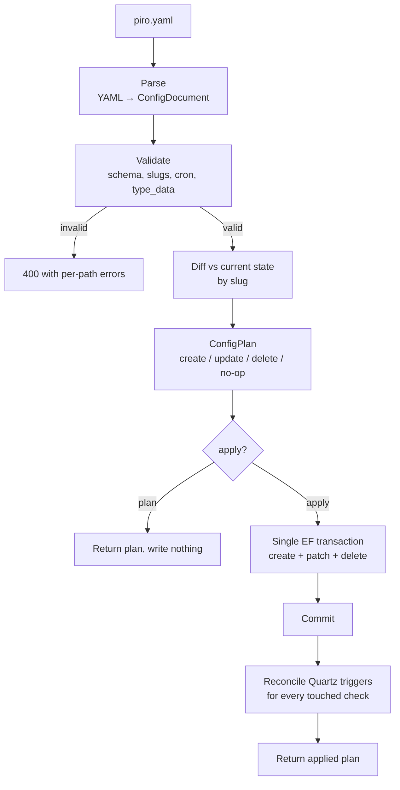
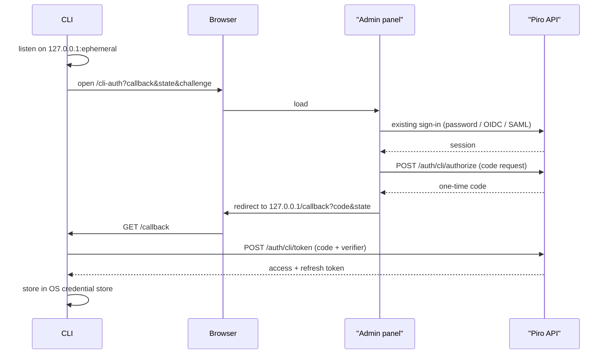
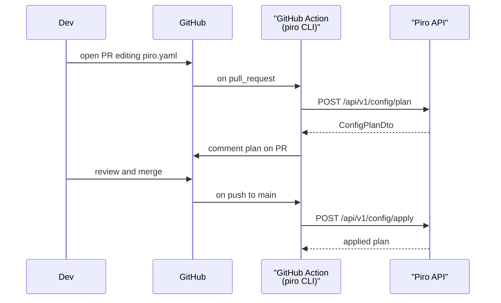

# RFC 0019 — Config as Code: `piro.yaml` and the `piro` CLI

Status: draft
Author: Arael Espinosa (https://github.com/cl8dep)
Date: 2026-07-27

## 1. Problem

Piro's monitoring topology can only be built by clicking through the admin panel. Every service and every check is created by hand, one form at a time, against a live instance. This produces four concrete failure modes:

**No reproducibility.** Standing up a second Piro instance — staging, a disaster-recovery replica, a self-hosted deployment for a different team — means manually recreating every service and check. There is no export today: `ServicesController` (`src/Piro.Api/Controllers/ServicesController.cs:21-30`) and `ChecksController` (`src/Piro.Api/Controllers/ChecksController.cs:15-19`) offer paged reads of DTOs, but nothing that round-trips into a form you could replay.

**No review.** Changing a check's cron from `*/5 * * * *` to `* * * * *` multiplies its load by five and is a single dropdown in a form. There is no diff, no approval, no record of who changed what or why. For teams that gate infrastructure changes behind PR review, monitoring configuration is the one thing that escapes it.

**No drift detection.** Once an instance and a team's intentions diverge, nothing surfaces it. A check disabled during an incident six months ago stays disabled, invisibly.

**Onboarding a service is manual toil.** A team adding a new microservice must remember to add the service, then each of its checks, with the right cron and the right type-specific config. In a repo-driven workflow this is a copy-paste of a YAML block in the same PR that ships the service.

The `Config as Code` milestone tracks this across seven issues (#23, #25, #26, #27, #28, #29, #31), none of which have any implementation: `YamlDotNet` appears in zero `.csproj` files, and there is no import, export, or reconciliation code anywhere in `src/`.

## 2. Non-goals

**GitOps pull.** Piro will not clone repositories, will not store GitHub tokens, will not receive webhooks, and will not run a reconciliation loop. Config as code is delivered exclusively by a CLI that pushes to the API. Repository-driven sync is achieved by running that CLI in the user's own CI. This keeps GitHub credentials out of Piro entirely and makes the feature work identically with GitLab, Bitbucket, or a local file.

**Making config as code mandatory.** An instance that never runs the CLI is unaffected in every respect. No schema changes, no new required fields, no behavior change to the admin panel. This is an additive capability, not a new operating model.

**Ownership tracking.** No `ManagedBy` column, no bundle identity, no record in the database of which resources came from a YAML file. The question "what should happen to a resource that exists in Piro but not in the YAML?" is answered by a CLI flag (§4.4), not by persisted state. This is deliberate: ownership metadata is only worth its migration and its UI complexity once multiple independent config sources contend for the same instance, which is not a problem anyone has yet.

**Incidents (#25) and maintenance windows (#26).** These are operational records, not configuration. An incident describes something that happened; replaying it from a Git checkout is meaningless, and a `--prune` that deletes incident history would be actively destructive. They are excluded from the config-as-code surface permanently, not deferred.

**Secrets.** An `Integration` holds credentials (`src/Piro.Domain/Entities/Integration.cs`). Checks may reference one via `Check.IntegrationId` (`src/Piro.Domain/Entities/Check.cs:36`). Neither integrations nor check-to-integration references are expressible in `piro.yaml` — a config file that lives in a Git repository must never be a place where credentials or references to them accumulate.

## 3. Design principle

**The YAML declares a subset; everything it does not declare, it does not touch.**

This single rule drives every decision below. It is what makes the feature safe to adopt incrementally, safe to abandon, and safe to extend field by field without a breaking change. A `piro.yaml` that names five fields on a service is an assertion about those five fields and silence about everything else — `image_url` set in the admin panel survives an apply, and adding `image_url` to the schema in a later release does not retroactively change the meaning of existing files.

The corollary is that the reconciler is a **patch engine, not a replacement engine**. Anywhere the design is tempted toward "the file is the complete truth," it resolves toward "the file is a partial assertion."

## 4. Design

### 4.1 The `piro.yaml` format

```yaml
# yaml-language-server: $schema=./piro.schema.json   # from `piro schema -o piro.schema.json`
version: 1

services:
  - slug: heva-api
    name: Heva API
    description: Main backend API
    is_hidden: false
    display_order: 1
    checks:
      - slug: health
        name: Health Endpoint
        type: Http
        cron: "* * * * *"
        is_active: true
        type_data:
          url: https://api.heva.com/health
          method: GET
          expectedStatusCode: 200
          timeoutMs: 5000

      - slug: dns
        name: DNS Resolution
        type: Dns
        cron: "*/5 * * * *"
        type_data:
          hostname: api.heva.com
```

The minimum valid service is three lines — `slug`, `name`, and nothing else.

**Service fields (v1):** `slug` (required, immutable identity), `name` (required), `description`, `is_hidden`, `display_order`.

Deliberately excluded from v1, and therefore never written by an apply: `image_url`, `default_status`, `history_days_desktop`, `history_days_mobile`, `escalation_policy`, `dependencies`, `tags`. Each is a candidate for a later version of the schema; each is currently owned by the admin panel alone.

**Check fields (v1):** `slug` (required, immutable within its service), `name` (required), `type` (required, immutable), `cron` (required), `description`, `is_active`, `type_data`.

Deliberately excluded: `integration` (§2), `required_worker_tags`, `alert_configs`.

**Never expressible, in any version:** `id`, `current_status`, `public_status`, `created_at`, `updated_at`. These are computed or assigned by Piro. `Service.CurrentStatus` carries an explicit "Never set directly" contract (`src/Piro.Domain/Entities/Service.cs:26`), and `PublicStatus` likewise (`src/Piro.Domain/Entities/Service.cs:28-31`).

`type_data` is a YAML mapping, not a JSON string. The reconciler serializes it to JSON before it reaches `Check.TypeDataJson`, which is a `jsonb` column (`src/Piro.Infrastructure/Persistence/Configurations/CheckConfiguration.cs:21`). Keys match the check's config record properties as reflected by `ConfigSchemaBuilder.For(Type)` (`src/Piro.Contracts/Schema/ConfigSchemaBuilder.cs:14`), which is the same source that drives the admin panel's dynamic check form and `GET /api/v1/checks/types` (`src/Piro.Api/Controllers/CheckTypesController.cs:21-30`).

`version: 1` is a required top-level discriminator. It exists so a future incompatible format can be introduced without guessing at the shape of an untagged file.

### 4.2 Identity: slugs, already unique, already immutable

No migration is required. The identity model config as code needs is already enforced:

- `Service.Slug` has a globally unique index (`src/Piro.Infrastructure/Persistence/Configurations/ServiceConfiguration.cs:15`).
- `Check.Slug` is unique per parent via a composite index on `(ServiceId, Slug)` (`src/Piro.Infrastructure/Persistence/Configurations/CheckConfiguration.cs:15`), which is exactly the scoping the nested YAML shape implies.
- Both are already immutable through the API: `UpdateServiceRequest` has no `Slug` field (`src/Piro.Application/DTOs/ServiceDto.cs:43-51`) and `ServiceAppService` documents the invariant (`src/Piro.Application/Services/ServiceAppService.cs:12`). `UpdateCheckRequest` has neither `Slug` nor `Type` (`src/Piro.Application/DTOs/CheckDto.cs:42-49`).

Renaming a slug in the YAML is therefore a delete plus a create, not a rename — the plan output must say so explicitly, because a user who renames `api` to `heva-api` expecting an in-place edit would otherwise be surprised by a destroyed check history. Changing a check's `type` is likewise a replace.

By-slug lookups exist at every layer already — `IServiceRepository.GetBySlugAsync`, `ICheckRepository.GetBySlugAsync(serviceId, slug, ct)`, plus the cheap existence probes `SlugExistsAsync` (`src/Piro.Application/Services/ServiceAppService.cs:34`) and `SlugExistsInServiceAsync` (`src/Piro.Application/Services/CheckAppService.cs:143`).

### 4.3 `ConfigReconciler` — the plan/apply engine

A new `ConfigReconciler` in `src/Piro.Application/Services/` owns parsing, validation, diffing, and application. It is the single place reconciliation logic lives, which is what lets the CLI, the API, and a future in-browser YAML editor (#75) share one implementation.

The plan is computed **server-side**. The CLI posts the YAML document and receives a plan; it does not fetch state and diff locally. This matters for three reasons: the reconciler needs validation the CLI cannot perform (check-type manifests, interval bounds), the diff must reflect the same normalization the write path applies, and a browser-based editor gets `plan` for free.



**Parse.** `YamlDotNet` deserializes into a `ConfigDocument` record graph in `Piro.Contracts`, with `type_data` captured as `Dictionary<string, object?>` and re-serialized to JSON. Parse errors report line and column — a YAML file is edited by hand, so positional errors are the difference between a usable tool and a frustrating one.

**Validate.** Everything is validated before anything is written. This closes real gaps in the current write path:

- *Cron.* Today an invalid cron passes both create and update. `EnsureScheduleWithinBounds` explicitly steps aside — `ICronIntervalCalculator.SmallestInterval` returns null on `FormatException`, `IndexOutOfRangeException`, and `ArgumentException` (`src/Piro.Infrastructure/Jobs/QuartzCronIntervalCalculator.cs:23-26`), and the caller treats null as "not this guard's concern" (`src/Piro.Application/Services/CheckAppService.cs:243-244`). The check persists and then throws from `CheckSchedulerService.ScheduleAsync` at `WithCronSchedule(QuartzCron.ToQuartzCron(check.Cron))` (`src/Piro.Infrastructure/Jobs/CheckSchedulerService.cs:32`) — after the commit, leaving a persisted check and a 500. A YAML apply that half-succeeds this way is unacceptable, so the reconciler validates cron up front. This requires promoting a cron-validity check into the Application layer: `QuartzCron.ToQuartzCron` is `internal` to Infrastructure (`src/Piro.Infrastructure/Jobs/QuartzCron.cs:4`), so `ICronIntervalCalculator` gains a `bool IsValid(string cron)` member implemented alongside `SmallestInterval`.
- *`type_data`.* Today the string is stored verbatim; the only inspection is a reflective `TimeoutMs` probe that swallows `JsonException` (`src/Piro.Application/Services/CheckAppService.cs:279`). Malformed or unknown-field configs reach `RegistryCheckExecutor` (`src/Piro.Infrastructure/Checks/RegistryCheckExecutor.cs:37`) and fail at execution. The reconciler validates `type_data` against the check's manifest config type using the deserialize-and-validate pattern that already exists for integration action input — `JsonUtils.DeserializeAndValidate<T>` (`src/Piro.Infrastructure/JsonUtils.cs:20-31`), used at `src/Piro.Application/Services/IntegrationAppService.cs:143`. That helper is `internal` to Infrastructure, so this promotes it behind an Application-layer interface.
- *Check type.* Resolved through `ICheckRegistry.Find(string checkId)` (`src/Piro.Checks.Abstractions/ICheckRegistry.cs:9-16`). An unknown `type` is a validation error naming the registered alternatives.
- *Interval bounds.* Reuses `EnsureScheduleWithinBounds` (`src/Piro.Application/Services/CheckAppService.cs:241-262`): the global one-minute floor, the per-type floor from `CheckManifest.DefaultIntervalSeconds` (`src/Piro.Checks.Abstractions/CheckManifest.cs:23`), and timeout-below-interval.
- *Duplicate slugs within the document*, and slug format.
- *Checks referencing an integration.* A check whose manifest declares `RequiredIntegration` (`src/Piro.Checks.Abstractions/CheckManifest.cs:41`) cannot be declared in YAML (§2). This is a validation error with an explicit message, not a silent skip.

All validation errors are collected and returned together, each with its YAML path (`services[2].checks[0].cron`). A user fixing one error at a time across ten round-trips is a broken workflow.

**Diff.** Match by slug, produce one `ConfigResourceChange` per resource: `Create`, `Update` (with the specific fields changing, old value and new), `Delete`, or `NoOp`. A resource present in Piro but absent from the YAML is `Delete` only when pruning is requested; otherwise it is omitted from the plan entirely and reported as an untouched count.

**Apply.** One `IUnitOfWork` transaction — the same abstraction `CheckAppService.CreateAsync` already uses (`src/Piro.Application/Services/CheckAppService.cs:167-179`). Either the whole document applies or none of it does. Ordering within the transaction: create services, then create and update checks, then delete checks, then delete services — so a check moving between services never collides, and a pruned service's checks are removed before the service.

### 4.4 Update is a patch, never a replacement

The design principle's sharpest consequence. When the YAML declares five service fields, the reconciler writes exactly those five. `Service.ImageUrl` set in the admin panel is not cleared. `HistoryDaysDesktop` is not reset to its default.

The existing update path is *almost* already patch-shaped: `ServiceAppService.UpdateAsync` applies each field only when non-null (`src/Piro.Application/Services/ServiceAppService.cs:58-83`), and `CheckAppService.UpdateAsync` does the same (`src/Piro.Application/Services/CheckAppService.cs:301-306`).

There is one exception, and it is a live hazard for this feature. `UpdateServiceRequest.EscalationPolicyId` is *not* patch-semantic — omitting it sets the field to null (`src/Piro.Application/Services/ServiceAppService.cs:70-79`). Since `escalation_policy` is out of scope for v1, every `piro apply` would silently detach the escalation policy from every service it touches, disabling on-call notifications for that service. This is exactly the class of bug the design principle exists to prevent.

The fix belongs in this RFC because it is a precondition, not a follow-up: `UpdateServiceRequest` gains an explicit tri-state for that field so "omitted" and "set to null" are distinguishable, and the DTO's doc comment (`src/Piro.Application/DTOs/ServiceDto.cs:42`, which currently and inaccurately describes the update as "a full replace") is corrected. The admin panel's behavior is preserved by sending an explicit clear where it previously relied on omission.

The same audit applies to `UpdateCheckRequest.IntegrationId`, which cannot currently be cleared to null at all (`src/Piro.Application/Services/CheckAppService.cs:306`). Since YAML never declares integrations, patch semantics leave it untouched, which is the desired behavior — no change needed, but the reconciler must not construct an `UpdateCheckRequest` in a way that trips it.

### 4.5 Deletion, and the `--prune` flag

Default behavior: **a resource in Piro but not in the YAML is left alone.** The plan reports it as untouched. This is what makes the file a partial assertion rather than a total one, and it means a user can adopt config as code for two of their twenty services without risking the other eighteen.

`--prune` opts into deletion. Because there is no ownership metadata, prune deletes *everything* not named in the documents — including resources created by hand in the admin panel. That is a sharp edge, and the design accepts it rather than papering over it: prune is opt-in per invocation, the plan enumerates every deletion by slug before anything happens, and the CLI requires confirmation (§4.6). Whoever runs `--prune` is asserting the documents are the complete truth for that instance. If it isn't, the plan output says so before they commit.

Two existing scheduler defects make deletion more than a database operation, and both must be fixed as part of this work:

**Deleting a service leaves orphaned Quartz jobs.** `ServiceAppService.DeleteAsync` (`src/Piro.Application/Services/ServiceAppService.cs:85-90`) removes the row; checks cascade at the database level via `DeleteBehavior.Cascade` (`src/Piro.Infrastructure/Persistence/Configurations/CheckConfiguration.cs:27`). Nothing calls `ICheckSchedulerService.UnscheduleAsync`, so every one of that service's check jobs keeps firing until the process restarts and `InitializeFromDatabaseAsync` rebuilds from `GetAllActiveAsync` (`src/Piro.Infrastructure/Jobs/CheckSchedulerService.cs:55-62`). Those jobs execute against a deleted check id. A prune that removes several services would leave a trail of them.

**Deactivating a check does not stop it.** `CheckSchedulerService.ScheduleAsync` returns immediately when `!check.IsActive` (`src/Piro.Infrastructure/Jobs/CheckSchedulerService.cs:16`), and the update path calls only `ScheduleAsync` (`src/Piro.Application/Services/CheckAppService.cs:312`). Toggling `is_active` from true to false therefore leaves the existing trigger in place and firing. Since `is_active: false` is a v1 YAML field, an apply that sets it would appear to succeed while the check kept running — a silent no-op that the plan claimed as a change.

Both are fixed in `ICheckSchedulerService` (`src/Piro.Application/Interfaces/ICheckSchedulerService.cs:6-16`) so the correction benefits the existing admin panel equally: `ScheduleAsync` unschedules when the check is inactive rather than returning early, and the service-delete path unschedules the service's checks before removing them.

### 4.6 The `piro` CLI

A new `src/Piro.Cli/` project, added to `Piro.slnx` (which currently lists sixteen projects under `/src/` at `Piro.slnx:3-18`).

```
piro login                          # interactive browser sign-in
piro logout                         # revoke the stored session
piro plan   -f piro.yaml            # diff only; writes nothing
piro plan   -f piro/                # a directory of YAML files
piro plan                           # discover config from the config file or ./piro.yaml
piro apply  -f piro/                # apply
piro apply  -f piro/ --prune        # apply, and delete what the files omit
piro export -o piro.yaml            # bootstrap from the current instance
piro export -o piro/ --split        # bootstrap, one file per service
```

**Exit codes**, chosen so CI can branch on them without parsing output:

| Code | Meaning |
|---|---|
| 0 | Success; for `plan`, no changes |
| 1 | Error — validation failure, network, auth |
| 2 | `plan` only: changes are pending |

`--output json` emits the plan as machine-readable JSON for CI consumption. `--auto-approve` skips the interactive confirmation that `apply` otherwise requires; `--prune` without `--auto-approve` requires typing the confirmation.

#### A file, a directory, or a glob

`-f` accepts a file, a directory, or a glob. A directory is walked for `*.yaml` and `*.yml`, **non-recursively by default** — `--recursive` opts into subdirectories. Files are loaded in lexicographic path order so the result is deterministic across machines and CI runners.

Splitting configuration across files is the normal case for any real topology: one file per service, or per team, in a directory a `CODEOWNERS` rule can target. The files are **concatenated, not merged**: each contributes its `services:` entries to one logical document, and a slug declared in two files is a validation error naming both paths, not a silent last-one-wins. There is no cross-file inheritance, no anchors spanning files, and no include directive — a file is readable on its own.

Every file carries its own `version: 1`. A directory whose files disagree on version is an error.

**The multi-file payload keeps file identity end to end.** `POST /api/v1/config/plan` takes a list of `{path, content}` rather than one blob, and every validation error carries the originating path plus line and column. Merging client-side into a single anonymous document would report `services[7].checks[2].cron` against a directory of twenty files, which is not an error message anyone can act on. Path-tagged documents are the only reason a split layout is usable.

**A directory makes `--prune` sharper, and the CLI must account for that.** With one file, a wrong path fails loudly — the file doesn't exist. With a directory, a too-narrow glob, a missing `--recursive`, a file with a `.yml.bak` extension, or an editor swap file silently yields a *smaller* document, and `--prune` then deletes every service the unread files declared. The failure is invisible precisely when it is most destructive. Therefore: `plan` and `apply` always print the resolved file list with a count before the plan, and `--prune` refuses to run when zero files matched rather than treating an empty document as "delete everything."

#### Configuration file

Connection settings live in `piro.config.yml`, resolved by walking up from the working directory (like `.gitignore` or `package.json`), falling back to `~/.piro/config.yml`. A repo-local file is what makes `piro plan` work with no arguments in CI and on a teammate's laptop.

```yaml
# piro.config.yml
current: production

instances:
  production:
    url: https://status.heva.co
    config: ./piro/            # default -f target
  staging:
    url: https://status.staging.heva.co
    config: ./piro/
```

`current` names the default instance; `--instance staging` (or `PIRO_INSTANCE`) selects another. `config` is the default `-f` target for that instance, so `piro plan` with no flags is unambiguous.

**The config file never holds credentials.** There is no `api_key` field, and the parser rejects one with a message pointing at the alternatives. This file is meant to be committed next to `piro.yaml`; a schema that invites a secret into a Git repository is a schema that will eventually receive one. Tokens live in the OS credential store (§ below) or in `PIRO_API_KEY`.

**Resolution order**, highest priority first: command-line flags → `PIRO_URL` / `PIRO_API_KEY` / `PIRO_INSTANCE` environment variables → the nearest `piro.config.yml` → `~/.piro/config.yml` → for credentials only, the stored session from `piro login`. Environment variables outrank the file so CI needs no file edits, and `piro login` is last so an explicit `PIRO_API_KEY` in a CI job is never shadowed by a developer's cached session.

`piro init` scaffolds a `piro.config.yml` and an example `piro.yaml`.

#### Authentication: two paths for two audiences

CI and humans have opposite requirements — CI needs a non-interactive, long-lived, revocable credential; a human wants to not paste a token. The CLI supports both.

**CI: an API key, with no backend changes.** `ApiKeyAuthenticationHandler` (`src/Piro.Infrastructure/Auth/ApiKeyAuthenticationHandler.cs:22-62`) reads the `X-Api-Key` header (`ApiKeyAuthenticationOptions.HeaderName`, `:14`), validates it, and issues the same claims a JWT would — user id, email, name, and one role claim per role (`:49-55`), so `[Authorize(Roles = ...)]` works unchanged. The scheme is selected purely by presence of that header (`src/Piro.Api/Program.cs:154-157`). `ApiKeyService.ValidateAsync` only accepts keys with `Scope == ApiKeyScope.Full` (`src/Piro.Infrastructure/Auth/ApiKeyService.cs:77`), so an inbound check token can never be used here. Users can already mint a Full-scope key from the admin panel (`apps/admin/src/features/configuration/pages/ApiKeysPage.tsx:36` → `POST /api/v1/auth/api-keys`, `src/Piro.Api/Controllers/AuthController.cs:148-156`).

**Humans: `piro login` opens a browser.** The CLI starts a loopback listener on `127.0.0.1` at an ephemeral port, opens the admin panel at `/cli-auth?callback=http://127.0.0.1:<port>/callback&state=<random>&challenge=<S256>`, and waits. The user authenticates in the browser with whatever the instance already supports — password, OIDC (`src/Piro.Api/Controllers/OidcController.cs`), or SAML (`src/Piro.Api/Controllers/Saml2Controller.cs`) — which is the decisive advantage: an SSO-only instance has no password for a CLI prompt to collect, and the browser is the only place that flow can complete. The panel then redirects to the loopback URL with a one-time code, and the CLI exchanges it for tokens.



This is PKCE-shaped deliberately: a loopback redirect on a shared machine is reachable by any local process, so the code alone must not be sufficient. `state` is verified before the code is used, the code is single-use with a short TTL, and the CLI holds the verifier.

Two endpoints are new — this is the one place the CLI is not free of backend work:

| Endpoint | Purpose |
|---|---|
| `POST /api/v1/auth/cli/authorize` | Authenticated (browser session); mints a one-time code bound to the callback, state, and challenge |
| `POST /api/v1/auth/cli/token` | Anonymous; exchanges code + verifier for tokens; single-use |

Plus a `/cli-auth` route in `apps/admin` that shows what is being authorized, requires an explicit approval click, and redirects. The approval click matters: without it, a user already signed into the panel would grant a CLI token by merely having a link opened.

**The issued credential is a refresh-token session, not a new mechanism.** RFC 0018 replaces the single-session model with one `RefreshToken` row per device, carrying a `DeviceLabel` for a future sessions screen (`src/Piro.Domain/Entities/RefreshToken.cs:20-21`). A CLI login is exactly that: one more session, labeled `piro-cli on <hostname>`, refreshing and revoking independently of the user's browser session, and revocable from the same UI. **This RFC therefore builds on 0018**, which is implemented — without per-device sessions, `piro login` would sign the user out of the admin panel, and `piro logout` would end their browser session.

Tokens are stored in the OS credential store — Keychain on macOS, DPAPI on Windows, Secret Service on Linux — falling back to `~/.piro/credentials.json` at mode `0600` with a warning when no store is available. Never in `piro.config.yml`. `piro logout` revokes the session server-side, not just locally.

`plan` and `apply` print which instance and identity they are acting as before doing anything, so a developer with several instances configured cannot apply staging config to production without having seen the target name.

**NativeAOT and the dependency graph.** `PublishAot` appears in no project today; the CLI would be the first. It must reference **nothing** from the existing graph: `Piro.Contracts` carries `FrameworkReference Microsoft.AspNetCore.App` (`src/Piro.Contracts/Piro.Contracts.csproj:10`), and `Piro.Infrastructure` pulls EF Core, Quartz, QuestPDF, Jint, and ITfoxtec SAML — all AOT-hostile. The CLI is a thin HTTP client that posts a YAML document and renders the returned plan; it duplicates a small set of plan/response records rather than sharing the server's. Since there is no `Directory.Build.props` at the repo root, `PublishAot` in the CLI's own `.csproj` cannot leak into any other project.

Because the CLI does not parse or validate YAML itself — it uploads the documents and the server validates — the AOT surface stays small: enumerate files, HTTP calls, deserialize known response shapes via a `System.Text.Json` source-generated context, print. YamlDotNet's reflection-based deserializer, which needs trim annotations to survive AOT, stays server-side where it runs on the JIT.

The two pieces that do add AOT surface are the config file and the login flow. `piro.config.yml` is small and closed, so it is parsed into a source-generated type rather than pulling YamlDotNet into the binary. The loopback listener uses `HttpListener`, and opening the browser is a platform-specific shell-out (`open`, `xdg-open`, `rundll32`); neither needs reflection. The OS credential stores are reached through native interop per platform, which is AOT-friendly but is the main source of platform-specific code in the CLI.

**Distribution.** `release.yml` builds four Docker images on release publish (`.github/workflows/release.yml:27-149`) and attaches assets in a final job that already holds `contents: write` and calls `gh release upload --clobber` (`:151-169`). CLI binaries hook in as a matrix job over `linux-x64`, `linux-arm64`, `osx-x64`, `osx-arm64`, `win-x64`, feeding that existing upload step, with `resolve-version.outputs.version` (`:12`) for stamping. Cross-OS AOT compilation is not supported, so macOS and Windows targets need their own runners.

`ci.yml`'s `backend` path filter is `src/**` (`.github/workflows/ci.yml:25`), so `src/Piro.Cli/` is automatically covered by the existing backend job.

### 4.7 API surface

Three endpoints on a new `ConfigController` at `api/v1/config`:

| Endpoint | Body | Returns |
|---|---|---|
| `POST /api/v1/config/plan` | `{documents: [{path, content}], prune}` | `ConfigPlanDto` |
| `POST /api/v1/config/apply` | `{documents: [{path, content}], prune}` | `ConfigPlanDto` with applied results |
| `GET /api/v1/config/export` | — | `text/yaml` |

`plan` is a first-class endpoint, not `apply?dryRun=true`. It is the endpoint CI calls on every pull request, and giving the read-only operation its own route means it can be reasoned about and authorized independently of the write.

**The request carries a list of documents, each tagged with its source path** (§4.6). A single-file invocation is the one-element case, so there is no separate shape for it. `path` is informational — used only to attribute errors and changes back to a file — and is never interpreted as a filesystem path server-side. It is echoed back in responses, so it is treated as untrusted display text.

`ConfigPlanDto` carries a summary (counts of create, update, delete, no-op) and a flat list of `ConfigResourceChange` — kind, slug, parent slug for checks, action, the source `path` and line, and for updates the per-field before and after. Validation errors are a parallel list, each with `path`, line, column, YAML pointer, and message, so a directory of twenty files produces errors a user can navigate.

**Authorization.** `[Authorize(Roles = "Owner,Admin")]`, matching the API-key management endpoints (`src/Piro.Api/Controllers/AuthController.cs:139`) and `CheckTypesController` (`src/Piro.Api/Controllers/CheckTypesController.cs:10`). There is no finer-grained option: no `Permissions` constants class exists, and the `Permission` / `RolePermission` entities (`src/Piro.Domain/Entities/Permission.cs`, `src/Piro.Domain/Entities/RolePermission.cs`) are mapped (`src/Piro.Infrastructure/Persistence/Configurations/RbacConfiguration.cs:21-42`) but never seeded and never read by any authorization decision. Activating that dormant RBAC is out of scope here.

Worth noting for reviewers: `ServicesController` and `ChecksController` carry no `[Authorize]` attribute at all, and `Program.cs` registers no fallback policy (`src/Piro.Api/Program.cs:243-244`), so service and check CRUD is currently anonymous. This RFC does not fix that, but it does mean the new config endpoints are *more* restricted than the endpoints they wrap. That asymmetry is intentional — a bulk mutation endpoint should not be the loosest door in the building — and the underlying gap is a separate issue.

### 4.8 Export

`GET /api/v1/config/export` serializes current services and checks into the v1 schema. Fields outside the v1 subset are omitted, and fields matching their default are omitted so the output stays readable. The emitted file leads with the `yaml-language-server` schema comment.

Export is a bootstrap tool, and it must be honest about being lossy. A check bound to an integration cannot be represented (§2); export emits it as a commented-out block with an explanatory note rather than silently dropping it, so a user who then runs `apply --prune` against the exported file does not delete checks that merely failed to serialize.

The endpoint always returns one document. Splitting is a CLI concern: `piro export -o piro/ --split` writes one `<service-slug>.yaml` per service into the target directory, which is the layout most teams will keep long-term and the one a `CODEOWNERS` rule can target per service. Without `--split`, `-o` is a single file. `--split` refuses to overwrite an existing non-empty directory unless `--force` is passed, since exporting over a hand-maintained directory would discard comments and ordering.

### 4.9 CI integration

The repository-sync experience is a documented GitHub Actions workflow, published as an example rather than as a Piro-hosted feature:



`PIRO_URL` and `PIRO_API_KEY` are repository secrets. Piro holds no GitHub credentials and has no inbound dependency on GitHub, which is what keeps §2's non-goal structurally true rather than merely a current limitation.

### 4.10 JSON Schema (#31)

The v1 format is small and closed, so a JSON Schema falls out of it almost for free. **Implemented as `GET /api/v1/config/schema`, generated from the serving instance's check registry, with `piro schema -o piro.schema.json` to download it** — rather than as a static file in this repository. The reason is the same one that makes `type_data` the hard part: each check declares its own config shape, so a schema baked at release time describes only the check types Piro ships with, and is silently incomplete for exactly the types an operator would most need help writing. Per-check-type `type_data` sub-schemas are generated from the same manifest reflection that already produces the admin panel's dynamic form — `ConfigSchemaBuilder.For(Manifest.ConfigType)` (`src/Piro.Contracts/Schema/ConfigSchemaBuilder.cs:14`), surfaced through `CheckTypeManifestExtensions` (`src/Piro.Application/Extensions/CheckTypeManifestExtensions.cs:24`). Generating it from the registry rather than hand-writing it means the schema cannot drift from the check types that actually exist.

`type_data` is bound to the check's type through a chain of conditionals — one `if type is X then type_data looks like Y` per registered check — so an editor completes `url` inside an HTTP check and `host` inside a DNS one. Each branch requires `type` to be present; without that it also matches a check omitting `type`, and every branch would apply at once. `additionalProperties` is false throughout, because under patch semantics an unrecognised key silently means "not declared", so a typo must be caught in the editor rather than quietly leaving the real value untouched. A check whose manifest declares `RequiredIntegration` is excluded, since the validator rejects it in YAML (§2) and offering it would autocomplete a file that can never apply.

One wrinkle worth recording: a property renamed by `[JsonPropertyName]` still binds from its CLR name, because the serializer matches case-insensitively — an HTTP check's `TimeoutMs` loads from either `timeout` or `timeoutMs`, and config written before the attribute existed uses the latter. The schema therefore describes both spellings; a schema stricter than the server rejects documents the server loads happily, and made an exported document fail its own schema.

### 4.11 Admin panel

v1 adds two surfaces to `apps/admin`.

**A read-only Config as Code page** — **deferred, not implemented.** Export is available through `piro export` and the API, so the page is a convenience rather than a dependency. When it lands it belongs under the existing configuration section (alongside `apps/admin/src/features/configuration/pages/ApiKeysPage.tsx`), containing:

- A short explanation of the CLI workflow with the install command and a link to the docs.
- An **Export** button that downloads `piro.yaml` from `GET /api/v1/config/export`.
- A link to API key management, since a Full-scope key is what CI uses.

**A `/cli-auth` route** that completes the browser login flow (§4.6). It is a full-page consent screen, not a dialog, and it is the only new interactive UI in this RFC:

- Reached with `callback`, `state`, and `challenge` query parameters. It renders only after the user is authenticated; an unauthenticated visitor goes through the normal sign-in flow (password, OIDC, or SAML) and returns here, parameters preserved.
- Shows who is signing in (the current user's email), what is being authorized (`Piro CLI`, with the hostname the CLI reported), and the fact that the session appears in their sessions list and can be revoked.
- Two buttons, **Authorize** and **Cancel**, with no default action on load. Authorization must be a deliberate click — a page that granted a token on render would turn any opened link into a credential leak. Cancel redirects to the loopback with an error so the CLI exits promptly instead of hanging until timeout.
- Validates that `callback` is a `127.0.0.1` or `localhost` loopback URL and rejects anything else, so the consent screen cannot be used to forward a code to an arbitrary origin.
- After Authorize, calls `POST /api/v1/auth/cli/authorize` and redirects to the callback with the code and state. Success and failure states are both rendered — a user whose CLI has already exited needs to be told the browser tab is now safe to close.

No YAML editing in v1. The in-browser editor (#75) is a later phase (§6) that reuses `plan` and `apply` unchanged, which is precisely why the plan is computed server-side.

Because there is no ownership metadata, existing service and check pages are unchanged — nothing is marked "managed by config," nothing becomes read-only. The admin panel behaves exactly as it does today.

### 4.12 What does NOT change

- **`ServiceAppService` and `CheckAppService` remain the only write path.** The reconciler composes their existing `CreateAsync` / `UpdateAsync` / `DeleteAsync` methods rather than writing to repositories directly. Alert config creation, system-tag reconciliation via `ISystemTagService.ReconcileCheckAsync` (`src/Piro.Application/Services/CheckAppService.cs:190`, `:315`), and inbound-token minting for check types shipping an inbound handler (`:186-187`) all continue to happen, unmodified, for YAML-created checks. This is the single most important reuse decision in the RFC: a parallel write path would silently skip these and produce checks subtly different from admin-panel ones.
- **`ICheckSchedulerService` keeps its interface** (`src/Piro.Application/Interfaces/ICheckSchedulerService.cs:6-16`). The two defects in §4.5 are behavioral fixes inside `CheckSchedulerService`, not new members.
- **The check registry and manifest system are untouched.** `ICheckRegistry`, `ICheck`, and `CheckManifest` are consumed for validation, not extended.
- **No database schema changes for config as code.** No ownership column, no new table for services or checks. The only persistence the RFC adds is the short-lived CLI authorization code (§5), which exists solely for the login flow.
- **No new authentication scheme, and no changes to `ApiKeyService`.** The browser login adds two endpoints that mint an ordinary refresh-token session — the same sessions RFC 0018 already manages, with the same rotation, expiry, and revocation. `ApiKeyAuthenticationHandler`, the `SmartAuth` policy scheme (`src/Piro.Api/Program.cs:145-175`), JWT validation, and `ApiKeyScope` are all unmodified. A CLI session is not a new kind of credential; it is a session with a label.
- **Alert configs, escalation policies, dependencies, tags, status pages, incidents, and maintenance windows** keep their existing controllers and UI as the only way to manage them.

## 5. Data / schema scope

**`Service` and `Check` are unmodified** (`src/Piro.Domain/Entities/Service.cs`, `src/Piro.Domain/Entities/Check.cs`). Config as code itself requires no migration — that is the direct consequence of rejecting ownership tracking.

**One migration, for the login flow only:** a `CliAuthorizationCode` row holding the code hash, the user id, the callback URL, the PKCE challenge, the state, an expiry in the low minutes, and a consumed-at timestamp. Only the hash is stored, matching how `ApiKey` (`src/Piro.Domain/Entities/ApiKey.cs:22`) and `RefreshToken` (`src/Piro.Domain/Entities/RefreshToken.cs:18`) both handle secrets. Rows are single-use and swept after expiry. A short-lived authorization code cannot live in process memory: that would break across multi-replica deployments, where the browser and the CLI can reach different API instances.

**New projects:**
- `src/Piro.Cli/Piro.Cli.csproj` — added to `Piro.slnx` under `/src/`. `PublishAot`, `InvariantGlobalization`, and its own `Nullable` / `ImplicitUsings` (there is no `Directory.Build.props` to inherit from).

While editing `Piro.slnx`, `src/Piro.Checks/Piro.Checks.csproj` and `src/Piro.Checks.Abstractions/Piro.Checks.Abstractions.csproj` should be added too — both exist on disk and are referenced by `Piro.Infrastructure.csproj:5` and `Piro.Application.csproj:6`, but are absent from the solution file and only build transitively.

**New package:** `YamlDotNet` in `Piro.Application` (or a small `Piro.Config` library if the reconciler warrants isolation). Server-side only; the CLI does not parse YAML.

**Modified, in the Application layer:**
- `ICronIntervalCalculator` (`src/Piro.Application/Interfaces/ICronIntervalCalculator.cs:8-17`) — gains `bool IsValid(string cron)`.
- A `type_data` validation abstraction, promoting the pattern in `JsonUtils.DeserializeAndValidate<T>` (`src/Piro.Infrastructure/JsonUtils.cs:20-31`) out of Infrastructure-internal scope.
- `UpdateServiceRequest.EscalationPolicyId` (`src/Piro.Application/DTOs/ServiceDto.cs:43-51`) — tri-state so omission and explicit-null differ (§4.4). Requires a corresponding change in the admin panel's service form.

**Modified, in Infrastructure:**
- `CheckSchedulerService.ScheduleAsync` (`src/Piro.Infrastructure/Jobs/CheckSchedulerService.cs:16`) — unschedule on inactive rather than return early.
- Service deletion (`src/Piro.Application/Services/ServiceAppService.cs:85-90`) — unschedule the service's checks before removal.

**New API endpoints:** `POST /api/v1/config/plan`, `POST /api/v1/config/apply`, `GET /api/v1/config/export`, `POST /api/v1/auth/cli/authorize`, `POST /api/v1/auth/cli/token`.

**New admin panel routes:** the Config as Code page and `/cli-auth` (§4.11).

**New repository files:** an example GitHub Actions workflow (`docs/config-as-code/github-actions.yml`) and an example `piro.yaml`. The JSON Schema is served by the API and fetched with `piro schema` (§4.10), so it is not checked in.

**Explicitly unaffected:** `Alert`, `AlertConfig`, `Incident`, `Maintenance`, `Page`, `ServiceDependency`, `Tag`, `EscalationPolicy`, `Integration`, `ApiKey`, `WorkerRegistration`, and every notification and escalation pipeline.

## 6. Phased plan

**Phase 1 — Correctness preconditions.** The three defects that would make a YAML apply unsafe, each shippable and valuable on its own: cron validation before persistence, `is_active: false` actually unscheduling its trigger, and service deletion unscheduling its checks. Plus the `UpdateServiceRequest.EscalationPolicyId` tri-state fix. This phase touches no new feature surface and fixes bugs the admin panel has today.

**Phase 2 — Reconciler and API.** `ConfigDocument`, `ConfigReconciler`, `ConfigPlanDto`, and the three config endpoints, with the multi-document payload from the start. Fully usable via `curl` before any CLI exists, and independently testable.

**Phase 3 — The CLI, API-key auth only.** `src/Piro.Cli/` with `plan`, `apply`, `export`, `init`, file/directory/glob resolution, `piro.config.yml`, AOT publishing, and the release-workflow matrix job. Authentication is `PIRO_API_KEY`. This phase is fully useful for CI — the primary audience — and needs no backend work beyond Phase 2.

**Phase 4 — Browser login.** `piro login` / `piro logout`, the two `auth/cli/*` endpoints, the `CliAuthorizationCode` entity, and the `/cli-auth` consent screen. Separated because it is the only part requiring a migration and new auth surface, and because it is the part that most warrants concentrated security review. It rests on the per-device sessions RFC 0018 already delivers.

**Phase 5 — Schema and CI ergonomics (#31).** The JSON Schema generated from the check registry and served at `GET /api/v1/config/schema`, `piro schema` to download it, and the example GitHub Actions workflow.

The admin panel's Config as Code page (§4.11) is **deferred**: the export button and the CLI-workflow blurb are conveniences, and nothing else in the feature depends on them. The `/cli-auth` consent screen is not deferred — the browser login cannot work without it — and shipped in phase 4.

**Later, out of scope here:** dependencies in YAML (#29), alert configs (#28), status pages (#27), and the in-browser YAML editor (#75) — each an extension of the same reconciler. Incidents (#25) and maintenance windows (#26) are excluded permanently (§2).

## 7. Alternatives considered

**A `ManagedBy` column tracking which resources came from YAML.** Rejected — it buys precise pruning (delete only YAML-created resources, never hand-made ones) at the cost of a migration, a UI concept for "managed" resources, an adoption flow for existing hand-made resources, and a conflict state when the YAML declares something the UI already owns. The design principle already delivers most of the safety: default behavior never deletes anything, and `--prune` is an explicit per-invocation assertion. The column becomes worth its complexity when multiple independent config sources contend for one instance, which is not a problem anyone has.

**GitOps pull — Piro clones the repo and reconciles.** Rejected — it requires storing GitHub tokens, handling webhooks, a reconciliation loop, and per-tenant credential management, in exchange for an experience the CLI-in-CI already provides. It also makes config as code structurally non-optional: the reconciliation loop exists whether or not anyone uses it. Push-only keeps Piro with zero outbound dependency on any forge, and works identically with GitLab, Bitbucket, or a local file.

**`apply?dryRun=true` instead of a separate `plan` endpoint.** Rejected — plan is the operation CI runs on every pull request, on the read-only side of a review boundary. A distinct route can be authorized, rate-limited, and reasoned about separately, and a query parameter that changes an endpoint from read-only to destructive is exactly the kind of switch that gets omitted.

**A single `piro.yaml`, no directory support.** Rejected — one file per service is how any topology past a handful of services stays reviewable, and it is what lets `CODEOWNERS` route a monitoring change to the team that owns the service. Concatenation with duplicate-slug detection gives that at almost no cost, whereas an include directive or cross-file anchors would make a single file unreadable on its own.

**Merging multi-file input client-side into one anonymous document.** Rejected — it simplifies the API contract by one field and makes every error message useless, since positions would refer to a concatenation the user never wrote. File identity has to survive to the validator.

**Credentials in `piro.config.yml`.** Rejected — the file's whole purpose is being committed next to the config it describes. A schema with an `api_key` field is a schema that eventually receives one, and a leaked Full-scope key is a full admin credential. The parser rejects the field rather than silently ignoring it, so the mistake is caught at the moment it is made.

**A device-code flow (`piro login` prints a code to type into a browser).** Rejected as the default — it exists for input-constrained devices, and pasting a code is strictly worse ergonomics on a machine that has a browser. A device-code fallback is worth adding later for remote shells where the CLI cannot open one, but the loopback listener plus printing the URL already covers most of that case.

**`piro login` with a username and password prompt.** Rejected — it cannot work on an OIDC or SAML-only instance, which is exactly the kind of deployment most likely to have a team large enough to want config as code. It would also put the CLI in the credential-handling business, and mean re-implementing MFA and password-reset flows the browser already has.

**Computing the plan client-side in the CLI.** Rejected — validation needs the check registry, manifest config types, and interval bounds, none of which the CLI has. Duplicating them would guarantee drift, and it would force YamlDotNet's reflection-heavy deserializer into the AOT binary. Server-side planning also hands the future in-browser editor (#75) a working plan for free.

**Go for the CLI.** Rejected — a single static binary is the strongest argument for Go, but NativeAOT produces the same, and Go would add a fourth language and toolchain to CI for a program that is a file read plus an HTTP POST.

**A flat top-level `checks:` list keyed by service.** Rejected — nesting checks under their service mirrors the real ownership model, where `Check.ServiceId` is non-nullable (`src/Piro.Domain/Entities/Check.cs:12`) and slug uniqueness is scoped to `(ServiceId, Slug)`. A flat list would need a redundant `service:` key on every entry and would make orphaned checks representable in the file.

**Full replacement semantics — the YAML is the complete truth for every field.** Rejected — it forces the schema to cover every field before v1 ships, makes every future field addition a breaking change, and means adopting config as code silently resets fields set from the admin panel.

## 8. Risks

**`--prune` deletes hand-made resources.** With no ownership metadata, prune's blast radius is the whole instance. A user who adopts config as code for part of their topology and then runs `--prune` deletes the rest. Mitigated by prune being opt-in per invocation, the plan enumerating every deletion by slug, and interactive confirmation unless `--auto-approve` is passed — but the sharp edge is real and documented rather than designed away.

**A directory turns a file-resolution mistake into silent data loss.** A missing `--recursive`, an unmatched glob, or a renamed file yields a smaller document set that `--prune` reads as "delete these." Printing the resolved file list and refusing to prune on zero matches (§4.6) catches the obvious cases, not the subtle one where four of five files load. Teams running `--prune` in CI should pin an explicit file list rather than a directory, and the docs should say so.

**Deleting a check destroys its history.** `Check.DataPoints` (`src/Piro.Domain/Entities/Check.cs:39`) cascade with the check. A slug typo in a YAML file, applied with `--prune`, silently discards a check's entire measurement history — and because slugs are immutable, a "rename" is a delete plus a create (§4.2), so even a well-intentioned rename loses history. The plan must call out history loss explicitly on every check deletion, not just report the slug.

**A large document, one transaction.** An apply spanning hundreds of resources holds a single transaction across many writes. Row-level lock contention with concurrently running checks is plausible on a big instance. The all-or-nothing guarantee is worth it, but the transaction's scope should be measured against a realistic topology before Phase 2 ships.

**Quartz reconciliation happens after the commit.** Following the existing pattern (`src/Piro.Application/Services/CheckAppService.cs:181`), scheduling occurs outside the transaction, so a scheduler failure leaves the database correct and the scheduler stale until restart. This is pre-existing behavior, but a bulk apply widens the window from one check to many. Scheduling failures must be reported in the apply response rather than swallowed, so the CLI can exit non-zero on a partially-scheduled apply.

**Type-data validation is stricter than the current write path.** The reconciler validates `type_data` against the manifest config type, while the admin panel does not. Checks created through the UI with malformed or unknown-field configs exist today and pass unnoticed; a `piro export` of such an instance produces a file that fails its own `piro plan`. Export should flag these rather than emit silently-invalid YAML.

**The `EscalationPolicyId` fix touches a live path.** Correcting the omission-nulls-the-field behavior (§4.4) changes how the admin panel's service form must send that field. Getting it wrong in the other direction — making the field impossible to clear — would be a user-visible regression in escalation-policy management, so this needs an explicit test for both "omitted, unchanged" and "explicitly cleared."

**The loopback login flow is the most security-sensitive code in this RFC.** A loopback listener is reachable by every local process, so PKCE, single-use codes, short TTLs, state verification, and loopback-only callback validation are all load-bearing rather than defense in depth. The `/cli-auth` screen is also a phishing target: a link crafted with an attacker-controlled callback would forward a token if the callback allowlist were ever loosened. This is a small amount of code that warrants disproportionate review, which is part of why it is isolated in Phase 4.

**AOT is new to this repository.** No project uses `PublishAot` today, and the release workflow builds only Docker images. Five-platform AOT publishing adds runners (cross-OS AOT is unsupported), new failure modes, and binaries nobody currently signs or notarizes. macOS users will hit Gatekeeper on an unsigned binary; that needs an answer before Phase 3 ships. Per-platform credential-store interop is the other place platform-specific bugs will concentrate.
