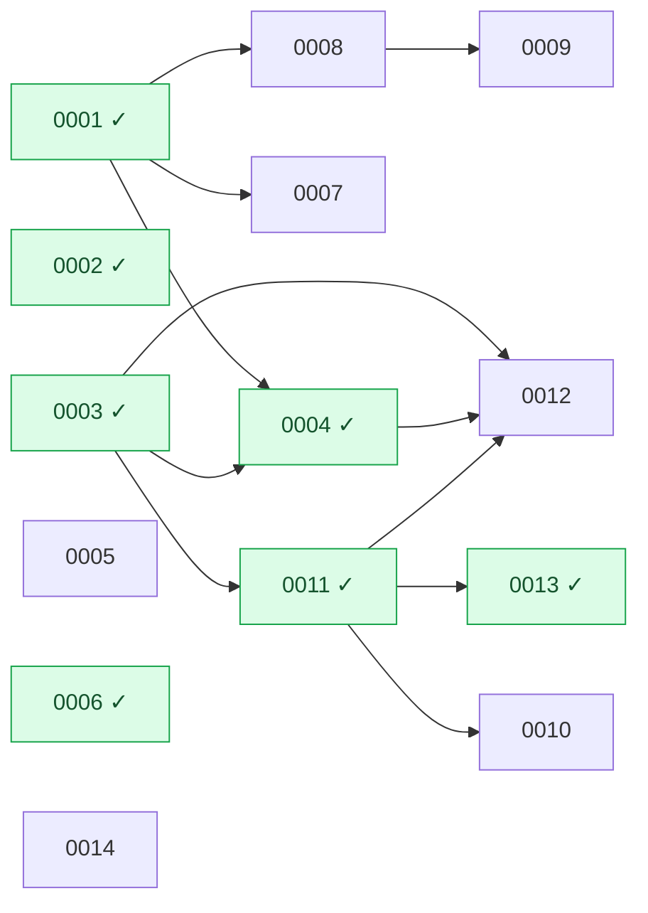

# Piro RFCs

Design documents for non-trivial changes, written against the real codebase (see the `rfc-writer` skill). Each RFC lives at `docs/rfcs/NNNN-kebab-title.md`.

> **How the RFC process works** — lifecycle, statuses, when to open a tracking issue, and how RFCs get discussed and accepted — is documented in **[PROCESS.md](PROCESS.md)**. If you want to *propose* a change, start there (and see the repo's [CONTRIBUTING.md](../../CONTRIBUTING.md)).

**RFC numbers are stable identifiers, not a ranking or an ordering.** A number is assigned once, at creation, as the next free integer — and never changes afterward, even if the RFC is superseded, rejected, or implemented out of order. Numbers are referenced from PRs, branches (`docs/rfc-NNNN-*`, `implements-rfc/NNNN-*`), commit messages, and cross-references inside other RFCs; renumbering would break all of those. This index records the **dependency order** separately, so the numbering stays immutable while the implementation sequence stays legible.

> The index table and dependency graph below are **generated** from each RFC's YAML front-matter by [`scripts/rfc-index.mjs`](../../scripts/rfc-index.mjs). Do not edit them by hand — change the front-matter of the RFC file and run `node scripts/rfc-index.mjs`. CI (`.github/workflows/rfc-index.yml`) fails if they drift.

<!-- BEGIN GENERATED INDEX -->

## Index

| # | Title | Status | Depends on |
|---|---|---|---|
| [0001](0001-third-party-alert-ingestion.md) | Third-party alert ingestion (GCP Cloud Monitoring) | **Implemented** (PR #173) | — |
| [0002](0002-raw-measurement-vs-alert-severity.md) | Separate raw measurement from alert severity (Prometheus/Alertmanager-style) | **Implemented** (PR #165) | — |
| [0003](0003-integration-manifest.md) | Integration manifest | **Implemented** (PR #172) | — |
| [0004](0004-pagerduty-dispatcher.md) | OAuth integration framework with resource discovery (PagerDuty as first consumer) | **Implemented** (PR #193) | 0001, 0003 |
| [0005](0005-incident-postmortems.md) | Postmortems (standalone post-incident review reports) | Proposed (PR #176) | — |
| [0006](0006-escalation-limits.md) | Escalation limits: per-step retries with a terminal state | **Implemented** (PR #182, #178) | — |
| [0007](0007-service-impact-analysis.md) | Service impact analysis (blast radius & propagation reasons) | Proposed (PR #183) | 0001 |
| [0008](0008-service-check-worker-tags.md) | Arbitrary tags on Services, Checks, and Workers, with tag-based worker↔check scheduling | Proposed (PR #184, #185) | 0001 |
| [0009](0009-system-notifications.md) | Notification system revamp: delivery contracts, a push engine for non-paging notifications, and group broadcast | Proposed (PR #186, #187) | 0008 |
| [0010](0010-script-check-type.md) | Script check type (sandboxed JavaScript, operator-driven HTTP) | Proposed | 0011 |
| [0011](0011-check-manifest-and-interval-limits.md) | Check manifest, config-as-schema, and interval/timeout limits | **Implemented** (PR #189, #188) | 0003 |
| [0012](0012-integration-actions-with-dynamic-ui.md) | Integration actions with dynamic UI (Jira ticket creation as first consumer) | Proposed | 0003, 0004, 0011 |
| [0013](0013-heartbeat-check-type.md) | Heartbeat check type | **Implemented** | 0011 |
| [0014](0014-password-reset-flow.md) | Password reset / forgot password flow | Accepted (PR #197, #84) | — |

Implemented (frozen): **0001, 0002, 0003, 0004, 0006, 0011, 0013**.

## Dependency graph

Arrows point from a prerequisite to the RFC that builds on it. Green nodes (`✓`) are implemented.

<!-- END GENERATED INDEX -->

## Reading the graph as chains

- **Integration/dispatch line:** `0001 ✓`, `0003 ✓` → **0004** (OAuth framework + `IAlertEventDispatcher`) → **0012** (integration actions; **hard-depends on 0004 from Phase 1** — Jira tickets are created over OAuth using 0004's encrypted token store; Phase 2 auto-create also rides 0004's dispatcher hook).
- **Tags line:** `0001 ✓` → **0008** (tags) → **0009** (system notifications).
- **Checks line:** `0003 ✓` → `0011 ✓` (check manifest) → **0010** (script check type), **0012** (action inputs reuse the config-as-schema engine), and **0013** (heartbeat check type; new manifest + executor riding the existing check pipeline).
- **Independent leaves** (no pending prerequisite): **0005** (postmortems), **0006** (escalation limits), **0007** (impact analysis, needs only implemented 0001).

## Suggested implementation order

A topological order over the pending RFCs (any order consistent with the graph works; this is one sensible pick that front-loads unblockers and respects the two real chains):

1. **0004** — establishes the OAuth framework + encrypted token store + outbound dispatcher that other integrations reuse. **Hard-blocks 0012** (both phases).
2. **0008** — unblocks 0009.
3. **0012** — Jira actions over OAuth; cannot start its Jira-auth work until 0004 lands (the action contract, `ExternalReference`, and frontend can be built against a stub token provider in the meantime).
4. **0010**, **0009** — depend on already-implemented (0011) / step-2 (0008) work respectively.
5. **0005**, **0006**, **0007** — independent leaves, schedulable whenever.

> This ordering is advisory. The stable RFC number (the filename) is the identifier; this section is the sequence.
