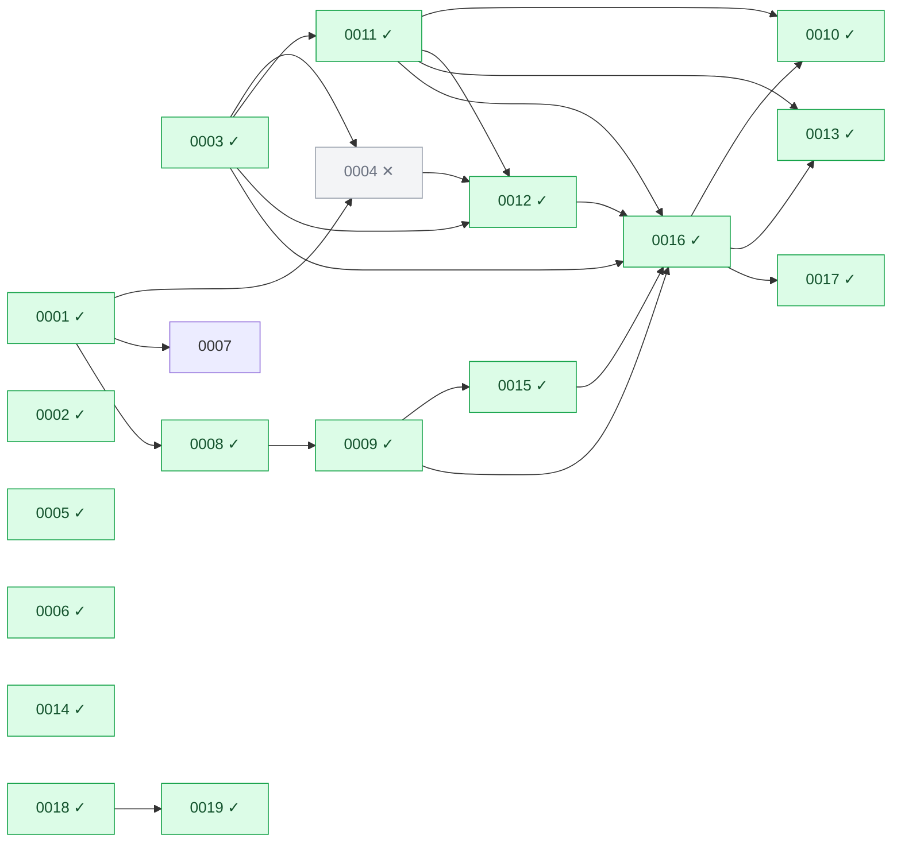

# Piro RFCs

Design documents for non-trivial changes, written against the real codebase (see the `rfc-writer` skill). Each RFC lives at `docs/rfcs/NNNN-kebab-title.md`.

> **How the RFC process works** — lifecycle, statuses, when to open a tracking issue, and how RFCs get discussed and accepted — is documented in **[PROCESS.md](PROCESS.md)**. If you want to *propose* a change, start there (and see the repo's [CONTRIBUTING.md](../../CONTRIBUTING.md)).

**RFC numbers are stable identifiers, not a ranking or an ordering.** A number is assigned once, at creation, as the next free integer — and never changes afterward, even if the RFC is superseded, rejected, or implemented out of order. Numbers are referenced from PRs, branches (`docs/rfc-NNNN-*`, `implements-rfc/NNNN-*`), commit messages, and cross-references inside other RFCs; renumbering would break all of those. This index records the **dependency order** separately, so the numbering stays immutable while the implementation sequence stays legible.

> The index table and dependency graph below are **generated** from each RFC's YAML front-matter by [`scripts/rfc-index.mjs`](../../scripts/rfc-index.mjs). Do not edit them by hand — change the front-matter of the RFC file and run `node scripts/rfc-index.mjs`. CI (`.github/workflows/rfc-index.yml`) fails if they drift.

<!-- BEGIN GENERATED INDEX -->

## Index

| # | Title | Status | Depends on |
|---|---|---|---|
| [0001](0001-third-party-alert-ingestion.md) | Third-party alert ingestion (GCP Cloud Monitoring) | **Implemented** (PR #173) | — |
| [0002](0002-raw-measurement-vs-alert-severity.md) | Separate raw measurement from alert severity (Prometheus/Alertmanager-style) | **Implemented** (PR #165) | — |
| [0003](0003-integration-manifest.md) | Integration manifest | **Implemented** (PR #172) | — |
| [0004](0004-pagerduty-dispatcher.md) | OAuth integration framework with resource discovery (PagerDuty as first consumer) | Withdrawn (PR #193, by 0015) | 0001, 0003 |
| [0005](0005-incident-postmortems.md) | Postmortems (standalone post-incident review reports) | **Implemented** (PR #205) | — |
| [0006](0006-escalation-limits.md) | Escalation limits: per-step retries with a terminal state | **Implemented** (PR #182, #178) | — |
| [0007](0007-service-impact-analysis.md) | Service impact analysis (blast radius & propagation reasons) | Proposed (PR #183) | 0001 |
| [0008](0008-service-check-worker-tags.md) | Arbitrary tags on Services, Checks, and Workers, with tag-based worker↔check scheduling | **Implemented** (PR #223, #185) | 0001 |
| [0009](0009-system-notifications.md) | Notification system revamp: an event catalog, contracted payloads, and a durable push engine | **Implemented** (PR #200, #187) | 0008 |
| [0010](0010-script-check-type.md) | Script check type (sandboxed JavaScript, operator-driven HTTP) | **Implemented** (PR #219, #39) | 0011, 0016 |
| [0011](0011-check-manifest-and-interval-limits.md) | Check manifest, config-as-schema, and interval/timeout limits | **Implemented** (PR #189, #188) | 0003 |
| [0012](0012-integration-actions-with-dynamic-ui.md) | Integration actions with dynamic UI (Jira ticket creation as first consumer) | **Implemented** (PR #206) | 0003, 0004, 0011 |
| [0013](0013-heartbeat-check-type.md) | Heartbeat check type | **Implemented** (PR #221, #1) | 0011, 0016 |
| [0014](0014-password-reset-flow.md) | Password reset / forgot password flow | **Implemented** (PR #204, #84) | — |
| [0015](0015-generic-outbound-webhook.md) | Generic outbound webhook (Zapier / Make compatible) | **Implemented** (PR #213, #210) | 0009 |
| [0016](0016-integration-sdk.md) | Integration SDK: self-describing integrations with an open discriminator | **Implemented** (PR #215, #216) | 0003, 0009, 0011, 0012, 0015 |
| [0017](0017-e2e-encrypted-push-and-relay-transport.md) | End-to-end encrypted push, and a relay transport for the published apps | **Implemented** | 0016 |
| [0018](0018-multi-session-refresh-tokens.md) | Multi-session refresh tokens (per-device sessions) | **Implemented** | — |
| [0019](0019-config-as-code-and-cli.md) | Config as Code: piro.yaml and the piro CLI | **Implemented** (PR #237, #235) | 0018 |

Implemented (frozen): **0001, 0002, 0003, 0005, 0006, 0008, 0009, 0010, 0011, 0012, 0013, 0014, 0015, 0016, 0017, 0018, 0019**.

## Dependency graph

Arrows point from a prerequisite to the RFC that builds on it. Green (`✓`) is implemented, grey is withdrawn, unstyled nodes are still open for discussion.

```mermaid
graph LR
  n0001["0001 ✓"]
  n0002["0002 ✓"]
  n0003["0003 ✓"]
  n0004["0004 ✕"]
  n0005["0005 ✓"]
  n0006["0006 ✓"]
  n0007["0007"]
  n0008["0008 ✓"]
  n0009["0009 ✓"]
  n0010["0010 ✓"]
  n0011["0011 ✓"]
  n0012["0012 ✓"]
  n0013["0013 ✓"]
  n0014["0014 ✓"]
  n0015["0015 ✓"]
  n0016["0016 ✓"]
  n0017["0017 ✓"]
  n0018["0018 ✓"]
  n0019["0019 ✓"]
  n0001 --> n0004
  n0003 --> n0004
  n0001 --> n0007
  n0001 --> n0008
  n0008 --> n0009
  n0011 --> n0010
  n0016 --> n0010
  n0003 --> n0011
  n0003 --> n0012
  n0004 --> n0012
  n0011 --> n0012
  n0011 --> n0013
  n0016 --> n0013
  n0009 --> n0015
  n0003 --> n0016
  n0009 --> n0016
  n0011 --> n0016
  n0012 --> n0016
  n0015 --> n0016
  n0016 --> n0017
  n0018 --> n0019
  classDef done fill:#dcfce7,stroke:#16a34a,color:#14532d;
  class n0001,n0002,n0003,n0005,n0006,n0008,n0009,n0010,n0011,n0012,n0013,n0014,n0015,n0016,n0017,n0018,n0019 done;
  classDef dead fill:#f3f4f6,stroke:#9ca3af,color:#6b7280;
  class n0004 dead;
```

<!-- END GENERATED INDEX -->
